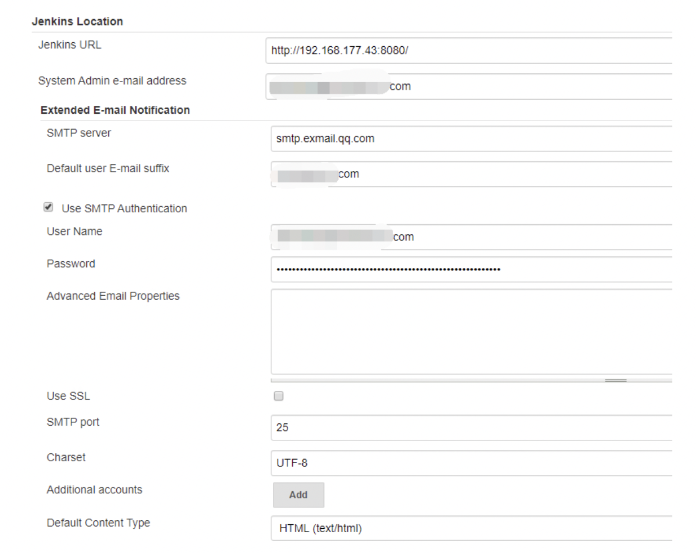
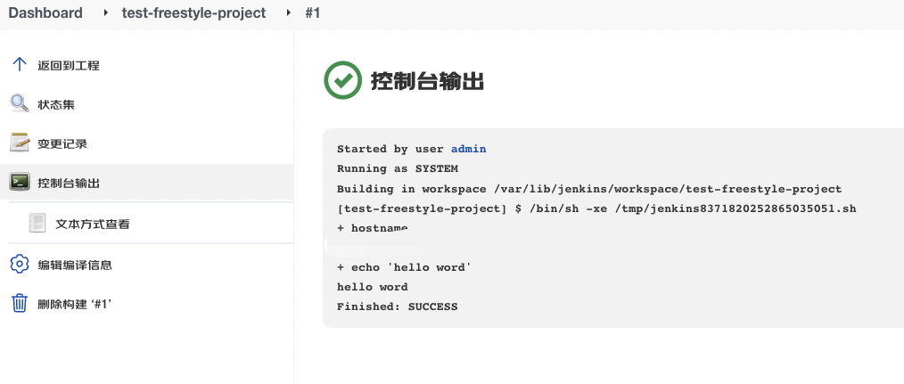

# 1、 安装

下载jdk1.8以上

```
wget --no-cookies --no-check-certificate --header "Cookie: gpw_e24=http%3A%2F%2Fwww.oracle.com%2F; oraclelicense=accept-securebackup-cookie" "http://download.oracle.com/otn-pub/java/jdk/8u141-b15/336fa29ff2bb4ef291e347e091f7f4a7/jdk-8u141-linux-x64.tar.gz"
```


解压

```
tar -zxvf jdk-8u141-linux-x64.tar.gz -C /usr/local/
```

添加环境变量

```
/etc/profile 添加如下内容
export JAVA_HOME=/usr/local/jdk1.8.0_141
export JRE_HOME=${JAVA_HOME}/jre
export CLASSPATH=.:${JAVA_HOME}/lib:${JRE_HOME}/lib
export PATH=${JAVA_HOME}/bin:$PATH

source /etc/profile
# java -version
java version "1.8.0_141"
Java(TM) SE Runtime Environment (build 1.8.0_141-b15)
Java HotSpot(TM) 64-Bit Server VM (build 25.141-b15, mixed mode)
```


安装jenkins

```
下载
wget --no-check-certificate https://pkg.jenkins.io/redhat/jenkins-2.230-1.1.noarch.rpm


下载完成安装
yum localinstall jenkins-2.337-1.1.noarch.rpm


启动服务
systemctl start jenkins
```


使用docker 启动

```
docker run -u root -it -d --name jenkins -p 8080:8080 -p 50000:50000 -v jenkins-data:/var/jenkins_home jenkins//jenkins
```

容器启动映射了8080和50000端口

8080是web的访问端口

50000端口是基于JNLP的jenkins代理（slave）通过TCP与jenkins master进行通信的端口

-v jenkins-data:/var/jenkins_home  挂载


安装好 访问Ip:8080


管理员密码在 

```
cat /var/lib/jenkins/secrets/initialAdminPassword
```


docker 根据提示进入查看密码

```
docker exec -it jenkins cat  /var/lib/jenkins/secrets/initialAdminPassword
```


上边也给出了提示

输入密码


选择安装所需插件（gradle、maven、等等），也可以后边在安装


# 2、系统管理


## 2.1 System Configuration

Configure System 系统管理

设置jenkins的全局配置及各种工具插件的全局配置，工作目录、可同时构建job的数量、jdk环境等


## 2.2 configure GlobalSecurity(全局工安全配置)

Jenkins的全局安全配置入口， 可以配置用户权限  API Token、agent代理等信息。


## 2.3 Configure Credentials(凭据配置)

该菜单项用来  创建各种类型的凭据，用于对系统或者服务进行认  证，比如登录服务器，登录源码仓库的认证等。


## 2.4 Global Tool Configuration(全局工具配置) ：

该菜  单项用来对Jenkins项目里使用到的全局工具进行  配置， 比如Jdk的配置， 代码编译具maven/ant/  grad le工具的配置， 代码拉取命令git的配置等等。  Manage Plugins(插件管理)：Jenkins各种插件  得入口， 用来对插件进行增删更新等操作， jenkins  强大的功能和扩展离不开各种插件的支持，所以在  初期这是一个使用比价频繁的菜单。


## 2.5 manage Plugins 插件管理

jenkins的各种插件的入口，用来对插件进行增删改查


## 2.6 System Information(系统信息)：

 该菜单用来显  示Jenkins系统的各种属性信息， 包括jenkins所在  系统的配置信息， jenkins环境变量信息， jenkins所  安装的插件信息等。  


## 2.7 System Log(系统日志)：

用来展示jenkins的系  统日志。  


## 2.8 Jenkins Cli(Jenkins命令行)

 该菜单项介绍了  如何使用jenkins-cli.jar左命今行操作jenkins,这个菜单提供了大量可以在命令行操作jenkins的命令及说明，比如启动jenkins

```
java -har jenkins-cli.jar -s ${jenkins_url} restart
```


## 2.9 Manage Nodes(管理节点)

该菜单项用于管理jen kins的节点信息， 比如增加或减少jenkins slave节  点， 修改master或者slave节点的配置等， 如何配  置将在后面章节介绍。  


## 2.10 Manage Users(用户管理)

该菜单项用于管理jenkins的系统用户信息， 包括用户信息的增删改查 等操作。  


上面列出了jenkins的一些常用的配置菜单， 在使用 jenkins的时候， 对于上面的菜单或多或少的都会接  触到，并且在以后的学习中会对某个菜单里的使用  进行详细的配置说明，这里先不多做介绍，当然如  果你有些迫不及待了，也可以自己试一下。  


# 3、配置文件

了解了Jenkins的面板配置， 再来看一下jenkins的 配置文件。Jenkins安装好以后， 使用的默认端口为`8080`， 通过ip加端口访问jenkins面板， 点击`Manage Jenkins`->`Configure System`， 进入系 统配置界面， 可以看到jenkins的默认配置， 比如下 


 
通过该图可以看到jenkins的主目录为`/var/lib/jenkins`， 该目录为Jenkins的实际工作目录， 对于jenkins的配置修改以及存放jenkins项目配置的文件都会放到此目录下，并不是运行Jenkins程序的目录。由上图发现该目录并不能在jenkins ui界面修改对于要想修改Jenkins的工作目录路径的需求应该怎么实现呢，或者如果想要修改jenkins的启动端口， jvm内存等， 又要如何修改呢?

本小节就简单介绍一下如何修改这些配置。 


对于使用Tomcat方式启动的Jenkins服务， 直接修改tomcat的端口和jvm内存设置即可。有关工作目录的修改， 大体就与使用rpm安装的jenkins服务相同了(建议保持默认即可)；对于使用容器镜像方式启动的jenkins服务如何配置， 可参考docker hub仓库下jenkins镜像的Dockerfile所以有关使用Tomcat方式或者容器化安装的Jenkins服务配置文件的说明这里不多说，主要介绍一下使用rpm方式安装的jenkins的配置文件的管理。 


我这里使用rpm方式安装的jenkins服务， 默认启动命令为`systemctl start jenkins`(以centos 7为例)但是在系统默认存放启动文件的目录有没有找到与jenkins有关的service文件， 该如何下手呢 ?

通过`systemctl status jenkins`命令，可以获取jenkins启动的脚本文件， 比如下面示例：  


```
# cat /usr/lib/systemd/system/jenkins.service |grep -v "^#\|^$"
[Unit]
Description=Jenkins Continuous Integration Server
Requires=network.target
After=network.target
[Service]
Type=notify
NotifyAccess=main
ExecStart=/usr/bin/jenkins
Restart=on-failure
SuccessExitStatus=143
User=jenkins
Group=jenkins
Environment="JENKINS_HOME=/var/lib/jenkins"
WorkingDirectory=/var/lib/jenkins
Environment="JENKINS_WEBROOT=%C/jenkins/war"
Environment="JAVA_OPTS=-Djava.awt.headless=true"
Environment="JENKINS_PORT=8080"
```


说明
我这里通过grep将所需要的内容过滤了出来， 如果想要看全部内容，可以将过滤条件去掉。
。

然后通过ps命令查看一下Jenkins的进程信息。


```
ps aux|grep jenkins
jenkins   6441  0.3 11.8 4690024 950276 ?      Ssl  16:01   1:12 /usr/bin/java -Djava.awt.headless=true -jar /usr/share/java/jenkins.war --webroot=%C/jenkins/war --httpPort=8080
root      8454  0.0  0.0 112824   984 pts/0    S+   22:13   0:00 grep --color=auto jenkins
```

 

由上面信息可以看到， jenkins服务主要配置文件为`/etc/sysconfig/jenkins`使用的java为自定义的`/usr/local/jdk 1.8.0_231/bin/java`启动方式也是通过war包启动， 日志文件存放在/var/Log/jenkins/jenkins.log) 文件里， jenkins服务运行所需要的程序文件放到了/var/cache/jenkins/war目录。当然，这些配置的路径，都是可以修改的。


了解完基本配置信息，下面看一下jenkins的主配置文件 

```
cat /etc/sysconfig/jenkins|grep -v "^#\|^$"

JENKINS_HOME="/var/lib/jenkins"
JENKINS_JAVA_CMD=""
JENKINS_USER="jenkins"
JENKINS_JAVA_OPTIONS="-Djava.awt.headless=true"
JENKINS_PORT="8080"
JENKINS_LISTEN_ADDRESS=""
JENKINS_HTTPS_PORT=""
JENKINS_HTTPS_KEYSTORE=""
JENKINS_HTTPS_KEYSTORE_PASSWORD=""
JENKINS_HTTPS_LISTEN_ADDRESS=""
JENKINS_HTTP2_PORT=""
JENKINS_HTTP2_LISTEN_ADDRESS=""
JENKINS_DEBUG_LEVEL="5"
JENKINS_ENABLE_ACCESS_LOG="no"
JENKINS_HANDLER_MAX="100"
JENKINS_HANDLER_IDLE="20"
JENKINS_EXTRA_LIB_FOLDER=""
JENKINS_ARGS=""


```

在这里， 就可以看到jenkins的详细配置了， 包括Jenkins的主要工作目录， Jenkins的端口， 运行Jenkins的用户(默认为jenkins) 以及jenkins启动时的java参数等。如果要修改jenkins的jvm参数， 只需要将配置放到JENKINS_JAVA_OPTIONS参数里即可，多个参数使用空格隔开，修改完配置文件，不要忘了重启Jenkins服务。


# 4、插件管理

## Jenkins汉化


⼤部分版本的Jenkins安装好以后，默认的语⾔为英⽂，有些同学可能不太习惯英⽂版
的jenkins，这时就需要对jenkins进⾏汉化，汉化⽐较简单，下⾯进⾏配置。


"Manage Jenkins"---> "Manage Plugins"在可选插件中找到`Locale plugin或[Localization: Chinese (Simplified)版本1.0.24]`插件，点击安
装即可。安装完以后在"Config System"菜单中找到Locale选项配置，设置"Default Lan
guage"为zh_CN，并勾选Ignore browser preference and force this language to all users


安装完重启服务即可

```
systemctl restart jenkins
```

配置好后重启Jenkins，从新登录界⾯就发现英⽂菜单变成了中⽂菜单。

Jenkins针对不同的安装⽅式或者不同的版本汉化⽅法可能不⼀样，⼤多数版本使⽤上
⾯的⽅法就能汉化成功。但是有的版本安装该插件后，重启jenkins后发现⾯板还是英
⽂的，汉化不成功。那么接下来就需要在安装Localization: Chinese (Simplified）插件
了，安装好后重启Jenkins即可。如果汉化完发现⾯板有⼀部分是中⽂⼀部分是英⽂的
话，可能与jenkins的版本或者安装⽅式有关了。

# 5、修改插件更新源

Jenkins强⼤的功能和扩展离不开插件的⽀持。在安装jenkins时，或者安装完jenkins以
后，需要安装很多必须的插件，使⽤官⽅默认的jenkins插件源安装插件时，要么速度
很慢，要么安装失败，使得⽆论是⼯作效率还是学习效率都⼤⼤降低，为了解决此问
题，需要修改⼀下jenkins下载插件的镜像源。
进⼊`Manage-Jenkins`-->`Manage Plugins` ---> `⾼级`⻚⾯，⽹上⼤多数⽅法都是修
改该⻚⾯下的"升级站点"下URL输⼊框的值，改为清华源或者Jenkins插件中⼼国内源


```
#原来地址
https://updates.jenkins.io/update-center.json
清华源
https://mirrors.tuna.tsinghua.edu.cn/jenkins/

国内
https://updates.jenkins-zh.cn/update-center.json
```

新版的到此就完成了

老版本的要以下操作

然⽽修改完成后，下载镜像还是很慢，这是因为Jenkins通过解析`update-center.json` ⽂
件的⽅式来获取插件版本以及下载插件，但是jenkins使⽤私钥来给`update-center.json`⽂
件做了签名，只有通过了公钥验证的`update-center.json`⽂件，才会被使⽤。所以还需要
替换Jenkins中使⽤的秘钥和私钥⽂件。替换证书⽂件到`https://github.com/jenkins-zh/mirror-adapter/tree/master/rootCA`下载`mirror-adapter.crt`⽂件，放到`/var/cache/jenkins/war/WEB-INF/update-center-rootCAs`⽬录下即可。


对于该配置流程，Jenkins中⽂社区帮⼤家把秘钥和地址的问题解决了，可以使⽤如下
⽅式：

说明：
先点击使⽤，然后在点击"设置更新中⼼地址"，在跳转的⻚⾯输⼊上⾯给出的地址即
可。
如果没有上⾯的Jenkins中⽂社区按钮，可能是你没有汉化导致的。

# 6、密码修改

密码修改
在使⽤Jenkins的时候常常遇到了忘记Jenkins管理员登录密码的情况，如果忘记了密码
怎么办？可以修改Jenkins的配置⽂件`${JENKINS_HOME}/config.xml`，找到：

```
<useSecurity>true</useSecurity>
```

将true 改为false，然后重启jenkins。

```
找到配置文件位置
cat /etc/sysconfig/jenkins|grep -v "^#\|^$"

cat /var/lib/jenkins/config.xml


```


Jenkins重启后，访问Jenkins 就可以直接跳过验证，直接跳转到Jenkins⾯板界⾯了。
然后点击`Manage Jenkins`-->`Config Global Security`，勾选"启⽤安全"，在"访问控
制"选项的"安全域"属性，选中`Jenkins’ own user database`，授权策略属性选中"Log

保存后，到"Manage Users"界⾯重置管理员⽤户密码即可。


# 7、配置和备份

使⽤jenkins另⼀个必不可少的配置就是对jenkins的备份。Jenkins的所有的数据都是以
⽂件的形式存放在`${JENKINS_HOME}`⽬录中。所以不管是迁移还是备份，只需要`$
{NKINS_HOME}`打包后在拷⻉，然后将打包的⽂件解压到新的`${JENKINS_HOME}`⽬录就
⾏了。备份jenkins的⽅法有很多种，本⽂就简单介绍⼀下常⽤的备份⽅法，使⽤`ThinB
ackup`插件。
在插件管理⻚⾯找到ThinBackup插件，安装即可（如果你不会安装，看⼀下第⼆篇的内
容吧）。


安装完以后在`manage jenkins`界⾯会出现`ThinBackup`菜单项，点击进去后进
⼊settings设置界⾯，进⾏备份设置。如下所示设置：


说明：


**Backup directory**备份⽬录，⽤于存储备份的⽂件，如果指定的⽬录不存在，默认在
进⾏备份之前会⾃动创建。


**Backup schedule for full backups**：进⾏备份的计划任务，与linux下的crontab⼀样，
其中上⾯的H，代表哈希，为了允许定期调度的任务在系统上产⽣均匀负载，应尽可能
使⽤符号H(⽤于“散列”)。例如，如果多个job都设置使⽤0 0 * * *将导致负载⼤幅飙升。
相⽐之下，使⽤H H *仍然会每天执⾏⼀次每个job，但不会同时执⾏，更好地使⽤有限
的资源。


**Backup schedule for differential backups:** 进⾏差异化备份的计划任务，同上。


**Max number of backup sets**备份的最⼤数量。


**Files excluded from backup (regular expression):** 不需要进⾏备份的⽂件的正则表达
式。


**Wait until Jenkins/Hudson is idle to perform a backup:** 等待jenkins空闲多⻓时间后进⾏备份。


**Backup build results:**

如果启⽤此选项，还将备份构建结果，⼀般不建议勾选此选项。


**Backup plugins archives**：备份插件。


**Backup userContent' folder**：备份${jenkins_home}/userContent⽬录下的⽂件。


**Backup next build number file**：备份jenkins构建的build id⽂件。


**Backup plugins archives**：备份插件。


**Clean up differential backups**：完成备份以后清除所有的差异备份。


**Move old backups to ZIP files**：如果选中此选项，则⽆论何时执⾏新的完整备份，所有旧备份集都将移⾄ZIP⽂件。每个ZIP⽂件将包含⼀个备份集，即⼀个完整备份和任何引⽤该备份⽂件的差异备份。⽂件名将标识包含备份的时间范围（即完整备份的时间戳和最新差异备份的时间戳）。


备份策略根据⾃⼰实际情况定义即可。
保存后回到ThinBackup界⾯，除了可以⾃动进⾏备份外，也可以通过⼿动备份，点击Ba
ckup Now按钮就会⽴即进⾏备份。如下按钮：


备份完后会在上⾯设定的备份⽬录下⽣成⼀个以FULL-开头，以当前时间（精确到分）
为结尾的⽬录，该⽬录下就是默认所有的Jenkins配置。当要使⽤备份⽂件进⾏恢复的时候，点击restore按钮，在跳转的界⾯中就会显示出该备份⽂件的备份时间，点击Restore即可。
总体来说，使⽤该插件备份相对简单，这⾥就不在多说，有兴趣的可以⾃⼰试⼀下。

# <--------------------------->

# 8、Jenkins强⼤的插件功能

安装好Jenkins后开始进⾏配置，⾸先安装插件，本次教程⽤到如下公共插件：

```
Maven Integration plugin：⽤于创建maven项⽬的插件
Pipeline：⽤于创建pipeline项⽬的插件
Ansible Plugin：⽤于使⽤ansible插件
Git/Git Parameter：⽤于拉取git代码的插件
Docker Pipeline：⽤于在Pipeline中使⽤与Docker相关的语法插件
SonarQube Scanner：⽤于执⾏Sonarqube scan的插件
Publish Over SSH：通过ssh协议发送⽂件到远程服务器
Email Extension Template：⽤于发送邮件给特定的⼈或组
Role-based Authorization Strategy：⽤户权限管理插件

```

回到⾸⻚，点击"manage Jenkins（管理jenkins） -> Manage Plugins（插件管理）"菜单，找到插件选中，install即可。
⽐如，安装ansible插件。


# 9、配置全局工具

## JDK

回到⾸⻚，点击"manage Jenkins -> Global Tool Configuration（全局⼯具配置）" 菜
单，⾸先看到Jdk⼯具配置，在上⼀节的⽂章中已经配置好了jdk，在这⾥直接配置引⼊即
可，如下所示。


## Maven

继续往下浏览，会发现有maven⼯具的配置，由于还没有安装，这⾥先配置⼀下。
到apache官⽹下载（根据个⼈需要选择指定的版本下载）。

解压后直接放到指定⽬录，然后在/etc/profile 添加环境变量配置，⽐如我的配置如下。

```
https://maven.apache.org/download.cgi
```


```
$ tar -zxvf apache-maven-3.8.4-bin.tar.gz -C /usr/local
$ vi /etc/profile
export M2_HOME=export M2_HOME=/usr/local/apache-maven-3.8.4
export PATH=$PATH:$M2_HOME/bin
$ source /etc/profile
```


```
mvn -v
Apache Maven 3.8.4 (9b656c72d54e5bacbed989b64718c159fe39b537)
Maven home: /usr/local/apache-maven-3.8.4
Java version: 1.8.0_282, vendor: Red Hat, Inc., runtime: /usr/lib/jvm/java-1.8.0-openjdk-1.8.0.282.b08-1.el7_9.x86_64/jre
Default locale: zh_CN, platform encoding: UTF-8
OS name: "linux", version: "3.10.0-957.el7.x86_64", arch: "amd64", family: "unix"
```


需要注意的是：
maven编译代码时，默认${Maven_HOME}/conf/路径下的settings.xml⽂件配置了读取存
储公共依赖jar包的仓库地址（默认是阿⾥云的仓库）以及⽤户名和密码，所以如果有
⽤其它地址的仓库（⽐如私有nexus），需要修改该配置⽂件。
关于Jenkins配置maven集成的内容到此就完成了，还是⽐较简单的。


## Email Extension Template 插件

Email Extension Template插件⽤来在执⾏job的时候发送email给要通知的⽤户或者组。
配置Jenkins Location和Extended E-mail Notification，其中系统管理员邮件地址⼀定要和
User Name值⼀致。如下所示。

安装完以后在`manage jenkins`界⾯会出现`# Editable Email Template Management`菜单项，点击进去后进
⼊settings设置界⾯，进⾏备份设置。如下所示设置：





这两个参数的内容均使⽤了jenkins内置的全局变量，其中`$PROJECT_NAME`表示项⽬的
名称，`$BUILD_NUMBER`表示项⽬构建的ID，`$BUILD_STATUS`表示项⽬构建状态。如果
想要⾃定义邮件的主题和内容，直接在这⾥修改即可。
配置好以后点击"Test configuration"测试⼀下。


# 10、⽤户权限控制

在使⽤Jenkins的时候也经常会遇到给不同的⽤户分配不同的权限的问题，Jenkins的权
限管理通过`Role-based Authorization Strategy`插件进⾏管理。如何安装该插件不在
演示，下⾯看⼀下如何开启该插件。


点击`Manage Jenkins`-->`Config Global Security`，在`访问控制`选项的`授权策略`中，选择`Role-Based Strategy`保存即可。保存退出后，在`manage Jenkins`中会出
现Manager and Assign Roles选项，该选项⽤于管理并配置⽤户权限。
"Manage and Assign Roles"选项下有三个菜单，如下所示。


通过Mnaage Roles选项创建⻆⾊，可以是全局⻆⾊也可以是项⽬⻆⾊。如果是项⽬⻆
⾊，则可以通过正则语法给相应的项⽬⻆⾊创建匹配规则，使该⻆⾊对某些项⽬有管理
权限。


通过Assign Roles选项分配⻆⾊，分配⻆⾊的主体为Jenkins系统⾥的⽤户，可以通过
"Manage Users"菜单查看到。

## 创建⻆⾊

点击Manage Roles，点击进去以后，会发现有⼀个默认的admin⻆⾊，该⻆⾊为具有管
理员权限的⽤户⻆⾊。
创建⼀个全局⻆⾊，⼀个项⽬⻆⾊，如下所示。


在Role to add输⼊框中，输⼊⻆⾊名称（⾃定义），然后在Pattern中输⼊要管理的项⽬
名称或者要匹配的多个jeknkin项⽬（job）的正则语法，⽐如我这⾥写的是test-.*表示匹
配以test-开头的所有项⽬。添加以后，点击"Pattern"框中匹配项就可以显示该正则匹配
到的项⽬名称了。然后在相应的权限配置栏中勾选该role的权限，⽐如对于凭据有什么
权限，对于job有什么权限等，这⾥就需要根据⾃⼰的实际情况勾选了。


在Role to add输⼊框中，输⼊⻆⾊名称（⾃定义），然后在Pattern中输⼊要管理的项⽬
名称或者要匹配的多个jeknkin项⽬（job）的正则语法，⽐如我这⾥写的是test-.*表示匹
配以test-开头的所有项⽬。添加以后，点击"Pattern"框中匹配项就可以显示该正则匹配
到的项⽬名称了。然后在相应的权限配置栏中勾选该role的权限，⽐如对于凭据有什么
权限，对于job有什么权限等，这⾥就需要根据⾃⼰的实际情况勾选了。

## 分配⻆⾊

创建好⻆⾊以后，就可以分配⻆⾊了，分配⻆⾊给谁呢？这就需要看jenkins⾥存在的
⽤户了。点击"Manage-Jenkins"-->"Manage Users"，可以看到jenkins系统⾥所有的
⽤户。然后回到"Manage and Assign Roles"菜单，点击"Assign Roles"，在跳转的界
⾯中就可以看到刚刚创建的⻆⾊。同样的，既可以给⽤户分配全局⻆⾊，也可以给⽤户
分配项⽬留⻆言⾊。


## Sonar

配置完公共插件，下⾯来介绍⼀下常⽤的持续交付过程中的使⽤代码质量检测插件：S
onar


介绍
Sonar是⼀个⽤于代码质量管理的开源平台，可以从多个维度管理和检测源代码的质
量。通过插件形式，可以⽀持包括java,C#,C/C++,PL/SQL,Cobol,JavaScrip,Groovy等
⼆⼗⼏种编程语⾔的代码质量管理与检测。sonar也是当下众多公司使⽤的⼀款代码质
量分析⼯具。
sonar从如下⼏个维度检测代码质量：


- sonar通过PMD，CheckStyle，Findbugs等代码规则检测⼯具规范代码编
  写；

- sonar也可以通过PMD，CheckStyle，Findbugs等代码规则检测⼯具检测出
  潜在的缺陷；

- 糟糕的复杂度分布⽂件、类、⽅法等，如果复杂度过⾼将难以改变，这会使得开发⼈员难以理解它们，且没有⾃动化的单元测试，对于程序中的任何组件的改变都将可能导致需要全⾯的回归测试；

  注释不⾜或者过多没有注释将使代码可读性变差，特别是当不可避免出现⼈员变动时，程序的可读性⼤幅度下降，⽽过多的注释⼜会使得开发⼈员将精⼒过多的花费在阅读注释上，亦违背初衷；

  sonar可以很⽅便地统计并展示单元测试覆盖率；通过sonar可以找出循环，展示包与包、类与类之间相互依赖关系，可以检测⾃定义的架构规则， 可以管理第三⽅的jar包，可以利⽤LCOM4检测单个任务规则的应⽤情况，检测耦合。

- sonar可以展示源码中重复严重的地⽅；

### sonar执⾏流程

开发⼈员将他们的代码提交到代码管理平台中（SVN，GIT等）。持续集成⼯具⾃动触发构建，调⽤SonarScanner对项⽬代码进⾏扫描分析。分析报告发送到SonarQube Server中进⾏加⼯。SonarQube Server 加⼯并且保存分析报告到SonarQube Database中，通过UI显示分析报告。


sonar环境需求
SonarQube服务实例需要⾄少2GB的RAM才能有效运⾏，并且1GB的可⽤RAM⽤于操系统。需要的磁盘空间量取决于所使⽤SonarQube分析的代码量。SonarQube必须安装在具有良好读写性能的硬盘上。sonar 的data⽂件夹包含Elasticsearch索引，当服务器启动并运⾏时，将在其上完成⼤量I/O操作. 因此，良好的读写硬盘性能将对整个SonarQube服务性能产⽣很⼤影响。


安装
sonar安装的⽅式也⽐较多，当然最简便的就是使⽤docker了，所以本次安装使⽤docker⽅式，下⾯看详细过程。安装sonar需要安装数据库，这⾥使⽤mysql5.7。

下载mysql:5.7镜像。

```
docker run --name mysql5.7 -v /data/mysql5.7-data:/var/lib/mysql -p 3306:3306
```

说明：
/data/mysql5.7-data为挂载的宿主机⽬录

进⼊容器中创建数据库与⽤户。

```
$ docker exec -it mysql5.7 bash
root@60253d27a5f5:/# mysql -uroot -p123456
mysql>
```


# 4. 创建数据库db_sonar

mysql> create database db_sonar character set utf8 collate utf8_general_ci;
Query OK, 1 row affected (0.00 sec)

mysql> flush privileges;
Query OK, 0 rows affected (0.00 sec)


#创建数据库⽤户，⽤户名密码都为sonar
mysql> grant all privileges on db_sonar.* to 'sonar'@'%'identified by 'sonar' with g
Query OK, 0 rows affected, 1 warning (0.00 sec)

mysql> flush privileges;
Query OK, 0 rows affected (0.00 sec)

有关sonar使⽤mysql数据库的配置就完成了。
启动sonar容器
下载 sonarqube:6.7.5 镜像。

```
docker pull sonarqube:6.7.5
启动sonarqube容器。
docker run --name mysql5.7 -v /data/mysql5.7-data:/var/lib/mysql -p 3306:3306 $ docker exec -it mysql5.7 bash
root@60253d27a5f5:/# mysql -uroot -p123456

```

说明：
--link 表示sonar容器要连接到名称为mysql5.7容器，在配置数据库连接的时候，数
据库地址可以直接写容器的名称
-v 挂载相关配置到 /data/sonar/ ⽬录下
-e 指定sonar启动时连接数据库的相关参数配置
待容器全部启动成功后查看


根据 http://ip:9000 访问web界⾯

到此，sonar安装完成。


# <------------------------>

# 11、Devops⼯具链

基础⼯具介绍安装配置
在前⾯的两个章节中简单介绍了⼀下Jenkins以及插件的安装配置等内容。本系列⽂章
虽然是基于Jenkins 进⾏展开的，但是实现Devops中的CI/CD也不是仅凭⼀个⼯具就能
实现的，需要众多Devops⼯具链的相互协作。所以在配置好Jenkins服务后，本章节来
介绍⼏款与Jenkins集成进⾏持续交付和持续部署的devops⼯具包。并且在以后的章节
中会通过与Jenkins配合以实现应⽤服务的构建和部署

```
Docker
Harbor
Gitlab
Ansible

```


## Docker

介绍
Docker 是什么⼤家都应该都有所了解，⼀个基于LXC技术构建的的⾼级容器引擎。Docker以容器为资源分割和调度的基本单位，封装整个软件运⾏时的环境，为开发者和系统管理员设计的⽤于构建、发布和运⾏分布式应⽤的平台。它是⼀个跨平台、可移植并且简单易⽤的容器解决⽅案。


Docker 基于Linux 内核的cgroup，namespace以及 AUFS 和Union FS等技术，对进程进
⾏封装隔离，属于操作系统层⾯的轻量级虚拟化技术。


说明
**Namespace**：是对全局系统资源的⼀种封装隔离，使得处于不同namespace的进程拥有
独⽴的全局系统资源，改变⼀个namespace中的系统资源只会影响当前namespace⾥的
进程，对其他namespace中的进程没有影响。Linux内核中提供了7种namesapce隔离系
统调⽤（docker ⽤到6种）：


**UTS**：UTS namespace提供主机名和域名的隔离
**IPC**：进程间通信，涉及的IPC资源包括常⻅的信号量，消息队列和共享内存。
**PID**：PID namespace隔离进程PID，两个namespace下的进程可以有相同的Pid，每个Pid
的namespace都有⾃⼰的计数程序。PID namespace中的第⼀个进程为PID 1（所有进程的⽗进程），像linux 中 的init进程。


**mount**：mount通过隔离⽂件系统挂载点对隔离⽂件系统提供⽀持
**Network** ：Network namespace主要提供了关于⽹络资源的隔离（不是真正的⽹络隔
离，只是把⽹络独⽴出来）
**User** ：User namespace主要隔离安全相关的标识符和属性，如⽤户id，⽤户组id，root
⽬录 、秘钥以及权限等。
**cgroup**：对⼀组进程进⾏统⼀的资源监控和限制，是Linux内核提供的⼀种将进程按组
进⾏管理的机制。cgroup 可以限制、记录任务组使⽤的物理资源（cpu、memory 、io


优先级分配：控制任务运⾏的优先级
资源统计：统计系统资源的使⽤量
任务控制：对任务执⾏挂起、恢复等操作


AUFS 和 Union FS：
UnionFS 是⼀种为 Linux 操作系统设计的⽤于把多个⽂件系统联合到同⼀个挂载点的⽂
件系统服务
AUFS 即 Advanced UnionFS ，是 UnionFS 的升级版，它能够提供更优秀的性能和效
率。
AUFS 作为联合⽂件系统，它能够将不同⽂件夹中的层联合（Union）到同⼀个⽂件夹
中，这些⽂件夹在 AUFS 中称作分⽀，整个联合的过程被称为联合挂载（Union Moun
t）
有关Docker的介绍就简单的介绍到这⾥，下⾯看⼀下Docker的安装


## Harbor组件

Harbor在架构上主要由6个组件构成：
**Proxy**：Harbor的registry，UI，token等服务，通过⼀个前置的反向代理统⼀接收浏览
器、Docker客户端的请求，并将请求转发给后端不同的服务。
**Registry**： 负责储存Docker镜像，并处理docker push/pull 命令。由于我们要对⽤户进
⾏访问控制，即不同⽤户对Docker image有不同的读写权限，Registry会指向⼀个toke
n服务，强制⽤户的每次docker pull/push请求都要携带⼀个合法的token, Registry会通
过公钥对token 进⾏解密验证。
**Core services**： 这是Harbor的核⼼功能，主要提供以下服务：
UI：提供图形化界⾯，帮助⽤户管理registry上的镜像（image）, 并对⽤户进⾏授权。
**webhook**：为了及时获取registry 上image状态变化的情况， 在Registry上配置webhoo
k，把状态变化传递给UI模块。
**token 服务**：负责根据⽤户权限给每个docker push/pull命令签发token. Docker 客户端
向Regiøstry服务发起的请求,如果不包含token，会被重定向到这⾥，获得token后再重
新向Registry进⾏请求。
**Database**：为core services提供数据库服务，负责储存⽤户权限、审计⽇志、Docker image分组信息等数据。
**Job Services**：提供镜像远程复制功能，可以把本地镜像同步到其他Harbor实例中。


Harbor的每个组件都是以Docker容器的形式构建的，官⽅也是使⽤Docker Compose来
对它进⾏部署。⽤于部署Harbor的Docker Compose模板位于 harbor/docker-compose.ym
l，harbor安装好以后通过docker ps命令或者docker-compose ps命令可以看到Harbor是
由7个（新版本是9个）容器组成的，如下所示：

# 5. docker-compose ps

5.1 Name Command State Ports
-----------------------------------------------------------------------------------------------

```
harbor-adminserver /harbor/harbor_adminserver Up
harbor-db docker-entrypoint.sh mysqld Up 3306/tcp
harbor-jobservice /harbor/harbor_jobservice Up
harbor-log /bin/sh -c crond && rm -f ... Up 127.0.0.1:1514->514/tcp
harbor-ui /harbor/harbor_ui Up
nginx nginx -g daemon off; Up 0.0.0.0:443->443/tcp, 0.0.0.0:44
registry /entrypoint.sh serve /etc/ ... Up 5000/tcp
```

说明
nginx：nginx负责流量转发和安全验证，对外提供的流量都是从nginx中转，所以开放h
ttps的443端⼝，它将流量分发到后端的ui和正在docker镜像存储的docker registry。


harbor-jobservice：harbor-jobservice 是harbor的job管理模块，job在harbor⾥⾯主要
是为了镜像仓库之前同步使⽤的;


harbor-ui：harbor-ui是web管理⻚⾯，主要是前端的⻚⾯和后端CURD的接⼝;


registry：registry就是docker原⽣的仓库，负责保存镜像。


harbor-adminserver：harbor-adminserver是harbor系统管理接⼝，可以修改系统配置
以及获取系统信息。


harbor-db：harbor-db是harbor的数据库，这⾥保存了系统的job以及项⽬、⼈员权限管理。由于本harbor的认证也是通过数据，在⽣产环节⼤多对接到企业的ldap中；


harbor-log：harbor-log是harbor的⽇志服务，统⼀管理harbor的⽇志。通过inspect可以看出容器统⼀将⽇志输出的syslog。


这⼏个容器通过Docker link的形式连接在⼀起，这样，在容器之间可以通过容器名字互相访问。对终端⽤户⽽⾔，只需要暴露proxy （即Nginx）的服务端⼝，对于其他的组件⽤途只需要做个简单的了解即可

#### 安装与配置

下载offline 版本的Harbor

```
https://github.com/goharbor/harbor/releases
```

配置Harbor

```
$ wget https://storage.googleapis.com/harbor-releases/release-1.7.0/harbor-offline
$ tar xvf harbor-offline-installer-v1.7.5.tgz
```


```
$ cd harbor
修改harbor.cfg内容如下：

```

#访问管理UI与注册服务的IP地址或主机名，不要使⽤localhost或127.0.0.1，因为Ha


```
hostname = 192.168.176.155
```


# 修改管理员密码

harbor_admin_password = Harbor12345

只需要修改harbor的地址和登录密码即可，前提需要安装docker-compose
执⾏ ./install.sh 即可⾃动下载镜像并启动


只需要修改harbor的地址和登录密码即可，前提需要安装docker-compose

```
curl -L https://get.daocloud.io/docker/compose/releases/download/1.29.1/docker-compose-`uname -s`-`uname -m` > /usr/local/bin/docker-compose
sudo chmod +x /usr/local/bin/docker-compose


执⾏ ./install.sh 即可⾃动下载镜像并启动

到这⾥Harbor就安装完成了


```

⽤户/密码 admin Harbor12345


### 关闭与启动 Harbor 命令

harbor ⽬录下

```
#前台启动
docker-compose up
#后台启动
docker-compose up -d
#关闭
docker-compose down
```

Docker 默认不允许⾮ HTTPS ⽅式推送镜像。但是可以通过Docker的配置选项来取消
这个限制

```
cat /usr/lib/systemd/system/docker.service |grep dockerd
ExecStart=/usr/bin/dockerd -H fd:// --containerd=/run/containerd/containerd.sock
```


```
$ docker login 192.168.176.155
Username: admin
Password:
WARNING! Your password will be stored unencrypted in /root/.docker/config.json.
Configure a credential helper to remove this warning. See
https://docs.docker.com/engine/reference/commandline/login/#credentials-store
Login Succeeded

```


从上⾯的登录信息可以看到docker私有仓库认证的凭证存放在/root/.docker/config.json
⽂件。
测试推送镜像

```
$ docker tag b3be36cace3a  11.91.161.27/goharbor/harbor-core:v1.10.10
$ docker push 192.168.176.155/library/nginx:test
登陆一直失败的话

[Docker 添加--insecure-registry ](https://www.cnblogs.com/shunzi115/p/14970130.html)

```

```
vim  /etc/docker/daemon.json

#增加一个daemon.json文件

{ "insecure-registries":["192.168.1.100:port"] }
```

此处port指的是harbor服务的port，不知为何，看到很多人设置的是5000端口，我测试后并不好使，然后改为harbor服务端口，原本是80，我本地调试改为81，即可远程登录私服。

harbor配置文件，harbor.yml，查看其中的http，port。

```
删除其他的没用的 重启docker 
systemctl daemon-reload    ---应用配置

systemctl restart docker      ---重启docker

docker-compose up

```

```
# docker login xx.xx.xx.xx:8090

Username: admin
Password:
Login Succeeded
```

看到这个就能登陆成功了


登陆成功

然后推送

前提是library要存在


```
# docker tag b3be36cace3a  xx.xx.xx.xx:8090/library/harbor-core:v1.10.10

# docker push  xx.xx.xx.xx:8090/library/harbor-core:v1.10.10

The push refers to repository [xx.xx.xx.xx:8090/library/harbor-core]
b1df430d541c: Pushed
cecb134ae993: Pushed
e570535efa12: Pushed
f1e6788f29b8: Pushed
a4ba54e44ac3: Pushed
454bac8f976d: Pushed
v1.10.10: digest: sha256:4c16c5ec90142ff6a28b49ea4c5508d7460ea2b39bb79c5db5effa3cd475138d size: 1575

```


到这⾥，harbor的基本安装配制就完成了。


## 5.2 GitLab

介绍
GitLab是⼀个开源的⽤于代码仓库管理的项⽬，使⽤Git作为代码管理⼯具，并在此基础上搭建起来的web服务。


Gitlab也是⽐较受欢迎并且众多公司在⽤的免费的代码托管服务，除了作为源码仓库服务外，Gitlab还有另⼀个重要的功能：Gitlab-CI，⼀套基于Gitlab的持续集成系统。Gitlab 8.0版本开始默认集成CI功能（GitLab CI），通过在项⽬内创建.gitlab-ci.yaml 配置⽂件读取CI任务并通过被称为 GitLab Runner 的Agent端进⾏持续交付与部署操作。每当gitlab仓库有代码更新的时候，就会触发提前定义的脚本（.gitlab-ci.yaml）进⾏预设定的操作（⽐如代码编译、测试、部署等）。


### 5.2.1 安装


Gitlab的安装⽐较简单，GitLab官⽹针对不同的系统也给出了⽐较详细的安装步骤，可以参考这⾥
为了测试⽅便，我这⾥直接使⽤docker安装，使⽤如下命令启动容器

```
docker run -d -p 4443:443 -p 80:80 -p 2222:22 --name gitlab --restart always -v /srv/gitlab/config:/etc/gitlab -v /srv/gitlab/logs:/var/log/gitlab -v /src/gitlab/data:/var/opt/gitlab gitlab/gitlab-ee
```

说明：
gitlab镜像默认使⽤的端⼝为80，在使⽤docker部署gitlab并设置启动参数时，宿主机端⼝最好也使⽤80（也就是 -p80:80参数），不要随意改，否则会遇到各种意想不到的坑。⽐如下⾯这个：
在使⽤docker⽅式安装gitlab时，遇到⼀个问题（使⽤vm默认没有此问题），因为映射的本地端⼝和gitlab内部端⼝不同，在使⽤gitlab-runner容器拉取应⽤代码的时候出现⽹络不通的问题，如下所示：


说明：
gitlab-runner默认拉取代码时，会使⽤gitlab 服务docker内部的ip或者hostname去拉取代码，肯定会导致⽹络不通，所以就需要做端⼝映射的时候保持宿主机和容器端⼝⼀样，由于gitlab默认内部端⼝为80，所以宿主机端⼝最好也⽤80如果⾮要⽤别的端⼝怎么办？⽐如使⽤-p8099:80，那么下⾯将会进⼊⼀个填坑的过程，虽然修改gitlab的配置⽂件、重启容器和服务可以解决上⾯的问题，但是这个过程坑也⽐较多，⽐如修改完地址和端⼝以后虽然能够拉取代码，有可能会影响Gitlab-CI的pipeline的操作等，或者修改完后重启容器⼜恢复默认配置等。所以为了保险起⻅，在做端⼝映射的时候宿主机端⼝最好⽤80


在Gitlab中创建好项⽬后，从项⽬配置中获取项⽬地址的时候，会发现项⽬的地址为`htt
p://$container_id/$group/$project_name.git`，虽然知道gitlab的实际地址，但是每创建⼀个项⽬，项⽬地址中的host都是容器的id，并且复制出来使⽤时都要⼿动进⾏替换，对于严谨的运维来说这是不能接受的，所以还需要统⼀修改项⽬的url地址。容器启动以后，修改宿主机/srv/gitlab/config/gitlab.rb或者容器/etc/gitlab/gitlab.rb⽂件，找到external_url关键字，去掉注释，并改成宿主机的ip地址（⽤于更改新创建的项⽬⾥拉取代码的地址）

```
external_url 'http://192.168.176.154'
然后重新启动gitlab


两种⽅法（任选）：
#进⼊容器
gitlab-ctl restart
或者直接

# 重启容器

docker restart gitlab

```

#### 测试

web访问ip:80


```
用户名
root

密码进入容器
docker exec -it d9c573857cf2 bash
查看
cat /etc/gitlab/initial_root_password
0aihreOGdn3TCfczfUFL73fMHUn0jOGYIFxBpfAl0Hk=
```

创建⼀个项⽬，⽐如我们要测试的项⽬


拉取代码

```
git clone http://xx.xx.xx.xx/root/test.git
正克隆到 'test'...
Username for 'http://11.91.161.27': root
Password for 'http://root@11.91.161.27':
remote: Enumerating objects: 3, done.
remote: Counting objects: 100% (3/3), done.
remote: Compressing objects: 100% (2/2), done.
remote: Total 3 (delta 0), reused 0 (delta 0), pack-reused 0
Unpacking objects: 100% (3/3), done.
```

## 5.3 Ansible

上⾯介绍完docker和gitlab，接下来简单介绍并安装⼀下⽐较流⾏的⾃动化运维⼯具Ansible。


介绍
Ansible 是⼀个开源的基于Python paramiko（Python实现的ssh协议库）开发的分布式、⽆需客户端、轻量级的⾃动化配置管理⼯具。Ansible基于模块化⼯作，本身没有批量部署的能⼒，它只是提供⼀种框架，真正具有批量部署功能的是ansible所运⾏的模块。ansible实现了批量系统配置、批量程序部署、批量运⾏命令等功能，配置语法使⽤ YMAL 及 Jinja2模板语⾔。


### 5.3.1 安装

Ansible是⽆代理的⾃动化⼯具，默认情况下通过SSH协议管理计算机。安装后，Ansible不会添加数据库，并且没有启动或继续运⾏守护程序。只需将其安装在⼀台计算机上，它就可以从该中⼼管理整个远程计算机。

前提条件：
当前，Ansible控制节点可以从安装了Python 2（2.7版）或Python 3（3.5版及更⾼版本）的任何计算机上运⾏。这包括Red Hat，Debian，CentOS，macOS，任何BSD等。控制节点不⽀持Windows。
安装前⾸先需要解决依赖关系：


```
yum -y install python-jinja2 PyYAML python-paramiko python-babel python-crypto
tar包安装
https://github.com/ansible/ansible/releases ##下载Ansible，解压安装
python setup.py build
python setup.py install
yum 安装
$ yum install https://dl.fedoraproject.org/pub/epel/epel-release-latest-7.noarch.rpm
$ sudo yum install ansible

```

安装完以后执⾏下⾯命令查看是否安装成功

```
ansible --version
ansible 2.9.21
  config file = /etc/ansible/ansible.cfg
  configured module search path = [u'/root/.ansible/plugins/modules', u'/usr/share/ansible/plugins/modules']
  ansible python module location = /usr/lib/python2.7/site-packages/ansible
  executable location = /usr/bin/ansible
  python version = 2.7.5 (default, Oct 30 2018, 23:45:53) [GCC 4.8.5 20150623 (Red Hat 4.8.5-36)]
```

出现上⾯内容说明ansible安装成功。


修改通过上⾯命令获取的ansible默认使⽤的配置⽂件（config file参数所指定的⽂件）h  ost_key_checking参数值（去掉注释，true改为false）

```
 host_key_checking = False


```


### 5.3.2 测试

⾸先可以通过默认的localhost组进⾏ping操作，⽐如⽤于解决ansible⾸次连接host服务器时需要验证的问题


```
# ansible localhost -m ping

127.0.0.1 | UNREACHABLE! => {
    "changed": false,
    "msg": "Failed to connect to the host via ssh: Permission denied (publickey,gssapi-keyex,gssapi-with-mic,password).",
    "unreachable": true
}
```

 解决

```
ssh-keygen

一路回车

```

Ansible通过ssh实现配置管理、应⽤部署、任务执⾏等功能。因此要使⽤ansible，需要
先配置ansible端能基于免密钥认证连接被管理的节点（⽤户名和密码也可以，本节暂
时不做演示），如下所示


Ansible通过ssh实现配置管理、应⽤部署、任务执⾏等功能。因此要使⽤ansible，需要先配置ansible端能基于免密钥认证连接被管理的节点（⽤户名和密码也可以，本节暂时不做演示），如下所示

在ansible端通过ssh-keygen -t rsa -P ''⽣成密钥对以后，执⾏如下命令

```
ssh-copy-id -i ~/.ssh/id_rsa.pub

```


```
ssh-copy-id -i ~/.ssh/id_rsa.pub x1.x1.x62.x9
/usr/bin/ssh-copy-id: INFO: Source of key(s) to be installed: "/root/.ssh/id_rsa.pub"
/usr/bin/ssh-copy-id: INFO: attempting to log in with the new key(s), to filter out any that are already installed
/usr/bin/ssh-copy-id: INFO: 1 key(s) remain to be installed -- if you are prompted now it is to install the new keys
root@xx.xx.1x2.19's password:

Number of key(s) added: 1

Now try logging into the machine, with:   "ssh '11.91.162.19'"
and check to make sure that only the key(s) you wanted were added.
```

输入密码接可以了

```
$ cat /etc/ansible/hosts

[test] #该名称⾃定义
192.168.177.43 #被远程管理的主机ip

```

将刚才的主机添加并测试

```
ansible test -m ping
11.91.162.19 | SUCCESS => {
    "ansible_facts": {
        "discovered_interpreter_python": "/usr/bin/python"
    },
    "changed": false,
    "ping": "pong"
}
```

然后执⾏如下命令

```
ansible test  -m shell -a "ifconfig"

192.168.177.43 | CHANGED | rc=0 >>
docker0: flags=4099<UP,BROADCAST,MULTICAST> mtu 1500
inet 172.17.0.1 netmask 255.255.0.0 broadcast 172.17.255.255
inet6 fe80::42:91ff:fea9:955c prefixlen 64 scopeid 0x20<link>
......
ens192: flags=4163<UP,BROADCAST,RUNNING,MULTICAST> mtu 1500
inet 192.168.177.43 netmask 255.255.254.0 broadcast 192.168.177.255
```

上⾯的ansible命令表示使⽤-m参数指定的shell模块，去远程主机执⾏通过-a参数指定命令"ifconfig"。
ansible测试没问题以后，我们就可以在jenkins中配置ansible的环境变量了。

点击 "Manage Jenkins"---> "Global Tool Configuration(全局⼯具配置)"，在跳转的界
⾯中找到Ansible 参数项，点击新增ansible，配置ansible命令的环境变量，如下所示


配置好保存即可
有关基础⼯具安装配置的内容到这⾥就介绍到这⾥，内容都相对⽐较简单，在以后的章节中会具体介绍使⽤这些⼯具的⽅法。


## 5.4 jenkins安装go 1.11

Jenkins 配置完毕后，在正式执行 Go 工程编译前，我们需要安装一个 Go Plugin 插件，该插件主要完成以下几个功能：

提供各预编译版本 GO 安装包，方便 Jenkins 所在机器执行安装。  
配置 GOROOT 环境变量，并指向安装的 Go 工具。  
添加 $GOROOT/bin 到系统 PATH 中，以方便构建时使用 GO 工具时可以直接使用。

说明一下，我们知道 GO 项目执行编译，需要指定好 GOROOT 以及配置 GOPATH 到环境变量中，这里插件直接帮我们配置好了，当然如果觉得默认配置路径不合适，我们也可以在执行构建时临时临时指定其他目录。

安装该插件，点击 “系统管理” -> “插件管理” -> “可选插件” -> 选择 “Go Plugin” -> 点击最下边 “直接安装” 即可完成安装。


安装完毕后，我们进入到 “系统管理” -> “全局工具配置” -> “Go” -> “新增 Go”，默认情况下，插件自动安装 “Install from [golang.org](https://links.jianshu.com/go?to=http%3A%2F%2Fgolang.org%2F)”，我们直接选择 Go 版本以及配置别名即可，如下图。  


安装完毕后，我们就可以使用 Go Plugin 插件啦！有两种方式使用该插件。

编译注意设置的参数

```
export GO111MODULE="on"
export GOPROXY="https://goproxy.cn,direct"
export GOPATH="/root/go"
export GOROOT="/usr/local/go"
```


# 6. Jenkins CD实践

在了解了Jenkins的系统配置与插件以后，本节开始正式学习⼀下使⽤Jenkins进⾏基础的CD实践。


开始之前要说明的是，本⽂介绍的部署⽅法以及脚本等⽐较基础，旨在介绍使⽤以及配置jenkins任务（job）的⼀些流程和⽅法，在后续的⽂章中会对部署⽅法优化和提⾼，对于不同的场景和需求还需要根据⾃⼰的实际情况出发进⾏项⽬配置。当然，如果你对enkins使⽤或者对持续交付的流程已经很熟了，你也可以略过此章节。


## 6.1 创建Jenkins项⽬

Jenkins包含多种类型的项⽬配置，⽐如freestyle、maven、pipeline等，每种类型的项⽬都有各⾃的优缺点以及固定的使⽤场景，重点在于要根据⾃⼰的实际情况选择合适的项⽬类型创建项⽬。下⾯简单介绍⼀下不同类型的项⽬的使⽤。创建Freestyle类型的项⽬


Freestyle，创建⼀个⾃由⻛格类型的项⽬。为什么叫⾃由⻛格的项⽬，个⼈理解为项⽬的配置扩展性较强，对于某项步骤的配置操作不局限于某⼀个特定的插件，实现想要达到的⽬标的⽅法具有多样性。


在Jenkins主⾯板点击"新建"菜单，在跳转到的界⾯中输⼊任务名称（⽐如我创建的job名称为test-freestyle-project），选择"Freestyle project（⾃由⻛格项⽬）"，然后在⻚⾯最下⾯点击确定即可。


该任务包含了如下⼏个配置步骤（图中红线框内的部分）：


**general**：⽤于配置任务构建时的全局配置，⽐如上⾯列出的选项框：
Run the build inside Docker containers⽤来定义构建时是否在docker容器内进⾏构建Discard old builds⽤于配置该项⽬构建的历史记录个数和保存的时间；限制项⽬的运⾏节点⽤于配置该项⽬在指定的Jenkins节点上构建；This project is parameterized ⽤于配置该项⽬使⽤参数化构建；


**源码管理**：⽤于配置构建时的源代码仓库。从运维⻆度去使⽤Jenkins，⼏乎所有的Job任务都涉及到代码的拉取操作，该步骤就是配置代码仓库的地址和对仓库认证凭据信息。代码仓库的类型主要分为CVS、Git、svn等。


**构建触发器**：该步骤主要⽤于配置什么时候运⾏Job，⽐如通过"身份令牌"进⾏远程构建配置；通过设置触发器在某个项⽬构建完成后在构建本项⽬，通过计划任务设置定时构建等。


**构建环境**：构建环境步骤⽤于设定构建时的⼯作环境配置，⽐如配置构建时使⽤的凭证设置；配置编译代码时使⽤的特定的配置⽂件；构建之前发送编译时需要⽤的⽂件到服务器或者执⾏命令等配置。


**构建**：构建步骤⽤于进⾏job构建操作，该步骤针对不同的插件有不同的使⽤⽅法。⽐如⽤于代码编译操作、⽐如执⾏命令、如果遇到需要构建镜像的需求，也可以构建容器镜像等。


**构建后操作**：该步骤作为整个jenkins 任务配置的最后⼀步，主要进⾏⼀些"收尾"⼯作，⽐如部署应⽤服务操作，有测试操作的⽣成测试报告；对代码进⾏质量分析操作、或者在上⾯操作步骤成功后设置构建其他job任务、发送邮件等操作。


对于jenkins新安装的插件的使⽤，会在上⾯列出的⼀个或者多个步骤中显示插件的使⽤选项。


相对于其它类型的Job（⽐如maven、pipeline类型），每种类型的job都有⾃身特定的配置步骤，并且各配置步骤会根据插件安装的多少也会有所差异，不过⼤体上的配置步骤都相同。
由于jenkins项⽬配置的参数选项⽐较多，⽽且参数选项会根据插件的安装有所不同，下⾯就先看⼀个最简单的使⽤示例。


在"构建"步骤的"增加构建步骤"选项框⾥选择Execute shell，该选项表示在⽬标主机上执⾏shell命令。需要注意的是，如果在"General"步骤没有对项⽬的运⾏节点进⾏特殊配置，该任务运⾏的主机为Jenkins master节点，也就是在jenkins master服务器上执⾏shell命令。


执⾏结果如下：



输出的结果为jenkins服务所在服务器的主机名。


如果勾选上在"General"步骤中的"限制项⽬的运⾏节点"选项框，在"标签表达式"输⼊框中输⼊在上⼀节中添加的slave节点的标签(jenkins-slave1)，在次执⾏该job，如下所示：


该结果表示在slave节点上执⾏jenkins job成功。
上⾯虽然成功执⾏了jenkins job，⽽我们使⽤jenkins的⽬的可不仅仅是在jenkins服务器上执⾏简单的shell命令，从运维⻆度出发，⽤得最多的就是通过jenkins服务拉取应⽤代码并编译测试，最后部署到指定的服务器上。


⽐如，我们使⽤在上⼀节中安装Gitlab时创建的test-helloworld仓库时提交的代码作为项⽬测试⽤例，通过配置jenkins拉取此项⽬代码，并使⽤maven管理⼯具编译代码。

## 6.2 代码编译


使⽤freestyle类型的job配置如下，在源码管理步骤中使⽤git服务。


使⽤freestyle类型的job配置如下，在源码管理步骤中使⽤git服务。
其中Credntials为创建的对Gitlab仓库认证的凭证，点击上图中的Jenkins选项，在跳转的界⾯中，在"类型"选项框选择Username with password，并在下⾯的输⼊框中输⼊⽤户名和密码以及⽤于区分该凭证的⽤户，输⼊好保存即可。然后就可以在Credntials参数的下拉框中看到刚刚创建的凭证了。有关Jenkins凭证的内容，会在下⼀章节详细介绍。


在"增加构建步骤"的下拉列表中选择 "Invoke top level Maven target"，配置maven构
建参数。


构建步骤这⾥使⽤maven插件进⾏构建，其中：
Maven 版本 参数为选择框，如果在Jenkins全局配置中配置了Maven⼯具的环境变量，这⾥从下拉列表中会有显示，⽐如我这⾥显示的为在Jenkins全局配置⾥设置的全局名称。


⽬标 这⾥应该写maven 编译代码的命令，可⽤的命令为 clean package/instlall/deploy，这些命令都可以进⾏代码的编译、测试、打包等操作。


POM 为编译代码时的pom.xml⽂件，该⽂件定义了项⽬的基本信息，⽤于描述项⽬如何构建，声明项⽬依赖等。这⾥可以写该⽂件的绝对路径，也可以写相对路径，上⾯示例配置的为${WORKSPACE}变量（jenkins⾃带的环境变量）路径下的pom.xml，也就是本项⽬⼯作⽬录下的pom.xml⽂件，所以这⾥也可以直接写pom.xml⽽不加任何路径。


Java 虚拟机参数 配置maven编译代码时的参数，上⾯示例配置参数为跳过执⾏src/test/java中的JUnit测试⽤例。


配置⽂件 这⾥设置的为maven编译代码时使⽤的配置⽂件。


如果觉得使⽤maven插件对话框的⽅式配置编译参数⽐较麻烦，也可以通过命令进⾏代码 编译。在“增加构建步骤”中使⽤"Exec shell"，输⼊mvn clean install即可，⽐较简单，这⾥不再演示了，有兴趣的可以⾃⼰试⼀下。


## 6.3 添加主机

项⽬代码编译成功了，就该着⼿部署该项⽬了（实际⼯作中可能会使⽤sonar对代码进⾏分析，鉴于该helloworld项⽬⽐较简单，代码质量分析的步骤就先略过，⾄于sonar的使⽤在以后的章节中会介绍）。将该项⽬部署到本地服务器上⽐较容易，通过shell命令将二进制包拷⻉到指定的⽬录下通过启动，或者直接通过curl命令启动。下
⾯介绍⼀下如何部署到远程服务器上。
要部署到远程服务器上，⾸先需要在jenkins系统中添加⼀台可远程连接的机器，步骤
如下：
点击"Manage Jenkins（管理jenkins）" --> "Configure System（系统配置）"找到 Pub
lish over SSH参数，点击"add"添加⼀台机器。

需要加载插件

```
Publish over SSH
```


说明
Publish over SSH参数⽤来配置要远程连接的服务器信息，包括服务器IP地址，⽤户名、密码、端⼝等，本次测试的服务器IP为"192.168.176.160"。


Name 为⾃定义的主机名称，在Jenkins项⽬配置中会通过该名称来连接指定的服务器。Remote Directory⽤来定义将⽂件copy到远程服务器的路径为"/data"⽬录，所以要确保176.160服务器上存在该⽬录，否则通过该插件进⾏⽂件拷⻉的时候会提示路径不存在。


Timeout选项最好设置⼤⼀点，默认30s，也就是如果连接超过30s就会断开连接，如果你的项⽬部署时间超过30s就需要更改此处（默认情况下⼀般不会超过30秒）。


配置好后下⾯有test configuration按钮，⽤来测试是否能连接成功。


如果担⼼远程服务器主机更改密码频繁，配置连接该主机也可以通过ssh-key的⽅式，主要配置上⾯的path to key或者key参数。其中，Path to key参数⽤来配置key⽂件（私钥）的路径。Key参数可⽤于将私钥复制到这个框中。如果你启动Jenkins服务⽤户已经做了对⽬标主机的免密认证，也可以不⽤配置这两个参数配置好以后，保存退出。


## 6.4 代码部署


添加完主机以后，就可以将编译好的包部署到该服务器上去了。这⾥以部署服务到go为例：


修改job配置，在"构建后操作"步骤的下拉列表中点击"Send build artifacts over SSH
"，配置如下：


说明：
SSH Server下的 Name为要发送⽂件到或者执⾏命令的远程主机，在上⾯的添加远程连接服务器步骤中有配置远程⽬标服务器的名称（本例为docker-test）。


Transfers 选项下的Source files栏这⾥应该写要从本地复制的jar包或者war包（微服务⼀般都是jar包），这⾥写成main的⽅式，类似于linux中的find⽅式从当前⼯作空间的所有⽬录去发现该二进制包。


Remote Prefix 相当于将找到的该war包路径的前缀去掉，因为代码编译好后默认会在项⽬名称⽬录下⽣成target⽬录，该⽬录存放代码编译后的产物，⽐如jar包，war包等。需要注意的是这⾥的路径是相对于当前项⽬所在的路径。


Remote directory表示要将⽂件拷⻉到此参数设置的⽬录下，本示例设置的是/⽬录。需要注意的是，这⾥设置的⽬录不是linux⽂件系统下的/⽬录，⽽是在jenkins"系统配置"⾥添加该服务器时Remote Directory选项所指定⽬录下的/⽬录，从"添加主机"⼩节的截图可看到，我在添加服务器时设置的Remote Directory⽬录为/data，所以这⾥的Remote directory对应到远程主机的⽬录为/data/，并且这个⽬录需要在构建前⾃⼰创建，否则发送⽂件时会提示⽬录不存在。


exec command表示在远程服务器上执⾏shell命令，此处的命令是⼀⾏⼀⾏执⾏的，并且上⼀条命令执⾏出错并不影响下条命令的执⾏，但是如果这些命令是有依赖关系的⽐如下条命令依赖上条命令），会导致部署失败。这⾥为了⽅便测试和学习，先将命令⼀⾏⼀⾏写出来，也可以将上⾯的命令写成⼀个脚本，然后通过执⾏脚本去部署服务。


这样就完成了⼀个⾃动部署tomcat服务的job配置。看⼀下Jenkins执⾏结果。


## 6.5 测试服务


```
curl -v 'http://xx.xx.xx.x:8080/'

* About to connect() to xx.xx.x.x port 8080 (#0)
* Trying xx.xx.x.x...
* Connected to xx.xx.xx.xx (xx.xx.x.x) port 8080 (#0)

> GET / HTTP/1.1
> User-Agent: curl/7.29.0
> Host: xx.xx.x.x:8080
> Accept: */*
>
> < HTTP/1.1 200 OK
> < Date: Tue, 08 Mar 2022 08:17:41 GMT
> < Content-Length: 12
> < Content-Type: text/plain; charset=utf-8
> <

* Connection #0 to host xx.x.x.x9 left intact
  hello docker
```

* 在配置jenkins项⽬部署war包的时候，除了使⽤Publish Over SSH插件以外，也可以通过在"Exec shell"选项框中直接输⼊shell命令或者shell脚本部署tomcat服务，相⽐于Publish Over SSH插件，该⽅法更简单灵活，扩展性更强，管理起来也更加⽅便。⾄于如何编写shell脚本，这⾥我就不演示了，有兴趣的可以⾃⼰实现⼀下。

  

  调试

```
ssh -vvvT  git@11.91.161.27:root/test.git
OpenSSH_7.4p1, OpenSSL 1.0.2k-fips  26 Jan 2017
debug1: Reading configuration data /root/.ssh/config
debug1: Reading configuration data /etc/ssh/ssh_config
debug1: /etc/ssh/ssh_config line 58: Applying options for *
debug2: resolving "11.91.161.27:root/test.git" port 22
ssh: Could not resolve hostname 11.91.161.27:root/test.git: Name or service not known
```

### 创建⼀个流⽔线类型的项⽬

创建与使⽤⼀个流⽔线类型（包括多分⽀流⽔线类型）的项⽬需要了解jenkins pipeline的⼀些基础知识，由于内容较多并且涉及到⼀些插件的使⽤，所以有关pipeline的内容将在后续的章节中进⾏详细的说明。


# 7. Jenkins常用项目配置参数

在上一章节简单介绍了使用jenkins部署服务到不同的机器上，但是对于在项目中的其它选参数都没有过多介绍，所以本章的开始先简单的介绍一下项目中一些常用的参数选项。

## 7.1 项目配置

本小节以freestyle（自由风格）类型的项目为例，对不同步骤中涉及到的一些常用的选项参数进行简单的说明，**需要注意的是**，每个步骤中的参数选项会根据在Jenkins中安装的插件会有所不同，如果下面介绍到的某些选项参数在你的项目中不存在，有可能是插件没有安装，所以如果遇到这种情况，直接搜索所用的插件安装即可。

### 7.2 General

General 步骤主要是用来配置构建任务的一些通用配置，比如：

**描述**：该输入框内容自定义，也可以不写，出发点是用来记录该job任务的一些描述信息，比如该项目属于哪个组，服务的用途是什么等内容。

`Discard old builds`(丢弃旧的构建)：用于处理Jenkins项目构建的历史记录，"保持构建的天数" 和 "保持构建的最大个数"根据自己情况自定义。

`This project is parameterized`(参数化构建过程)：在非pipeline类型的job中这可能是用的比较多的一个参数，用于定义job构建过程中用到的一些参数，参数的类型很多，在下面会进行详细的介绍。

`Throttle builds`（控制并发的选项），用来设置两个任务之间最小间隔和同一个时间内最大任务数量，该功能用的很少，如果要使用此选项，则下面的"**在必要的时候并发构建**"参数需要勾选。

`Restrict where this project can be run`(限制项目的运行节点)：设置项目在指定的机器上运行。

### 7.3 源码管理

源码管理步骤这里不需要在过多介绍了，根据不同的源码仓库选择不同的代码拉取方式即可，对代码仓库的认证方式使用jenkins凭证，前面有过介绍，这里不再多说。

### 7.4 构建触发器

该步骤中使用介绍了几种使job任务自动构建的方法，比如：

`Trigger builds remotely (e.g., from scripts)`(触发远程构建 (例如，使用脚本))：用于在jenkins外部通过url命令触发，需要自己设置身份令牌（TOKEN_NAME），该参数在配置时已经给出了url的连接，比较简单。

`Build after other projects are built`：监控其他job的构建状态，触发此job构建。

`Build periodically`：周期进行项目构建，输入框内的填写方式参考linux中的crontab，如果"分时日月周"中有0，可以用H代替。

`Poll SCM`：用于定时检查源码变更，如果有变更就拉取代码并执行构建动作。如果没有更新就不会构建，同样遵循linux crontab的书写方式。

### 7.5 构建环境

构建环境步骤用于在任务构建之前所做的一些准备配置，比如：

`Use secret text(s) or file(s)`：用于绑定想要使用的jenkins凭证，该参数使用的插件为`Credentials Binding Plugin`。

`Send files or execute commands over SSH before the build starts`：在任务构建之前发送文件或者执行命令，该参数使用的插件为`Publish Over SSH`。

`With Ant`：使用ant，与maven工具类似，使用的插件为`Ant Plugin`。

### 7.6 构建

"**构建**"步骤可以理解为整个jenkins任务工作的核心了，在这个步骤中，对于中心任务的实现有多种方法，相应的参数选项也会比较多，这里会根据实际情况酌情介绍部分选项参数。比如：

`Build/Pubilsh Docker image`：用于根据指定的Dockerfile构建镜像并上传到私有仓库，使用的插件为`Docker plugin`。

`invoke top-level Maven targets`：前面有做简单介绍，这里不重复说明。

`Conditional steps(multiple)`：根据一个或者多个条件进行任务构建，默认自带的选项参数。

`Deploy to Kubernetes`：根据给定的文件部署资源对象到kubernetes集群，使用的插件为`Kubernetes Continuous Deploy Plugin`，后面会详细介绍。

`Execute Docker command`：用于执行docker命令或者，包括重启容器，拉取镜像、打包镜像等，基本上支持在bash shell中的所有docker子命令。

`Execute sonarQube Scanner`：执行`sonar-scanner`命令检测代码质量，用到的插件为`Sonarqube scanner`。

`Exec shell`：使用jenkins启动时设置的用户执行shell命令。

`Invoke Ansible ..`：在jenkins中使用ansible系列命令，用到的插件为`jenkins ansible plugin`。

`Provide Configuration files`：使用在jenkins中配置的某些服务或功能的配置文件，使用的插件为`Config File Provider Plugin`，在以后的章节中会介绍到。

`Send files or execute commands over ssh`：通过ssh发送文件或者执行shell命令，使用的插件为`Publish Over SSH`。

有关"构建"步骤中的选项参数就简单的介绍这么多，虽然在工作中不一定能全部用到，但是了解这些选项的用法对于灵活使用jenkins还是很有帮助的。

### 7.7 构建后操作

构建后操作可以算是Jenkins 任务的收尾工作了，在此步骤中，可以通过`Archive the artifacts`选项保存在上一步骤中的生成的归档文件；可以使用`E-mail Notification`选项发送构建详情等信息通知管理人员；也可以使用`publish over ssh`插件发送部署文件或执行命令或者使用`Build other project`选项根据条件构建其他任务等。

关于Jenkins项目配置的部分选项参数就简单的介绍到这里，对于一些选项的使用在以后的章节中会进行详细的介绍。

## 7.2 参数化构建过程

实际工作中，在Jenkins UI中配置job或者编写pipeline流水线的时候，为了提高Jenkins Job的灵活性，肯定会有用到变量的情况。变量的值除了可以使用Jenkins内部预设的变量，也可以使用从外部传入的变量。而这些从外部传入的变量，在配置jenkins Job时，大多数都是以参数化构建的方式定义的。

使用参数化构建，可以根据实际情况定义自己想要设定的参数，jenkins参数化构建选项提供了十多种类型的参数定义，下面针对一些常用类型的参数定义做一个简单的说明。

参数化构建需要安装插件


安装好


### 7.2.1 Boolean Parmeter

布尔型参数，该类型的参数的值只能是true或者false。

示例如下，勾选`This project is parameterized`，从"**添加参数**"下拉列表中点击"**Boolean Parameter**"


在"构建"步骤使用`Exec shell`编写如下脚本：

```
#!/bin/bash

if ${test_boolean} is true:
then
    echo "参数勾选了"
else
    echo "参数没有勾选"
fi
```

传递的参数需要通过`${参数名称}`引用。

保存后点击`Build with Parameters`，如下所示：


构建结果这里就不展示了，有兴趣的自己测试一下。

### 7.2.2 Choice Parameter

选择参数，在jenkins中定义一个参数值列表，构建时通过选定的值传给参数，并被其他步骤引用。

示例如下：


在"构建"步骤中在"Exec shell" 输入框中输入命令。

```
#!/bin/bash

echo "current command: git clone $branch http://192.168.176.154/root/test-helloworld.git"
```

保存后执行job。


构建时可以根据下拉列表中的分支拉取代码。构建结果自己测试即可。

### 7.2.3 File Parameter

文件参数用于从浏览器表单提交中接受一个文件，并作为构建参数。上传后的文件将会放在当前工作空间（$WORKSPACE）中指定的位置，你可以在构建任务中访问并使用它。

如下示例：


**说明：**

表单提交中的文件名称就是文件的路径，并且是在环境变量中可见的。但是引用该文件时，直接使用自定义的文件路径即可。例如：把文件放到当前工作目录的test目录（不存在会自动创建）下，使用时直接使用该文件路径，而不用使用变量。

在"**构建**"步骤中的"**Exec shell**" 输入框中输入命令：

```
#!/bin/bash

cat $WORKSPACE/test/test.xml
```

点击保存后执行，即可查看该文件的内容。


### 7.2.4 Extend choice Parameter

顾名思义，可扩展的选择参数，相比于`choice Parameter`只能使用单个参数选项外，该参数可以同时定义多个参数选项，并为每个参数选项设置不同的值，该参数使用插件为`Extended Choice Parameter Plug-In`。

首先看一下该参数支持的参数类型：


其中：

"Name 和Description"参数为自定义。  
该参数支持的类型主要为单选、多选框和输入框，至于hidden用处不大，这里不做介绍。

### 7.2.5 单选类型参数

`Single Select`和`Radio Butions`均为单选框。

首先看一下`Single Select`类型，选择该类型后，点击构建时多个参数会组成一个下拉列表。


**其中：**

**Name**：为该参数的名称。  
**Description**：该参数的描述。  
**Parameter Type**：为参数类型，这里选择的是`single select`。  
**Number of Visible Items**：可用的参数的数量。  
**Delimiter**：如果设置了多个参数，每个参数之间的分隔符。

参数值设置：


**说明:**

**Choose Source for Value**：该参数得值，必须项。  
**Choose Source for default Value**：该参数的默认值，非必须。  
**Choose Source for Value Description**：关于该参数值的描述，非必须；如果没有设置该选项，在执行job的时候，在参数后面的下拉列表中会直接显示该参数的值；如果设置了才参数，在执行job的时候，在参数后面的下拉列表中会直接显示该参数的值的描述，也就是此参数设置的值，需要注意的是，如果设置了此参数，此参数的值数量，要与设置的value的值的数量相同，如果数量不相同，最后的一个值会使用设定的Value的值填充，效果可以看下面。

在"**构建**"步骤中的"**Exec shell**" 输入框中输入命令：

```
#!/bin/bash

echo $test_extend_choice 
```

执行时效果如下所示：


**说明**：

在配置job时，对于最后一个job的描述值没有填写，这里就会直接显示value的值。  
此时如果选择para1并执行，就会打印值value1。

如果设置了基础参数类型为`Radio Butions`时，构建job时，显示的是这样的：


这里可以看到在选择参数值的时候出现了滚动条，这是因为在设置"**可用的参数的数量**"的时候，设置的值比实际的参数的数量少造成的，所以为了美观，建议有多少个参数就设置"可用的参数的数量"为多少。

其他设置与使用`Single Select`时一样，这里不再多说，有兴趣的可以自己试验一下。

### 7.2.6 多选类型参数

如果设置了多选框，在执行jenkins任务的时候可以设置多个选项参数，并使用这些参数指定的值，多选框的类型为`Multi Select`和`Check Boxes`，首先看一下基础版本。


在"**Exec Shell**"输入框中输入：

```
#!/bin/bash

echo $key
```

测试一下，执行时会输出选定的key的值。


选定哪个参数，就会输出哪个参数对应的值。

除了使用单个`Extend choice Parameter`以外，也可以创建多个`Extend choice Parameter`组合使用。

**示例**

比如下面示例：在部署微服务应用的时候，常常会遇到多个微服务应用构建时依赖同一个公共服务的情况，此时在部署多个微服务应用的同时，可以先构建公共服务，在构建应用服务。

**首先**，如果多个项目依赖一个公共服务的情况，第一个`Extend choice Parameter`参数可以使用单选框类型，为了美观以及更清楚地列出公共服务列表，我使用`Radio Buttons`类型的参数，如下所示：


**说明：**

定义一个依赖服务参数，参数选择类型为单选，定义两个参数值，build和not_build，对应的描述分别为"构建依赖服务"和"不构建依赖服务"。

第二个`Extend choice Parameter`参数配置如下：


**说明：**

该参数名称为app_service，描述为应用服务。

在"**Exec Shell**"输入框中输入如下脚本。

```
#!/bin/bash

string=$app_service
array=(${string//,/ })

build_job(){
    for service in ${array[@]}
    do
    {
        echo  "并行构建 $service " 
    }&
    done
    wait

}

if [ "$dependency_service" == "build" ]
then
    echo "构建依赖服务xxx"
    build_job
else
    echo "不构建依赖服务"
    build_job

fi
```

执行如下所示：


结果如下：


其次，如果有多个公共服务的时候，可以使用多选框类型的选择参数进行配置，参考上面示例中应用服务的配置即可。

除了使用`Check boxes`作为多选的选择参数以外，还可以用`Multi Select`，只不过该参数在选择多个参数选项的时候需要按住ctrl键，操作起来比`Check boxes`略显麻烦，其它都没什么特殊变动，这里就不在演示了，有兴趣的可以自己尝试一下。

### 7.2.7 输入类型参数

输入类型参数就比较简单了，定义了参数之后，参数类型直接使用`Text Box`类型，然后在构建时输入参数的值即可，一般用的不多。

### 7.2.8 Git Parameter

`Git Parameter`主要用于在构建job之前预先从"**源码管理**"步骤中设定的git源码库中获取该源码仓库的git标记（支持的git标记包括标签、分支、分支或标签、修订、Pull Request），并根据标记拉取git代码进行构建。

如下所示，点击"Build with Parameter"后会自动列出设定的源码仓库的git标记（列出的标记根据设定的git标记类型会有所不同，此示例使用的git标记为分支）。


**其中：**

* 参数类型可以根据自己实际情况选择
* 默认值为必须要填写的参数

此时在设置"源码管理"的时候需要设置分支为上面创建的参数变量。


**说明：**

* **Branches to build** 虽然名称为指定的分支，但是对于上面提到的各种git标记放到这里都是可用的。

### 7.2.9 Password Parameter

密码类型的参数：如果在配置Jenkins任务的时候不想在job中或者console log中显示明文密码，可以使用该参数，如下所示，可以给该参数设置一个默认值。


比如在登录私有docker hub仓库的时候使用该参数。

```
#!/bin/bash

docker login 192.168.176.155 -u admin -p $test_password_para
```

虽然整个过程是加密的，但是在`exec shell`中通过`echo $test_password_para`命令还是能够获取明文密码的，并且涉及到密码的使用，Jenkins凭据会比使用该参数更有优势，所以此参数还是根据个人情况使用吧。

### 7.2.10 String Parameter

字符串参数，最普通的参数，类似于`Extend choice Parameter`中的输入类型参数，比较简单，这里就不演示了，有兴趣的可以自己尝试一下。

有关参数化构建的内容就简单的介绍到这里。


### 7.2.11 变量

在Jenkins job中除了可以使用上面自定义的变量外，还可以使用Jenkins中内置的环境变量，内置的环境变量可以在job的任何配置步骤中使用，可以通过`http://Jenkins_URL/env-vars.html/`获取所有的内置变量。如下所示：


......

变量很多，但是在工作场景中用的比较频繁也就那么几个，比如`WORKSPACE`变量，该变量表示当前job的工作空间，也是该job在Jenkins服务器上的绝对路径；`BUILD_NUMBER`变量表示当前job的构建ID；`JOB_NAME`表示当前job的名称，也就是jenkins的项目名称。比如在"**Exec shell**"中输入。

```
echo $WORKSPACE $BUILD_NUMBER $BUILD_ID $JOB_NAME
```

构建job后输出的内容如下：


关于其他变量的介绍可以自己去试一下，这里不做过多介绍。

## 7.3 视图

使用jenkins的过程中，如果Job数量特别大，想快速定位想要构建或者修改配置的Job、或者想要对同一个项目组中Job任务进行统一管理，可以通过在Jenkins中建立视图来对Job进行管理。jenkins中的视图类似于电脑上的文件夹。默认jenkins中有一个All的视图，所有的项目均会在此视图下列出。

### 7.3.1 创建视图

下面创建一个视图。

在Jenkins的主面板点击"**New View**"选项（也可以点击All视图右面的"**+**"按钮），在跳转的界面中输入视图名称，如下图所示：


**其中：**

* `List view`选项比较简单，用于从全局job列表中自定义选择要放到该视图下的Job，选择Job时可以通过条件过滤或者正则表达式匹配想要放到该视图下的Job；同时对于该视图中的显示Job信息的列的字段名称进行自定义添加或者删除，如下所示

  

  根据自己实际需求配置即可。

* `My View`选项将会将当前用户所能看到的所有job添加到新创建的视图中。

* `Pipeline Aggregator View`选项用于在jenkins系统中全屏显示pipeline类型job的staeg和Job构建属性信息等，一般用处不大。

配置好点击保存就创建了视图。

如果想要删除视图，在点击视图名称后，直接在jenkins面板中点击"删除视图"即可。并且视图删除后，job任务不会被删除。

## 7.4 凭据

凭据（cridential）是Jenkins访问第三方应用时的认证信息。凭据可以是账号/密码、SSH密钥、加密文件等。Jenkins可以通过设置的凭据与其它第三方应用在可信与可控的范围内进行交互。为了提高安全性，Jenkins会对凭据进行加密存储，使用该凭据时默认使用凭据ID与第三方应用认证。

Jenkins默认可以存储以下类型的凭据：

* **Secret text** - API token之类的token (如GitHub个人访问token),
* **name and password** - 用户名和密码
* **Secret file** - 保存在文件中的加密内容
* **SSH name with private key** - SSH 公钥/私钥对
* **Certificate** - `PKCS#12` 证书文件和可选密码

而如果安装了像docker、kubernetes、openshift这类插件的情况下，也会增加对这类系统的凭据类型：

* **Docker Host Certificate Authentication** - Docker 仓库认证信息
* **Kubernetes configuration（kubeconfig）**：对kubernetes容器编排系统的认证
* **openshift nanme password**：对openshift系统登录的认证

### 7.4.1 创建凭据

在jenkins主面板中点击"**凭据（cridential）**"--->"**系统（system）**"--->"**全局凭据（Global credentials）(unrestricted)**"，如下所示：


在跳转的界面中点击"**添加凭据（add credentials）**"，以创建一个`name with password`类型的凭据为例。

如下所示：


这里需要说一下ID参数，ID参数的值可以自定义，如果不填写，jenkins会自动生成一个ID，至于如何使用这个凭据，将在下面的"创建jenkins项目"小节中介绍。

Jenkins凭据在持续交付和部署过程中使用比较频繁，在以后的章节中会介绍多种类型的凭据的创建，本节有关凭据的内容就简单的介绍到这里。

## 7.5 配置Master-Slave

使用jenkins的时候，为了避免Jenkins服务所在的主机资源消耗过大，影响Jenkins服务的性能，往往会增加一个或多个slave节点来专门执行Jenkins任务，这就是我们熟知的Jenkins的Master/slave架构。

Jenkins 的Master/Slave架构相当于Server和agent的概念。Master提供web接口让用户来管理job和slave，job可以运行在master本机或者被分配到slave上运行。一个Master可以关联多个slave用来为不同的job或相同的job的不同配置来服务。

配置Jenkins slave节点不需要安装jenkins服务，只需要将jenkins主节点使用的一些基础工具（本系列课程用到jdk、maven、git、ansible、docker、sonar等工具栈）等安装配置好就可以了。jenkins的slave节点可以是虚拟机，也可以是容器，可以是静态的主机资源，也可以是动态的容器资源，鉴于使用动态的容器资源需要相关的jenkins插件方面的知识，这里就先介绍一下如何添加静态的主机节点。

点击 "**Manage Jenkins(系统管理)**"--> "**Manage Nodes(节点管理)**"，可以看到目前只有一个master节点，点击左侧的"**New Node**"，给该slave节点设置一个名字，比如我这里为"slave1"，点击确定，


**说明：**

* `of executors`（并发构件数量）：表示同时进行构建的任务数量，根据自己情况填写。

* `Remote root directory`(远程工作目录)：为必填项，里面用来保存拉取的应用代码，根据自己情况设定。

* `Labels`（标签）：该slave节点的标签，在Jenkins 项目里可以通过该标签匹配到slave节点。

* `Usage`：用于设置使用该节点的策略，可以设置为尽可能多的使用该节点（如上所示），也可以设置为`only build jobs with label expressions matching this node`，表示只有jenkins job中设置了指定job任务在该节点运行才会使用该节点。

* `Launch metheod`：用于配置jenkins slave节点的启动方式，主要分为ssh和jnlp两种，其中ssh为master主动连接slave节点，jnlp为slave节点主动连接agent，图上的配置使用的ssh方式。

`Host`（主机）：这里写Jenkins Slave服务器的地址。

`Credentials`(凭据)：这里需要添加一下登录Slave服务器的用户名和密码。

`Advanced`（高级）：用来设置该服务器的一些相关信息。

port：如果服务器ssh端口不是22，可以设置成别的。

JavaPath：这里需要设置一下 slave服务器java可执行文件的绝对路径。比如我的配置为（`/usr/local/jdk1.8.0_231/bin/java`）。

设置完成后，点击最下方的保存按钮。在跳转到的界面，然后点击`launch Agent`按钮。日志如下表示添加节点成功。


节点添加成功后，可以修改jenkins项目配置，勾选`Restrict where this project can be run`，在出现的框中输入slave节点的名称或者label，保存后再次构建该项目，就会在新添加的节点构建该项目。如下所示：


除了使用vm虚拟机作为jenkins的slave节点以外，也可以使用docker容器作为jenkins的slave节点，同时slave节点也可以通过容器编排工具进行编排，在以后的章节中这些内容都会介绍到，并且对于常用的使用动态slave作为job执行的环境的内容也会进行说明，敬请期待。

有关jenkins项目配置内容到这里就结束了，在后面的章节开始进入实践阶段。


# 8. Jenkins部署之Docker要点

## 8.1 docker 基础操作

在前面的实践章节介绍了将服务部署到容器中，有些读者对于docker可能并不熟悉，而且在后面的文章中，基本上所有的实践案例都是围绕着容器展开的，所以介绍后面的实践内容之前有必要先学习一下docker的基础操作。当然，如果你对docker的操作比较熟悉，也可以略过此节的内容。

Docker的三大核心组件：镜像、容器和镜像仓库。使用docker服务的操作基本上也是围绕这三大核心组件开展的，在前面的"**基础工具安装**"章节对于企业级的镜像仓库已经做了介绍，本节主要来介绍一下镜像操作和容器操作。如果你时一个docker老司机，那么你也可以略过此章节。

## 8.2 镜像基本操作

本小节主要涉及到的内容如下：

* 获取镜像
* 列出镜像
* 删除镜像
* 构建镜像

## 8.3 获取镜像

从Docker 官方Registry获取镜像的命令是docker pull。其命令格式为：

```
docker pull [option] [Docker Registry地址]/<仓库名>:<标签>
```

具体的参数选项可以通过`docker pull --help`命令查看，**这里说一下镜像地址名称的格式。**

`Docker Registry`地址的格式一般是

```
<域名/IP>[:端口号]
默认地址是Docker Hub的地址。

<仓库名>：如上面语法所示，这里的仓库名是两段式名称，即
```

<用户名>/<镜像名>

对于 Docker Hub，如果不给出用户名，则默认为library，也就是官方镜像。比如：

```
$ docker pull ubuntu:14.04
14.04:Pulling from library/ubuntu
......
Digest:sha256:147913621d9cdea08853f6ba9116c2e27a3ceffecf3b492983ae97c3d643fbbe
Status:Downloaded newer image for ubuntu:14.04
```

上面的镜像地址没有给出，默认使用docker hub下library用户下镜像，获取官方`library/ubuntu`仓库中标签为14.04的镜像。

如果从其他镜像仓库获取，例如：阿里云

```
docker pull registry.cn-beijing.aliyuncs.com/daimler-jenkins/jenkins-slave-java
```

如果想要查询官方的某个镜像怎么办？使用

```
docker search <关键字>
```

命令可以根据关键字搜索镜像，比如我要搜索jenkins镜像，就会列出存在的jenkins镜像，如下所示

```
[root@glusterfs-160 ~]# docker search jenkins
NAME                                   DESCRIPTION                                     STARS     OFFICIAL   AUTOMATED
jenkins                                Official Jenkins Docker image                   4642      [OK]       
jenkins/jenkins                        The leading open source automation server       1904                 
jenkinsci/blueocean                    https://jenkins.io/projects/blueocean           490                  
......
```

也可以通过在浏览器访问`hub.docker.com`官方界面通过输入关键字搜素想要获取的镜像，这里就不在演示了，有兴趣大家可以试一下

## 8.4 列出镜像

要想列出已经下载下来的镜像，可以使用 `docker images` 命令。

```
$ docker images
REPOSITORYTAG IMAGE ID CREATED SIZE
redis latest 5f515359c7f8 5 days ago 183MB
nginx latest 05a60462f8ba 5 days ago 181MB
```

上面列表包含了仓库名、标签、镜像ID、创建时间以及所占用的空间。镜像ID是镜像的唯一标识，一个镜像可以对应多个标签。

如果仔细观察，会注意到，这里标识的所占用空间和在Docker Hub上看到的镜像大小不同。

比如openjdk:latest 镜像大小，拉取下来为495 MB，但是在 Docker Hub显示的却是 244 MB。这是因为Docker Hub中显示的体积是压缩后的体积。在镜像下载和上传过程中镜像是保持着压缩状态的，因此 Docker Hub 所显示的大小是网络传输中更关心的流量大小。

而 `docker images`命令显示的是镜像下载到本地后，展开的大小，准确说，是展开后的各层所占空间的总和，因为镜像到本地后，查看空间的时候，更关心的是本地磁盘空间占用的大小。

**另外一个需要注意的问题是**，`docker images` 列表中的镜像体积总和并非是所有镜像实际硬盘消耗。由于 Docker 镜像是多层存储结构，并且可以继承、复用，因此不同镜像可能会因为使用相同的基础镜像，从而拥有共同的层。由于 Docker 使用 Union FS，相同的层只需要保存一份即可，因此实际镜像硬盘占用空间很可能要比这个列表镜像大小的总和要小的多。

**虚悬镜像**

如果在images列出的这中镜像既没有仓库名，也没有标签，并且均为"`&lt;none&gt;`"的镜像，比如

```
<none> <none> 00285df0df87 5 days ago 342 MB
```

这类镜像为虚悬镜像，虚悬镜像的产生大多是因为镜像仓库里的镜像更新并重新拉取后，旧镜像的标签转移到新镜像上来导致的；另一种情况是通过build操作构建镜像时，构建失败导致的。一般来说，虚悬镜像已经失去了存在的价值，是可以随意删除的。

可通过如下命令列出所有的虚悬镜像

```
$ docker images -f dangling=true
```

可以用下面的命令删除

```
$ docker rmi $(docker images -q -f dangling=true)
```

中间层镜像

为了加速镜像构建、重复利用资源，Docker会利用中间层镜像。所以在使用一段时间后，可能会看到一些依赖的中间层镜像。

与之前的虚悬镜像不同，有些无标签的镜像很多都是中间层镜像，是其它镜像所依赖的镜像。这些无标签镜像不应该删除，否则会导致上层镜像因为依赖丢失而出错。实际上，如果这些镜像在使用中，默认也是不能删除的。这些镜像也没必要删除，因为相同的层只会存一遍，而这些镜像是别的镜像的依赖，因此并不会因为它们被列出来而多存了一份，无论如何你也会需要它们。

只要删除那些依赖它们的镜像后，这些依赖的中间层镜像也会被连带删除。

默认的`docker images`列表中只会显示顶层镜像，如果希望显示包括中间层镜像在内的所有镜像的话，需要加-a参数。

```
$ docker images -a
```

列出部分镜像

不加任何参数的情况下，`docker images`命令会列出所有顶级镜像，但是有时候我们只希望列出部分镜像。`docker images`命令有多个参数可以帮助做到这个事情。

#根据仓库名列出镜像

```
$ docker images Ubuntu
```

#列出特定的某个镜像，也就是说指定仓库名和标签

```
$ docker images ubuntu:16.04
```

**根据指定条件列出镜像**

比如根据REPOSITORY和Tag列出匹配的镜像

```
$ docker images --filter=reference='busy*:*libc'

REPOSITORY          TAG                 IMAGE ID            CREATED             SIZE
busybox             uclibc              e02e811dd08f        5 weeks ago         1.09 MB
busybox             glibc               21c16b6787c6        5 weeks ago         4.19 MB
```

也可以使用多个filter

```
$ docker images --filter=reference='busy*:uclibc' --filter=reference='busy*:glibc'

REPOSITORY          TAG                 IMAGE ID            CREATED             SIZE
busybox             uclibc              e02e811dd08f        5 weeks ago         1.09 MB
busybox             glibc               21c16b6787c6        5 weeks ago         4.19 MB
```

--filter支持的关键字如下

* dangling (`boolean - true or false`)，列出虚悬镜像
* label (`label=` or `label==`) 根据指定lable列出镜像
* before (`[:]`, `or`) - 过滤出在给定的image id之前创建的镜像
* since (`[:]`, `or`) - 过滤出引用此image id创建的镜像
* reference 根据给出的匹配条件过滤出镜像

**以特定格式显示**

默认情况下，`docker images` 会输出一个完整的表格，但是我们并非所有时候都会需要这些内容。比如，刚才删除虚悬镜像的时候，我们需要利用`docker images` 把所有的虚悬镜像的ID列出来，然后才可以交给`docker rmi`命令作为参数来删除指定的这些镜像，这个时候可以使用**-q** 参数，用于列出镜像的id

```
$ docker images -q
5f515359c7f8
```

如果希望自己组织列，获取指定的解析结果，可以用Go的模板语法。

比如，下面的命令会直接列出镜像结果，并且只包含镜像ID和仓库名：

```
$ docker images --format "{{.ID}}:{{.Repository}}“
5f515359c7f8: redis
```

或者打算以表格等距显示，并且有标题行，和默认一样，不过自己定义列：

```
$ docker images --format "table{{.ID}}\t{{.Repository}}\t{{.Tag}}"
IMAGE ID REPOSITORY TAG
5f515359c7f8 redis latest

```

format支持如下关键字

| `.ID`           | Image ID               |
| --------------- | ---------------------- |
| `.Repository`   | 镜像仓库名称           |
| `.Tag`          | 镜像标签               |
| `.Digest`       | 镜像 摘要              |
| `.CreatedSince` | 镜像创建后经过多长时间 |
| `.CreatedAt`    | 镜像创建时间           |
| `.Size`         | 镜像占用空间大小       |

## 8.5 删除镜像

如果要删除本地的镜像，可以使用`docker image rm`命令，其格式为：

```
$ docker image rm [选项] <镜像1> [<镜像2>...]
或者使用 
$ docker rmi [OPTIONS] IMAGE [IMAGE...]
```

可以通过 `docker rmi --help` 查看更多帮助

#用`docker images` 命令来配合

可以使用 `docker images -q` 来配合使用`docker rmi`，这样可以成批的删除希望删除的镜像。删除虚悬镜像的指令是：

```
$ docker rmi $(docker images -q -f dangling=true)
```

#比如，我们需要删除所有仓库名为redis的镜像：

```
$ docker rmi $(docker images -q redis)
```

#默认情况下，正在运行使用的镜像是不能被删除的，需要先停止容器在进行删除操作，也可以使用 -f 参数强制删除

## 8.6 构建镜像 使用 Dockerfile 定制镜像

要构建镜像，就要制定构建的指令，而Dockerfile就是包含一些自定义的指令和格式、用来构建镜像的文本文件。

Dockerfile 提供了一系列统一的资源配置语法，用户可以根据这些语法命令自定义配置，构建自定义镜像。

在学习构建镜像之前，先学习一下Dockerfile的一些基本介绍以及基本指令

此次Dockerfile主要介绍如下内容:

* Docker build 构建过程
* Dockerfile 基础指令
* 使用 Dockerfile 定制镜像

构建过程大致如下：

Docker Client 端收到用户指令，解析命令行参数并发送给Docker Server，Docker Server 端收到http请求后：

* 首先创建一个临时目录，将context指定的文件系统解压到该目录下
* 读取并解析Dockerfile
* 根据解析出的Dockerfile遍历其中所有指令，并分发到不同的模块去执行
* 解析器指令（parser）为每一个指令创建一个临时容器，并在里面执行当前命令，然后通过commit，使此容器生成一个镜像层。所有层的集合就是build后的结果。最后一次commit的镜像id就会作为此镜像的最终Id

## 8.7 Dockerfile 基础指令

**COPY**

复制文件，格式如下

```
COPY <源路径>...<目标路径>COPY ["<源路径1>",..."<目标路径>"]
```

COPY 指令有两种格式，一种类似于命令行，一种类似于函数调用。

COPY 指令将从构建上下文目录中<源路径> 的文件/目录复制到新的一层的镜像内的<目标路径> 位置。

比如：

```
COPY package.jsssson /usr/src/app/
```

<源路径> 可以是多个，甚至可以是通配符，其通配符规则要满足Go的 filepath.Match规则，如：

```
COPY hom* /mydir/COPY hom?.txt /mydir
```

**说明：**

* <目标路径> 可以是容器内的绝对路径，也可以是相对于工作目录的相对路径（工作目录可以用WORKDIR指令来指定）。
* <目标路径>不需要事先创建，如果目录不存在会在复制文件前先行创建缺失目录。

此外，还需要注意一点，使用COPY指令，源文件的各种元数据都会保留。比如读、写、执行权限、文件变更时间等。这个特性对于镜像定制很有用。特别是构建相关文件都在使用Git进行管理的时候。

**ADD 高级的复制文件**

ADD 指令和COPY的格式和性质基本一致。但是在COPY基础上增加了一些功能

比如 <源路径> 可以是一个URL，这种情况下，Docker引擎会试图去下载这个链接的文件放到<目标路径> 下；下载后的文件权限自动设置为600，如果这并不是想要的权限，那么还需要增加额外的一层RUN进行权限调整。

另外，如果下载的是个压缩包，需要解压缩，也一样还需要额外的一层RUN指令进行解压缩。所以不如直接使用RUN指令，然后使用wget或者curl工具下载，处理权限、解压缩、然后清理无用文件更合理。因此，这个功能其实并不实用，而且不推荐使用。

如果 <源路径> 为一个tar压缩文件的话，压缩格式为gzip，bzip2以及xz的情况下，ADD指令将会自动解压缩这个压缩文件到<目标路径> 去。

在某些情况下，这个自动解压缩的功能非常有用，比如官方镜像ubuntu中：

```
FROM scratch
ADD ubuntu-xenial-core-cloudimg-amd64-root.tar.gz /...
```

但在某些情况下，如果我们真的是希望复制个压缩文件进去，而不解压缩，这时就不可以使用ADD命令了。**最适合使用ADD的场合，就是所提及的需要自动解压缩的场合。**

因此在COPY和ADD指令中选择的时候，**可以遵循这样的原则**，所有的文件复制均使用COPY指令，仅在需要自动解压缩的场合使用ADD。

**CMD 容器启动命令**

Docker 容器实质就是进程。既然是进程，那么在启动容器的时候，需要指定所运行的程序及参数。**CMD 指令就是用于指定默认的容器主进程的启动命令的**。

在指令格式上，一般推荐使用exec格式，这类格式在解析时会被解析.jssssON数组，**因此一定要使用双引号"，而不要使用单引号**。

**提到CMD就不得不提容器中应用在前台执行和后台执行的问题。**

Docker 不是虚拟机，容器中的应用都应该以前台执行，而不是像虚拟机、物理机里面那样，用upstart/systemd去启动后台服务，容器内没有后台服务的概念。

`CMD service nginx start` 会被理解为 `CMD [ "sh","-c", "service nginx start"]`，因此主进程实际上是sh。那么当 `service nginx start`命令结束后，sh也就结束了，sh作为主进程退出了，自然就会令容器退出。

正确的做法是直接执行nginx可执行文件，并且要求以前台形式运行。比如：

```
CMD ["nginx","-g", "daemon off"]
```

ENTRYPOINT

ENTRYPOINT 的格式和RUN指令格式一样，分为exec格式和 shell 格式。ENTRYPOINT 的目的和CMD一样，都是在指定容器启动程序及参数。

　　当指定了ENTRYPOINT 后，CMD 的含义就发生了改变，不再是直接的运行其命令，**而是将 CMD 的内容作为参数传给 ENTRYPOINT指令**，即实际执行时，将变为：

```
<ENTRYPOINT> "<CMD>"
```

说通俗了就是相当于在容器内部（或者dockerfile）CMD执行的命令列表里加上了新传入的参数，并且执行

**示例如下**

首先看一下CMD命令

```
$ cat Dockerfile
FROM nginx
CMD ["echo","hello"]

$ docker build -t nginx:test .

$ docker run -it nginx:test
```

**效果如下所示：**


**说明**

* 重新构建的镜像加入了CMD命令（此命令会覆盖之前存在镜像里的nginx daeomon off命令），所以运行时会打印出新加入的命令，并且运行后会自动关闭容器（因为命令执行完毕了）

在运行一个容器，并且传入命令

```
docker run -it nginx:test world
```


**说明**

* 新传入的命令 world 会覆盖cmd里的`echo hello`命令，由于此命令不存在，所以会报错

**修改Dockerfile，CMD改成ENTRYPOINT**

```
$ cat dockerfile
FROM nginx
ENTRYPOINT ["echo","hello"]

$ docker build -t nginx:ent .

$ docker run -it nginx:ent

$ docker run -it nginx:ent world
```


从执行结果可以看到world 被当做参数传去了

**WORKDIR 指定工作目录**

格式：

```
WORKDIR <工作目录路径>
```

 使用WORKDIR指令可以来指定工作目录（或者称为当前目录），以后各层的当前目录就被改为指定的目录，如该目录不存在，WORKDIR 会帮你建立目录。

　 在 Shell中，连续两行是同一个进程执行环境，因此前一个命令修改的内存状态，会直接影响后一个命令；而在Dockerfile中，这两行RUN命令的执行环境根本不同，是两个完全不同的容器。

**因此如果需要改变以后各层的工作目录的位置，那么应该使用WORKDIR指令。**

示例

```
FROM nginx
WORKDIR /home
RUN pwd
ENTRYPOINT ["pwd"]

```

效果如下所示：


**ENV 设置环境变量**

格式：

```
ENV <key> <value>
ENV <key1>=<value1> <key2>=<value2>...
```

这个指令是设置环境变量，无论是后面的其它指令，如RUN，还是运行时的应用，都可以直接使用这里定义的环境变量。

```
ENV NODE_VERSION 7.2.0

RUN touch $NODE_VERSION-txt
CMD ["ls"]
```

下列指令可以支持环境变量展开：

```
ADD、COPY、ENV、EXPOSE、LABEL、USER、WORKDIR、VOLUME、STOPSIGNAL、ONBUILD。
```

**ARG 构建参数**

格式：

```
ARG <参数名>[=<默认值>]
```

构建参数和ENV的效果一样，都是设置环境变量。**所不同的是**，ARG所设置的构建环境的环境变量，在将来容器运行时是不会存在这些环境变量的。但是不要因此就使用ARG 保存密码之类的信息，因为`docker history` 还是可以看到所有值的。

Dockerfile中的 ARG 指令是定义参数名称，以及定义其默认值。该默认值可以在构建命令 docker build 中用 `--build-arg &lt;参数名&gt;=&lt;值&gt;` 来覆盖。

 在1.13 之前的版本，要求`--build-arg`中的参数名，必须在Dockerfile中用ARG定义过才能用。换句话说，就是`--build-arg`指定的参数，必须在Dockerfile中使用了。如果对应参数没有被使用，则会报错退出构建。

从1.13 开始，这种严格的限制被放开，不再报错退出，而是显示警告信息，并继续构建。这对于使用CI系统，用同样的构建流程构建不同的Dockerfile的时候比较有帮助，避免构建命令必须根据每个Dockerfile的内容修改。

如下示例：

```
$ cat Dockerfile
ARG full_name
ENV JAVA_APP_JAR $full_name
ENV AB_OFF true
ADD$JAVA_APP_JAR /deployments/

#构建
$ docker build -t image_name --build-arg full_name=full_name .
```

**EXPOSE 声明端口**

格式：

```
EXPOSE <端口1> [<端口2>...]
```

EXPOSE指令是声明运行时容器提供服务端口，**这只是一个声明，在运行时并不会因为这个声明应用就会开启这个端口的服务**。

在Dockerfile中写入这样的声明有两个好处：

* 帮助镜像使用者理解这个镜像服务的守护端口，以方便配置映射；
* 在运行时使用随机端口映射时，也就是`docker run -P`时，会自动随机映射 EXPOSE的端口。

要将EXPOSE和在运行时使用 `-p 宿主端口:容器端口` 区分开来。-p，是映射宿主端口和容器端口。换句话说，就是将容器的对应端口服务公开给外界访问；而EXPOSE仅仅是声明容器打算使用什么端口而已，并不会自动在宿主进行端口映射。

**VOLUME 定义匿名卷**

格式：

```
 VOLUME ["<路径1>","<路径2>"...]
VOLUME <路径>
```

VOLUME /data

　　这里的/data目录就会在运行时自动挂载为匿名卷，任何向/data 中写入的信息都不会记录进容器存储层，从而保证了容器存储层的无状态化。当然，运行时可以覆盖这个挂载设置，比如：

```
docker run -d -v /mydata:/data xxxx
```

在这行命令中，就使用了mydata这个命名卷挂载到了/data 这个位置，替代了Dockerfile中定义的匿名卷的挂载配置。

示例

```
$ cat dockerfile
FROM nginx
WORKDIR /home
RUN pwd
volume ["/data"]

$ docker build -t nginx:volume .

$ docker run -itd nginx:volume
```

通过`docker inspect docker_id` 可查看此volume 映射到本地的位置，创建一个文件，写入测试的内容，然后退出容器，可发现文件在本地还在

**USER 指定当前用户**

USER 指令和 WORKDIR 相似，都是改变环境状态并影响以后的层。WORKDIR 是改变工作目录，USER 则是改变之后层的执行RUN，CMD 以及ENTRYPOINT 这类命令的身份。

当然，和 WORKDIR 一样，USER 只是帮助你切换到指定用户而已，这个用户必须是事先建立好的，否则无法切换

```
RUN groupadd -r redis && useradd -r -g redisredis

USER redis

RUN ["redis-server"]
```

如果以root 执行的脚本，在执行期间希望改变身份，比如希望以某个已经建立好的用户来运行某个服务进程，不要使用su或者sudo，这些都需要比较麻烦的配置，而且在TTY 缺失的环境下经常出错。

建立redis用户，并使用gosu换另一个用户执行命令

```
RUN groupadd -r redis && useradd -r -g redis redis
```

设置CMD，并以另外的用户执行

```
CMD ["exec", "gosu","redis","redis-server"]
```

到此，常用的dockerfile的指令就介绍的差不多了，熟悉dockerfile的各个指令以后，可以帮助我们更加快速的编写dockerfile文件

**使用 Dockerdile 定制镜像**

了解了Dockerfile的常用指令后，编写好Dockerfile，就可以通过`docker build`命令构建镜像了。

首先看一下构建语法

```
$ docker build --help
$ docker build [OPTIONS] PATH | URL | -
```

PATH或URL指向的文件为context（上下文路径），此路径包含build过程中的Dockerfile文件以及其它需要构建到镜像中的资源文件。

 使用Dockerfile 定制镜像，那一定是以一个镜像为基础，在其上进行定制。就像下面 redis镜像的容器，对其进行修改一样，基础镜像是必须指定的。而FROM就是指定基础镜像，因此一个Dockerfile中FROM是必备的指令，并且必须是第一条指令。

先看一个初学者示例（只做演示用，非最终版）：

```
$ cat Dockerfile
FROM debian:jessie
RUN apt-get update
RUN apt-get install -y gcclibc6-dev make
RUN wget -O redis.tar.gz "http://download.redis.io/releases/redis-3.2.5.tar.gz"
RUN mkdir -p /usr/src/redis
RUN tar -xzf redis.tar.gz -C /usr/src/redis--strip-components=1
RUN make -C /usr/src/redis
RUN make -C /usr/src/redis install
```

**说明**：

* FROM 指定一个基础镜像，必须存在
* RUN 指令用来执行命令行命令，最常用的指令之一

Dockerfile 中每一个指令都会建立一层，RUN也不例外。每一个RUN的行为，就和刚才我们手工建立镜像的过程一样：新建立一层，在其上执行这些命令，执行结束后，commit这一层的修改，构成新的镜像。

而上面的这种写法，创建了7层镜像。这是完全没有意义的，而且很多运行时不需要的东西，都被装进了镜像里，比如编译环境、更新的软件包等等。结果就是产生非常臃肿、非常多层的镜像，不仅仅增加了构建部署的时间，也很容易出错。 这是很多初学 Docker 的人常犯的一个错误。Union FS 是有最大层数限制的，比如 AUFS，曾经是最大不得超过 42 层，现在是不得超过 127 层。

所以，修改上面dockerfile 如下所示:

```
FROM debian:jessie
RUN apt-get update \
  && apt-get install -y gcclibc6-dev make \
  && wget -O redis.tar.gz "http://download.redis.io/releases/redis-3.2.5.tar.gz" \
  && mkdir -p /usr/src/redis \
  && tar -xzf redis.tar.gz -C /usr/src/redis--strip-components=1 \
  && make -C /usr/src/redis \
  && make -C /usr/src/redis install
```

另一点需要注意的是，Dockerfile的文件名并不要求必须Dockerfile。也可以使用-f参数指定其他Dockerfile名称，此时后面的工作目录需要指定Dockerfile的上下文目录。

比如，我的Dockerfile在`/root/docker/`目录下，此目录下还有一个aa.jsssson文件，Dockerfile如下

```
FROM debian:jessie
RUN build Deps='gcc libc6-dev make wget'\    
   && mkdir -p /usr/src/redis
COPY ./aa.jsssson /usr/src/redis
```

那么构建的命令为

```
docker build -t redis:v1 -f /root/docker/Dockerfile /root/docker/
```

如果目录下有些东西确实不希望构建时传给Docker引擎，那么可以用.gitignore一样的语法写一个`.dockerignore`，该文件是用于剔除不需要作为上下文传递给Docker引擎的。

```
echo ".git" > .dockerignore
```

在Dockerfile文件所在目录根据上面的`docker build`命令进行镜像构建：

```
$ docker build -t redis:v3 .
```

说明:

* "." 表示当前目录（可以理解为Dockerfile目录），而dockerfile就在当前目录也是在指定的上下文的目录

有关镜像操作的内容就介绍到这里，下面看一下容器的操作

# 9. 容器操作

本小节主要介绍以下内容：

* Docker命令分类
* 启动容器
* 后台运行容器
* 查看容器
* 进入容器
* 导入导出容器
* 删除容器

## 9.1 Docker 命令分类

在进行容器实操之前，先看看容器的一些命令分类

```
Docker 环境信息 info、version

容器生命周期管理  Create、exec、kill、pause、restart、rm、run、start、stop、unpause

镜像仓库命令     login、logout、pull、push、search

镜像管理       build、images、import、load、rmi、save、tag、commit

容器运维操作    attach、export、inspect、port、ps、rename、stats、top、wait、cp、diff、update

容器资源管理    volume、network

系统信息日志    events、history、logs　#events打印容器的实时系统事件， history 打印出指定镜像的历史版本信息，logs打印容器中进程的运行日志
```

更多命令可参考[官网](https://docs.docker.com/engine/reference/commandline/docker/)

## 9.2 启动容器

启动容器有两种方式，一种是基于镜像新建一个容器并启动，另外一个是将在终止状态（stopped）的容器重新启动。

**命令语法**

```
$ docker run --help
Usage:  docker run [OPTIONS] IMAGE [COMMAND] [ARG...]
```

新建并启动，所需要的命令主要为 `docker run`。例如，下面的命令输出一个 “Hello World”，之后终止容器。

```
$ docker run ubuntu:14.04 /bin/echo 'Hello world'
Hello world
```

**注意：**容器启动后只是输出 hello world，输出后容器关闭退出

下面的命令则启动一个 bash终端，允许用户进行交互。

```
$ sudo docker run -t -i -m 2G --cpu-shares 1536 ubuntu:14.04 /bin/bash
root@af8bae53bdd3:/#
```

其中：

* -t 参数让Docker分配一个伪终端（pseudo-tty）并绑定到容器的标准输入上
* -i 参数则让容器的标准输入保持打开。
* -c 参数用于给运行的容器分配cpu的shares值
* -m 参数用于限制为容器的内存信息，以 B、K、M、G 为单位
* -v 参数用于挂载一个volume，可以用多个-v参数同时挂载多个volume
* -p 参数用于将容器的端口暴露给宿主机端口 格式：hostport：containerport

需要注意的是，如果没加`-d`（后台运行）参数，从容器bash终端退出后，此容器会终止运行

**启动和终止容器**

 可以使用 `docker start/stop/restart` 命令，直接将一个已经存在的容器启动/关闭/重启。容器的核心为所执行的应用程序，所需要的资源都是应用程序运行所必需的。除此之外，并没有其它的资源。可以在伪终端中利用ps或top命令来查看进程信息。


```
$ docker start/stop/restart <container_Id/containerName>
```

## 9.3 后台运行容器

 更多的时候，需要让Docker在后台运行而不是直接把执行命令的结果输出在当前宿主机下。可以通过添加 -d 参数来实现。

**注意：**

 容器是否会长久运行，是和`docker run`指定的命令有关，和 -d 参数无关。docker 容器后台运行必须加 -it参数，使用-d参数启动后会返回一个唯一的 id，也可以通过 `docker ps` 命令来查看容器信息。

要获取容器的输出信息，可以通过如下命令获取。

```
docker logs -f [container ID or container NAMES]
```

**终止后台运行的容器**

 可以使用`docker container stop`来终止一个运行中的容器，当Docker容器中指定的应用结束时，容器也自动终止。 只启动了一个终端的容器，用户通过 exit 命令或 Ctrl+d 来退出终端时，所创建的容器立刻终止。

终止状态的容器可以用`docker container ls -a`或者`docker ps -a` 命令看到。

例如：

```
$ sudo docker ps -a
CONTAINER ID IMAGE COMMAND CREATED STATUS PORTS NAMES
ba267838cc1b ubuntu:14.04 "/bin/bash" 30 minutes ago Exited (0) About a minute ago trusting_newton
98e5efa7d997 training/webapp:latest "python app.py" About an hour ago Exited (0) 34 minutes ago backstabbing_pike
```

处于终止状态的容器，可以通过`docker start`命令来重新启动(如果不是意外终止的容器)。`docker restart`命令会将一个运行态的容器终止，然后再重新启动它。

## 9.4查看容器

容器启动了，那么该如何查看呢？通过`docker ps`命令，docker ps命令不加参数情况下用来列出正在运行的容器。

首先看一下ps命令的参数

```
$ docker ps -h
Flag shorthand -h has been deprecated, please use --help

Usage:  docker ps [OPTIONS]

List containers

Options:
  -a, --all             Show all containers (default shows just running)
  -f, --filter filter   Filter output based on conditions provided
      --format string   Pretty-print containers using a Go template
  -n, --last int        Show n last created containers (includes all states) (default -1)
  -l, --latest          Show the latest created container (includes all states)
      --no-trunc        Don't truncate output
  -q, --quiet           只显示容器id
  -s, --size            Display total file sizes
```

-a 参数用来显示所有的容器，无论状态是运行的还是退出的

```
$ docker ps -a
CONTAINER ID        IMAGE                                                    COMMAND                  CREATED             STATUS                      PORTS                                                             NAMES
336dded76f59        gitlab/gitlab-ee                                         "/assets/wrapper"        2 months ago        Up 2 months (healthy)       0.0.0.0:80->80/tcp, 0.0.0.0:2222->22/tcp, 0.0.0.0:2443->443/tcp   gitlab
854e0ae79353        goharbor/harbor-jobservice:v1.9.1                        "/harbor/harbor_jobs…"   4 months ago        Exited (128) 4 months ago                                                                     harbor-jobservice
.....
```

-f 参数用来根据关键字过滤出想要列出的容器，比如

根据name获取指定的容器

```
$ docker ps --filter "name=nostalgic"

CONTAINER ID        IMAGE               COMMAND             CREATED             STATUS              PORTS               NAMES
715ebfcee040        busybox             "top"               3 seconds ago       Up 1 second                             i_am_nostalgic
9b6247364a03        busybox             "top"               7 minutes ago       Up 7 minutes                            nostalgic_stallman
```

根据指定退出码列出容器

```
$ docker ps -a --filter 'exited=0'

CONTAINER ID        IMAGE             COMMAND                CREATED             STATUS                   PORTS                      NAMES
ea09c3c82f6e        registry:latest   /srv/run.sh            2 weeks ago         Exited (0) 2 weeks ago   127.0.0.1:5000->5000/tcp   desperate_leakey

$ docker ps -a --filter 'exited=137'

CONTAINER ID        IMAGE               COMMAND                CREATED             STATUS                       PORTS               NAMES
b3e1c0ed5bfe        ubuntu:latest       "sleep 1000"           12 seconds ago      Exited (137) 5 seconds ago                       grave_kowalevski
```

**根据容器状态列出容器**（status）

可选参数有 `created`, `restarting`, `running`, `removing`, `paused`, `exited` and `dead`.


```
$ docker ps --filter status=running

CONTAINER ID        IMAGE                  COMMAND             CREATED             STATUS              PORTS               NAMES
715ebfcee040        busybox                "top"               16 minutes ago      Up 16 minutes                           i_am_nostalgic

$ docker ps --filter status=paused

CONTAINER ID        IMAGE               COMMAND             CREATED             STATUS                      PORTS               NAMES
673394ef1d4c        busybox             "top"               About an hour ago   Up About an hour (Paused)        x 1
```

 使用-f参数还可以使用--format关键字，将获取到的内容格式化或者获取想要的指定的容器信息，

例如要获取容器的容器id和容器名称

```
$ docker ps -a --filter 'exited=0' --format "table {{.ID}}\t{{.Names}}"
CONTAINER ID        NAMES
0f15dba71e5c        runner-Zm2_mVvw-project-2-concurrent-0-cache-c33bcaa1fd2c77edfc3893b41966cea8
5e3cff545d1f        runner-Zm2_mVvw-project-2-concurrent-0-cache-3c3f060a0374fc8bc39395164f415a70
```

format参数支持的关键字如下

| `.ID`         | Container ID       |
| ------------- | ------------------ |
| `.Image`      | Image ID           |
| `.Command`    | command 命令       |
| `.CreatedAt`  | 创建时间           |
| `.RunningFor` | 运行时间           |
| `.Ports`      | expose的端口       |
| `.Status`     | 容器状态           |
| `.Size`       | 容器占用的disk大小 |
| `.Names`      | 容器名称           |
| `.Label`      | 特殊的容器标签     |

有关容器的查看操作就简单介绍到这里

## 9.5 进入容器

 在使用-d参数时，容器启动后会进入后台。某些时候需要进入容器进行操作，有很多种方法，包括使用`docker attach/exec` 命令或 `nsenter` 工具等。

**exec 命令**

```
sudo docker exec -it 775c7c9ee1e1 /bin/bash
```

**更简单的，下载 .bashrc_docker，并将内容放到 .bashrc 中**

```
$ cat .bashrc_docker

alias docker-pid="sudo docker inspect --format '{{.State.Pid}}'"
alias docker-ip="sudo docker inspect --format '{{ .NetworkSettings.IPAddress }}'"

#the implementation refs from https://github.com/jpetazzo/nsenter/blob/master/docker-enter
function docker-enter() {
    #if [ -e $(dirname "$0")/nsenter ]; then
    #Change for centos bash running
    if [ -e $(dirname '$0')/nsenter ]; then


# with boot2docker, nsenter is not in the PATH but it is in the same folder

```


    if [ -z "$1" ]; then
        echo "Usage: `basename "$0"` CONTAINER [COMMAND [ARG]...]"
        echo ""
        echo "Enters the Docker CONTAINER and executes the specified COMMAND."
        echo "If COMMAND is not specified, runs an interactive shell in CONTAINER."
    else
        PID=$(sudo docker inspect --format "{{.State.Pid}}" "$1")
        if [ -z "$PID" ]; then
            echo "WARN Cannot find the given container"
            return
        fi
        shift
    
        OPTS="--target $PID --mount --uts --ipc --net --pid"
    
        if [ -z "$1" ]; then
            # No command given.
            # Use su to clear all host environment variables except for TERM,
            # initialize the environment variables HOME, SHELL, USER, LOGNAME, PATH,
            # and start a login shell.
            #sudo $NSENTER "$OPTS" su - root
            sudo $NSENTER --target $PID --mount --uts --ipc --net --pid su - root
        else
            # Use env to clear all host environment variables.
            sudo $NSENTER --target $PID --mount --uts --ipc --net --pid env -i $@
        fi
    fi
    }

将以上内容放到 .bashrc文件下

```
$ source ~/.bashrc
```

这个文件中定义了很多方便使用Docker的命令，例如`docker-pid`可以获取某个容器的PID；而`docker-enter`可以进入容器或直接在容器内执行命令。 

```
$ docker-enter c0c00b21f8f8
root@c0c00b21f8f8:~# ls
root@c0c00b21f8f8:~# pwd
/root
root@c0c00b21f8f8:~# exit
logout

$ docker-pid c0c00b21f8f8
11975
```

## 9.6 删除容器

可以使用 `docker rm` 来删除一个处于终止状态的容器。 例如

```
$sudo docker rm trusting_newton(<container_name>)
trusting_newton

```


```
如果要删除一个运行中的容器，可以添加 -f 参数。Docker 会发送 SIGKILL 信号给容器。

**清理所有处于终止状态的容器**

用 `docker ps -a` 命令可以查看所有已经创建的包括终止状态的容器，如果数量太多要一个个删除可能会很麻烦，用 `docker rm $(docker ps -a -q)` 可以全部清理掉。

**注意**：这个命令其实会试图删除所有的包括还在运行中的容器，不过就像上面提过的 `docker rm` 默认并不会删除运行中的容器。

删除所有终止的容器

```

$ docker container prune　　　　#删除所有停止的容器， 
-f 强制删除， --filter "until=24h"  删除停止超过24小时的容器

有关docker容器的内容就简单介绍到这里


# 10. Jenkins集成之Ansible要点

在前面的章节中，通过Jenkins内置的插件简单的实现了部署项目到虚拟机和容器当中。虽然实现了应用代码的部署，但是在稍显复杂的场景中仅凭Jenkins内置的插件完成CD工作还是很难满足需求的，可能你会遇到如下问题：

* 在大批量主机上部署代码，替换配置文件等操作单靠内置的插件实现复杂困难；
* 在项目数量持续增加的情况下，添加/修改项目的配置、项目配置维护也逐渐增加了难度

基于上面列出的以及其它可能发生的影响工作效率的问题，就需要用到我们之前介绍的自动化运维工具Ansible来解决了。不过在正式使用ansible 重构前面章节部署服务的脚本之前，首先来学习一下在后面章节中即将用到的与ansible相关的基础知识。

本节主要涉及到的内容如下：

* Ansible inventory
* Ansible 变量
* Ansible 条件判断
* Ansible 循环
* Ansible Template

## 10.1 Ansible inventory

Inventory，也就是被管理的主机清单。在大规模的配置管理工作中，Ansible可同时针对基础架构中的多个系统工作，它通过选择Ansible inventory中列出的主机清单来完成此操作。

默认情况下该清单保存在本地服务器的`/etc/ansible/hosts`文件中。它是一个静态的INI格式的文件，当然我们还可以在运行ansible或ansible-playbook命令的时候用`-i`参数临时指定该文件。如果`-i`参数指定的是一个目录，则ansible执行时会指定该目录下的多个inventory文件。

主机和组（Host & Groups）

Inventory 文件的定义可以采用多种格式。不过我们这里主要介绍在`/etc/ansible/hosts`文件中使用INI格式，如下所示：

```
mail.example.com

[webservers]
foo.example.com
bar.example.com

[dbservers]
one.example.com
two.example.com
bar.example.com
```

**说明：**

* `mail.example.com` 为没有被分组的主机，没有被分组的主机一般都写到inventory清单文件的开头。

* 方括号"[]"中是组名，用于对主机进行分类,便于对不同主机进行区别管理。

* 一个主机可以属于不同的组，比如上面的`bar.example.com`主机同时属于webserver组和dbserver组。这时属于两个组的变量都可以为这台主机所用，至于变量的优先级关系将于以后的章节中讨论。

* 这里的主机可以是一个ip，也可以是一个FQDN形式的域名，只要ansible主机能与之正常通信即可，更详细的配置在后面讨论。

看一下如何列出目标组里的主机清单：

```
ansilbe <group_name>|host --list-host
```

默认组

Ansible有两个默认组：`all`和`ungrouped`。

* `all`包含每个主机。
* `ungrouped`包含的主机只属于all组且不属于其他任何一组

下面写法等同于匹配inventory清单文件中的所有机器：

```
all
*
```

端口

如果有主机的SSH端口不是标准的22端口，可在主机名之后加上端口号，用冒号分隔。

例如，端口号不是默认设置时，可以做如下配置：

```
badwolf.example.com:5309
```

别名

上面提到过，主机可以是FQDN形式，也可以是ip形式，假设有一些静态IP地址，希望设置一些别名，而且不在系统的host文件中设置，又或者是通过隧道在连接，那么可以设置如下形式：

```
 test_ansible ansible_ssh_port=5555 ansible_ssh_host=192.168.177.43
```

**说明：**

* 在上面的例子中，通过 `test_ansible` 别名，执行ansible时会ssh连接`192.168.177.43` 主机的5555端口。这是通过inventory 文件的特性功能设置的变量。

匹配

如果要添加大量格式类似的主机，不用列出每个主机名：在看一组相似的hostname或者ip , 可简写如下：

```
[webservers]
www[01:50].example.com
```

**说明：**

* 方括号"[]"中`01:50` 也可写为`1:50` 效果相同，表示指定了从www1到www50，webservers组共计50台主机；

如果你不习惯ini格式，也可以使用yaml格式，如下

```
 webservers:
    hosts:
      www[01:50].example.com:
```

还可以定义字母范围的简写模式：

```
[databases]
db-[a:f].example.com
```

* 表示databases组有db-a到db-f共6台主机。

如下写法分别表示一个或多个groups。**多组之间以冒号分隔表示或的关系**。这意味着一个主机可以同时存在多个组：

```
webservers
webservers:dbservers
```

也可以排除一个特定组，如下示例中，所有执行命令的机器必须隶属 webservers 组但同时不在 dbservers组：

```
webservers:!dbservers
```

也可以指定两个组的交集，如下示例表示，执行命令有机器需要同时隶属于webservers和nosql组。

```
webservers:&nosql
```

也可以组合更复杂的条件：

```
webservers:dbservers:&nosql:!phoenix
```

上面这个例子表示"webservers" 和 "dbservers" 两个组中隶属于 "nosql" 组并且不属于"phoenix" 组的机器才执行命令。

也可以使用变量，如果希望通过传参指定group，需要通过-e参数传参实现，但这种用法不常用：

```
webservers:!{{excluded}}:&{{required}}
```

也可以不必严格定义groups，单个的hostname，IP ， groups都支持通配符：

```
*.example.com
*.com
```

Ansible也同时也支持通配和groups的混合使用：

```
one*.com:dbservers
```

在高级语法中，你也可以在group中选择对应编号的server或者一部分servers：

```
webservers[0]

webservers[0-25]
```

**说明：**

* `webservers[0]`表示匹配 webservers1 组的第 1 个主机。
* `webservers1[0:25]` 表示匹配 webservers1组的第 1 个到第 26 个主机。

大部分人都在匹配时使用正则表达式，只需要以 ‘~’ 开头即可：

```
~(web|db).*\.example\.com
```

也可以通过 --limit 标记来添加排除条件，`/usr/bin/ansible` or `/usr/bin/ansible-playbook`都支持：

```
ansible-playbook site.yml --limit datacenter2
```

如果你想从文件读取hosts，文件名以@为前缀即可。

比如下面示例用于将`site.yaml`中指定的主机列表在list.txt中存在的主机列出来：

```
ansible-playbook site.yml --limit @list.txt --list-hostsxxxxxxxxxx 1
```

## 10.2 Ansible 变量

在使用shell编写脚本时，多多少少的肯定会用到变量，同样的，使用playbook执行任务时，也会用到变量。使用变量可以使编写的playbook更加灵活，减少代码量，同时，Ansible使用**变量**来帮助处理系统之间的差异。

使用变量之前，先看一下如何定义有效变量：变量名称应为字母、数字和下划线组成。变量名应始终以字母开头，ansible内置的[关键字](https://docs.ansible.com/ansible/latest/user_guide/playbooks_variables.html)不能作为变量名。

定义与使用变量有多种方式，这里简单介绍三种常用的：

在play中定义与使用变量

要在play或者playbook中使用变量，是在ansible中使用变量最常用的方式，可以借助**vars**和**vars_files**关键字，并以`key:value`形式存在，比如：

```
hosts: web
vars:                         
    app_path: /usr/share/nginx/html
tasks:

- name: copy file
  copy:
    src: /root/aa.html
    dest: "{{ app_path }}"
```

上面示例使用vars定义变量，在dest中引用变量。上面定义了一个变量，也可以定义多个变量，如下：

```
vars:                           
  app_path: /usr/share/nginx/html
  db_config_path: /usr/share/nginx/config

#也可以使用yaml语法格式的变量设置
vars:                           

- app_path: /usr/share/nginx/html
- db_config_path: /usr/share/nginx/config
```

也可以使用类似"属性"的方式定义，比如：

```
vars:
  nginx:
    app_path: /usr/share/nginx/html
    db_config_path: /usr/share/nginx/config
tasks:

- name: copy file
  copy:
    src: /root/aa.html
    dest: "{{ nginx.app_path }}"
- name: copy file
  copy:
    src: /root/db.config
    dest: "{{ nginx['db_config_path'] }}"

```

需要注意的是，引用变量时：

* 当key与value中间分隔符使用的冒号，如果value的值开头是变量，那么需要使用双引号引起来，如果变量没有在开头，可以不用引起来；

* 当key与value中间分隔符使用的等号，不论value的值开头是不是变量，都不必用引号引起来：

例如：

这样的语法会报错：


```
hosts: app_servers
vars:
    app_path: {{ base_path }}/22
```

这样做就可以了：

```
hosts: app_servers
vars:
     app_path: "{{ base_path }}/22"
```

**var_files**

在play中也可以是使用vars_files关键字定义文件形式的变量，比如：

```
hosts: all
vars_files:

- /vars/external_vars.yml
  tasks:
- name: test
  command: /bin/echo "{{ somevar }}"
```

var_files文件内容格式为`key:value` 键值对形式。

```
somevar: somevalue
password: magic
ip: ['ip1','ip2']
```

**include_vars**

在play中引用变量时，也可以使用`include_vars`参数，`include_vars`可以动态的在需要的时候引用文件中定义的变量。

示例：

```
$ cat test_var.yaml ---
name: test_CI
version: v1

$ cat test_vars.yaml---

- hosts: ansible
  gather_facts: no
  tasks:
  - include_vars:
    file: /root/test_var.yaml
  - debug:
    msg: "{{version}}"

# 

```

执行结果

```
$ ansible-playbook test_vars.yaml 
......
TASK [debug] ***************************************************************************************
ok: [192.168.177.43] => {
    "msg": "v1"
}
......
```

也可以将file文件内所有的变量赋值给一个变量名，如下：

```
$ cat test_vars.yaml
---

- hosts: ansible
  gather_facts: no
  tasks:
  - include_vars:
    file: /root/test_var.yaml
    name: test_include_vars
  - debug:
    msg: "{{test_include_vars}}------>{{ test_include_vars.version }}"
    ~
```

```
执行结果：
TASK [debug] ***************************************************************************************
ok: [192.168.177.43] => {
    "msg": "{u'version': u'v1', u'name': u'test_CI'}------>v1"
}
```

TASK [debug] ***************************************************************************************
ok: [192.168.177.43] => {
    "msg": "{u'version': u'v1', u'name': u'test_CI'}------>v1"
}

```
$ cat template-debug.yaml

- hosts: ansible
  tasks:
  - name: exec command
    shell: hostname
    register: exec_result

  - name: Show debug info
    debug:
      msg: "{{ exec_result }}"

#执行结果
$ ansible-playbook template-debug.yaml 

......

TASK [Show debug info] *****************************************************************************
ok: [192.168.177.43] => {
    "msg": {
        "changed": true, 
        "cmd": "hostname", 
        "delta": "0:00:00.115138", 
        "end": "2020-02-26 15:51:54.825096", 
        "failed": false, 
        "rc": 0, 
        "start": "2020-02-26 15:51:54.709958", 
        "stderr": "", 
        "stderr_lines": [], 
        "stdout": "ansible", 
        "stdout_lines": [
            "ansible"
        ]
    }
}

PLAY RECAP *****************************************************************************************
192.168.177.43             : ok=3    changed=1    unreachable=0    failed=0   
```

其中：

register参数将执行的结果赋给变量exec_result，然后debug模块引用了变量。

根据结果可得到，该任务的执行结果返回的是一个字典，也就是该变量的值是一个字典，而该字典下的`stdout`key的值才是该命令真正的执行结果，其中的changed、cmd、stderr、stdout_lines等key作为该任务执行结果的附加key，所以可以通过dict['key']的方式获取具体的值。比如：

```
  - name: Show debug info
    debug:
      msg: "{{ exec_result.stdout }}"

  # 执行结果

  TASK [Show debug info] *****************************************************************************
  ok: [192.168.177.43] => {
      "msg": "ansible"
  }
```

rc 可以理解为任务执行的返回码，0表示成功。

上面stdout的值如果是列表（或已经是列表），则可以在任务循环中使用它。

```
name: 列表循环
hosts: all
tasks:

  - name: 列出目录所有文件和目录
    command: ls /home
    register: home_dirs

  - name: 添加软连接
    file:
      path: /mnt/bkspool/{{ item }}
      src: /home/{{ item }}
      state: link
    loop: "{{ home_dirs.stdout_lines }}"
```

上面的示例将/home目录的下的文件列出来以后给home_dirs变量，并使用loop循环列出，执行下一步任务。

### 10.2.1 在命令行定义变量

除了上面的定义变量方法外，还可以在执行playbook的同时通过-e参数传递变量，比如：

```
$ cat release.yml---

- hosts: ansible
  gather_facts: no
  tasks:
  - name: test
    debug:
      msg: "version: {{ version}}, other :{{ other_variable }}"

#执行结果
$ ansible-playbook release.yml --extra-vars "version=1.23.45 other_variable=foo"

.....
TASK [test] ****************************************************************************************
ok: [192.168.177.43] => {
    "msg": "version: 1.23.45, other :foo"
}
```

或者使.json方法：

```
$ ansible-playbook release.yml --extra-vars '{"version":"1.23.45","other_variable":"foo"}'

$ ansible-playbook arcade.yml --extra-vars '{"pacman":"mrs","ghosts":["inky","pinky","clyde","sue"]}'

```

使.json文件方式：

```
ansible-playbook release.yml --extra-vars "@some_file."
```

有关变量的使用就先简单的介绍到这里。

### 10.2.2 Ansible 条件判断

在大多数语言中，条件表达都使用`if/else`语句，而在ansible中，条件表达主要用于template模板，本小节内容则主要介绍一下在playbook中经常使用的条件语句："when"。

### when

首先以一个简单的示例演示一下如何使用when：

循环列表，当num大于5时打印数字：

```
- hosts: ansible
  gather_facts: false
  tasks:
  - name: tes
    debug: 
      msg: " {{ item }}"
    with_items: [0,2,4,6,8,10]
    when: item > 5

​```
with_items：表示循环，下面会说到。

执行结果如下：

​```

$ ansible-playbook test-when.yaml 
.....

ok: [192.168.177.43] => (item=6) => {
    "msg": " 6"
}
ok: [192.168.177.43] => (item=8) => {
    "msg": " 8"
}
ok: [192.168.177.43] => (item=10) => {
    "msg": " 10"
}
......
```

```

```

上面的例子使用了">"比较运算符，在ansible中可以用如下比较运算符：

* `==` ：等于
* `！=` ： 不等于
* `&gt;`：大于
* `&lt;`：小于
* `&gt;=`：大于等于
* `&lt;=`：小于等于

上面的逻辑运算符除了可以在playbook中使用外，也可以在template的jinja2模板中使用。

除了上面的比较运算符之外，ansible还支持逻辑运算符，如下：

* and：和
* or：或者
* not：否，也可以称之为取反
* ()：组合，可以将一些列条件组合在一起

在实际工作中，when语句除了单独使用外，与注册变量（register）组合使用也比较常见，比如：

可以将任务执行的结果传递给register指定的变量名，并通过when语句去做条件判断，如下示例。

```
tasks:

  - command: /bin/false
    register: result
    ignore_errors: True

  - command: /bin/something
    when: result is failed

  - command: /bin/something_else
    when: result is succeeded

  - command: /bin/still/something_else
    when: result is skipped
```


**说明：**

上面`ignore_errors`参数表示，如果该命令执行错误（比如命令不存在）导致报错时忽略错误，这样即便这个任务执行失败了也不会影响playbook内其他任务的运行。

下面三个命令表示根据register指定的变量结果去判断要不要执行当前任务。

上面的示例可以说只是演示了一下when与register结合使用的语法，那么下面就以实际的例子来演示一下：

例1：

可以使用"stdout"值访问register变量的字符串内容。

```
hosts: ansible
gather_facts: false
tasks:

- shell: cat /etc/motd
  register: motd_contents

- shell: echo "motd contains the word hi"
  when: motd_contents.stdout.find('hi') != -1
```

**说明:**

上一节介绍register变量时提到过register指定的变量实际内容是一个字典，该字典有多个key，上面的示例就是用了stdout这个key，该key的值就是实际执行命令的结果，然后用find方法搜索指定的值，最后通过when语句判断。

例2：

使用"stdout"值列出register变量的字符串内容。

例如：检查register变量的字符串内容是否为空：

```
name: check
hosts: all
tasks:
    - name: list contents of directory
      command: ls mydir
      register: content
    - name: check_wether_empty
      debug:
        msg: "Directory is empty"
      when: contents.stdout == "
```

或者判断某个分支是否存在。

```
- command: chdir=/path/to/project  git branch
  register: git_branches

- command: /path/to/project/git-clean.sh
  when: "('release-v2'  in git_branches.stdout)"
```

when与playbook内设置的其它变量也可以一起使用，如下示例：

```
vars:
  epic: true

tasks:
    - shell: echo "This certainly is epic!"
      when: epic

tasks:
    - shell: echo "This certainly isn't epic!"
      when: not epic

tasks:
    - shell: echo "I've got '{{ foo }}'"
      when: foo is defined
```


    - fail: msg="Bailing out. this play requires 'bar'"
      when: bar is undefined

其中，defined和undefined用来判断该变量是否被定义。

exists 类似与linux系统中的"test -e"命令，用来判断**ansible控制节点**路径或者文件是否存在。

比如，判断ansible主机 homed 目录是否存在，可以写成这样。

```
- hosts: ansible
  gather_facts: no
    vars:
      path: /homed
    tasks:
  - debug:
      msg: "file exists"
        when: path is exists
```

同样的，也可以使用`is not exists`来判断目录不存在，这各比较简单，这里就不再演示了。

如果要判断远程主机目录是否存在怎么办？可以通过判断命令执行结果来作为条件，比如：

```
name: 判断目录是否存在
shell: ls {{ dest_dict }}
register: dict_exist
ignore_errors: true

- name: 创建相关目录
  file: dest="{{ item }}" state=directory  mode=755
  with_items:
    - "{{ dest_dict }}"
      when: dict_exist is failure
```

**defined/undefind/none**

defined和undefind用来判断变量是否定义，none用来判断变量值是否为空，若为空则返回真

示例如下：

```
- hosts: ansible
  gather_facts: no
    vars:
      name: "web"
      version: ""
    tasks:
  - debug:
      msg: "变量已定义"
        when: name is defined
  - debug:
      msg: "变量没有定义"
        when: version1 is undefined
  - debug:
      msg: "变量定义了，但为空"
        when: version is none
```

这里就不演示效果了，有兴趣大家可以自己尝试一下。有关条件判断的内容的就先到这里

## 10.3 Ansible 循环

日常工作中可能会遇到比如复制很多文件到远程主机、按序执行多个启动服务的命令或者遍历某个任务的执行结果等情况，在playbook中，可通过循环完成此类型的任务。

### 10.3.1 loop

一个简单的循环，比如创建多个用户：

通常写是这样的：

```
- name: add user testuser1
  user:
    name: "testuser1"
    state: present
    groups: "wheel"

- name: add user testuser2
  user:
    name: "testuser2"
    state: present
    groups: "wheel"

```

但是如果使用了循环，也可以是这样的：

```
name: add several users
user:
  name: "{{ item }}"
  state: present
  groups: "wheel"
loop:

   - testuser1
   - testuser2
```

如果在yaml文件或vars中定义了列表，也可以是这样：

```
loop: "{{ somelist }}"
```

在变一下，如果遍历的项目类型不简单的字符串列表，例如**字典**，也可以是这样：

```
name: add several users
user:
  name: "{{ item.name }}"
  state: present
  groups: "{{ item.groups }}"
loop:

  - { name: 'testuser1', groups: 'wheel' }
  - { name: 'testuser2', groups: 'root' }
```

### 10.3.2 register with loop

在前面提到过，`register`与loop一起使用后，放置在变量中的数据结构将包含一个`results`属性，该属性是来自模块的执行结果的列表。

例如：

```
shell: "echo {{ item }}"
loop:

  - "one"
  - "two"
    register: res
```

随后，执行的结果会放在变量中

```
shell: echo "{{ item }}"
loop:

  - one
  - two
    register: res
    changed_when: res.stdout != "one"
```

也可以将任务执行的结果通过loop进行循环

```
- name: list dirs
  shell: ls /dir
  reigister: list_dict

- name: test loop
  debug:
    msg: "{{ item }}"
  loop:  list_dict.stdout_lines
```

with_x 与loop

随着Ansible 2.5的发布，官方建议执行循环的方法使用`loop`关键字而不是`with_X`（with_X不是表示某一个关键字，而是一系列关键字的集合）样式的循环。

在许多情况下，`loop`使用过滤器更好地表达语法，而不是使用`query`，进行更复杂的使用`lookup`。

以下示例将展示将许多常见`with_`样式循环转换为`loop`和filters。

**with_list**

with_list 每个嵌套在大列表的元素都被当做一个整体存放在item变量中，不会“拉平”嵌套的列表，只会循环的处理列表（最外层）中的每一项

```
- name: with_list
  debug:
    msg: "{{ item }}"
  with_list:
    - one
    - two
    - [b,c]

- name: with_list -> loop
  debug:
    msg: "{{ item }}"
  loop:
    - one
    - two

- name: with_list_loop
  vars:
      testlist:
     - a
       - [b,c]
            - d
              tasks:
  - debug:
      msg: "{{item}}"
        loop: "{{testlist}}"
```

**with_items**

示例如下：

拉平”嵌套的列表，如果大列表中存在小列表，那么这些小列表会被"展开拉平"，列表里面的元素也会被循环打印输出。

依次将abcd四个txt文件和 shell目录拷贝到目标文件夹下

```
name: copy file
    copy: src=/root/{{ item }} dest=/root/test/{{ item }}
    with_items:
    - a.txt
    - b.txt
    - ['c.txt','d.txt']
    - shell   （目录）

```


也可以这样写

```
name: copy file
    copy: src=/root/{{ item }} dest=/root/test/{{ item }}
    with_items: ['a.txt','b.txt','shell']
```

with_items也可以用于循环字典变量，如下

```
- name: add users
  user: name={{ item }} state=present groups=wheel
  with_items:    
  - testuser1
  - testuser2

- name: add users
  user: name={{ item.name }} state=present groups={{ item.groups }}
  with_items:
  - { name: 'testuser1', groups: 'test1' }
  - { name: 'testuser2', groups: 'test2' }
```

用`loop`和`flatten`过滤器将`with_items`替换

```
- name: with_items
  debug:
    msg: "{{ item }}"
  with_items: "{{ items }}"

- name: with_items -> loop
  debug:
    msg: "{{ item }}"
  loop: "{{ items|flatten(levels=1) }}"

- name: with_item_list
  vars:
      testlist:
     - a
       - [b,c]
            - d
              tasks:
  - debug:
      msg: "{{item}}"
        loop: "{{testlist | flatten(levels=1)}}"
```

#flatten过滤器可以替代with_flattened，当处理多层嵌套的列表时，列表中所有的嵌套层级都会被拉平

**with_indexed_items**

循环列表时为每一个元素添加索引

```
name: with_indexed_items
debug:
  msg: "{{ item.0 }} - {{ item.1 }}"
with_indexed_items: "{{ items }}"
```

示例如下，打印出列表内的元素的索引以及对应的值

```
$ cat test_with_index.yaml 
---

- hosts: ansible
  tasks:
  - name: with_indexed_items
    debug:
      msg: "{{ item.0 }} - {{ item.1 }}"
    with_indexed_items:
    - ['a','b','c','d']

#打印结果
ok: [192.168.177.43] => (item=[0, u'a']) => {
    "msg": "0 - a"
}
ok: [192.168.177.43] => (item=[1, u'b']) => {
    "msg": "1 - b"
}
ok: [192.168.177.43] => (item=[2, u'c']) => {
    "msg": "2 - c"
}
ok: [192.168.177.43] => (item=[3, u'd']) => {
    "msg": "3 - d"
}
```

将with_indexed_items关键字替换为loop关键字，flatten过滤器（加参数），再配合loop_control关键字，可以替代with_indexed_items。当处理多层嵌套的列表时，只有列表中的第一层会被拉平

```
name: with_indexed_items -> loop
debug:
  msg: "{{ index }} - {{ item }}"
loop: "{{ items|flatten(levels=1) }}"
loop_control:
  index_var: index
```

说明：

* “loop_control”关键字可以用于控制循环的行为，比如循环时获取元素的索引。
* "index_var"是loop_control的一个设置选项，它的作用是指定一个变量，loop_control会将循环获取到的索引值放到这个变量中。当循环到这个索引值时，就能根据这个索引获取到对应的值。

**with_flattened**

`with_flattened`与使用with_items的效果是一样的。

将`with_flattened`替换为`loop`和`flatten`过滤器。

```
- name: with_flattened
  debug:
    msg: "{{ item }}"
  with_flattened: "{{ items }}"

- name: with_flattened -> loop
  debug:
    msg: "{{ item }}"
  loop: "{{ items|flatten }}"

---

- name: test_with_flattened
  vars:
      testlist:
     - a
       - [b,c]
            - d
              tasks:
  - debug:
      msg: "{{item}}"
        loop: "{{testlist | flatten}}"
```

**with_together**

该关键字会将多个列表进行组合，如果多个列表的长度不同，则使用最长的列表长度进行对齐，短列表中元素数量不够时，使用none值与长列表中的元素对其。类似于python下的zip函数

如下示例

```
hosts: ansible
tasks:

- name: with_together
  debug:
    msg: "{{ item.0 }} - {{ item.1 }}"
  with_together:
  - ['a','b','c','d']
  - [1,2,3,4,5,6,7]
```

```
执行结果

ok: [192.168.177.43] => (item=[u'a', 1]) => {
    "msg": "a - 1"
}
ok: [192.168.177.43] => (item=[u'b', 2]) => {
    "msg": "b - 2"
}
ok: [192.168.177.43] => (item=[u'c', 3]) => {
    "msg": "c - 3"
}
ok: [192.168.177.43] => (item=[u'd', 4]) => {
    "msg": "d - 4"
}
ok: [192.168.177.43] => (item=[None, 5]) => {
    "msg": " - 5"
}
ok: [192.168.177.43] => (item=[None, 6]) => {
    "msg": " - 6"
}
ok: [192.168.177.43] => (item=[None, 7]) => {
    "msg": " - 7"
```

将with_together替换为`loop`和`zip`过滤器。

```
name: with_together -> loop
debug:
  msg: "{{ item.0 }} - {{ item.1 }}"
loop: "{{ list_one|zip(list_two)|list }}"
```

zip根据最短的列表长度，对列表进行组合

**With_dict**

循环字典，比如

```
users:
  alice:
    name: Alice Appleworth
    telephone: 123-456-7890
  bob:　　　　　　　　　　　　　　#key
    name: Bob Bananarama　　　　#value1
    telephone: 987-654-3210　　 #value2

tasks:

  - name: Print records
    debug: msg="User {{ item.key }} is {{ item.value.name }} ({{ item.value.telephone }})"
    with_dict: "{{ users }}"
```

`with_dict`可以通过取代`loop`和任一`dictsort`或`dict2items`过滤器。

```
- name: with_dict
  debug:
    msg: "{{ item.key }} - {{ item.value }}"
  with_dict: "{{ dictionary }}"

- name: with_dict -> loop (option 1)
  debug:
    msg: "{{ item.key }} - {{ item.value }}"
  loop: "{{ dictionary|dict2items }}"

- name: with_dict -> loop (option 2)
  debug:
    msg: "{{ item.0 }} - {{ item.1 }}"
  loop: "{{ dictionary|dictsort }}"

- name: with_dict -> loop (option 2)
  debug:
    msg: "{{ item.0 }} - {{ item.1 }}"
  loop: "{{  lookup('dict',dict_name) }}"
```

**with_random_choice**

`with_random_choice`只需使用`random`过滤器即可替换，而无需使用`loop`。

```

```

有关循环的内容就介绍到这里，上面列举的基本都是工作中能用到的示例，对于一种需求，实现方法有很多，选择最适合的一种即可。

### 10.3.4 Ansible Template

使用ansible编写playbook的时候，替换配置文件内容的操作时有发生，而template模块无疑是完成这一操作的最好利器。Ansibl- name: with_random_choice

```
 debug:
    msg: "{{ item }}"
  with_random_choice: "{{ my_list }}"

- name: with_random_choice -> loop (No loop is needed here)
  debug:
    msg: "{{ my_list|random }}"
```


tags: randome template模块使用Jinja2模板来启用动态表达式和访问变量。使用文件（`roles/templates/xxx.j2`）引用Jinja2模版实现配置文件内容的拼接与替换。

Jinja2是基于python的模板引擎，相比较于python原生的Jinja2模版，ansible使用过滤器、插件、测试变量等能够使部署代码更加简洁高效。

template模块的使用方法和copy模块基本相同，本次template章节主要讲一下template使用方法以及经常使用的jinja2基本语法。

### 10.3.5 template使用语法

前面提到template模块的使用方法大致与copy模块相同，所以使用语法也差不多

```
ansible <group_name> -m template -a "src=<src_path>.j2 dest=<dest_path> option=..."

​```
其中option表示其它参数，常用的如下：

​```

* 
```

* backup：在覆盖之前将原文件备份，备份文件包含时间戳信息
* follow：是否遵循目的机器中的文件系统链接
* force：是否强制执行
* group：设置文件/目录的所属组
* mode：设置文件权限，模式实际上是八进制数字（如0644），少了前面的零可能会有意想不到的结果。从版本1.8开始，可以将模式指定为符号模式（例如u+rwx或u=rw,g=r,o=r）
* newline_sequence(2.4+)：   指定要用于模板文件的换行符
* owner：设置文件/目录的所属用户
* src： Jinja2格式化模板的文件位置（必须）
* trim_blocks：设置为True，则块之后的第一个换行符被移除
* unsafe_writes：是否以不安全的方式进行，可能导致数据损坏
* validate：复制前是否检验需要复制目的地的路径
* dest：Jinja2格式化模板的文件要copy的目的地址（必须）
  .....
* 在看一些常用的例子：

把nginx.conf.j2文件经过填写参数后，复制到远程节点的nginx配置文件目录下

```
$ ansible web -m template -a "src=/root/nginx.conf.j2 dest=/usr/share/nginx/conf/nginx.conf owner=nginx group=nginx mode=0644"
```


把sshd_config.j2文件经过填写参数后，复制到远程节点的ssh配置文件目录下

```
$ ansible web -m template -a "src=/etc/ssh/sshd_config.j2 dest=/etc/ssh/sshd_config owner=root group=root mode=0600 backup=yes"
```

### 10.4 在Jinja2中使用变量

定义变量后，也可以使用Jinja2模板系统在playbook中使用它们。需要将变量用双括号"{{ }}"引起来，除了双括号装载变量，还有其它表达式：

* {{ }}：用来装载变量，当然也可以用来装载其它python类型的数据，比如，列表、字符串、表达式，或者ansible的过滤器等
* ：用来装载控制语句，比如for循环，if语句等
* {# #}：用来装载注释，当文件被渲染后，被注释的内容不会包含在文件之内

下面一个简单的Jinja2模板：


```
My amp goes to {{ max_amp_value }}
```

此表达式提供了变量替换的最基本形式。

可以在playbook中使用相同的语法。例如：

```
template: src=foo.cfg.j2 dest={{ remote_install_path }}/foo.cfg

$ cat foo.cfg.j2    {{i}}
```

在template内部，可以自动访问主机范围内的所有变量。

## 10.5 Jinja2 使用语法

Jinja2的语法是由variables(变量)和statement(语句)组成，如下：

* variables: 可以输出数据

```
  {{ my_variable }}
  {{ some_dudes_name | capitalize }}
```

* statements: 可以用来创建条件和循环等等


  ```
  
  ```

#  简单的if else elif endif

  
  ...
    
  ...
      
  

    # for 循环

  
    {{ item }}
  

  {# COMMENT #} 表示注释

  ```
从variables的第二个示例可知，Jinja2 支持使用带过滤器的 Unix 型管道操作符，也可以称之为过滤器，ansible有很多的内置[过滤器](https://docs.ansible.com/ansible/2.7/user_guide/playbooks_filters.html#filters-for-formatting-data)可供使用。

下面以一个示例将上面的语法做个简单的说明：


  ```

$ cat /root/template-test.yaml 
---

- hosts: ansible
  gather_facts: no
  tasks:
  - template:
    src: /tmp/ansible/test.j2
    dest: /opt/test
    vars:
      test_list: ['test','test1','test2']
      test_list1: ['one','two','three']
      test_dict: {'key1':'value1'}
      test_dict1: {'key1':{'key2':'value2'}}

$ cat /tmp/ansible/test.j2 


    {{i}}


 
    
value1 --> {{i}}
    
value2 -->{{i}}
    
value3 -->{{i}}
    



-------------->{{value}}


{{ test_dict1['key1']['key2'] }}

$ ansible-playbook template-test.yaml
或者通过ad-hoc命令执行
$ ansible ansible -m template -a "src=test.j2 dest=/opt/test"

  ```
执行结果

  ```

$ cat /opt/test

```


    test
    test1
    test2
    
    value1 --> one
    
    value2 -->two
    
    value3 -->three

上面的示例为了简单，将所有的变量放到了playbook的yaml文件中，当然，该变量也可以放到模板文件中，如

```



    {{i}}


```
效果与上面的一样

### 10.5.1 去掉换行符

对于上面的结果发现，每条结果后会自动换行，如果不想换行，可以在结束**控制符"%}"之前添加一个“-”**，如下所示

```


{{ i }}


```
### 10.5.2 字符串拼接

在jinja2中，使用波浪符"~"作为字符串连接符，它会把所有的操作数转换为字符串，并且连接它们。

```


{{ key ~ ':' ~ val }}


```
### 10.5.3 转义

在对配置文件进行操作的时候，难免遇见设置特殊字符，比如"空格"，"#"，单引号双引号之类的字符，如果想要保留这些特殊字符，就需要对这些字符进行转义。

使用转义操作，简单的可以使用单引号" ' " ，进行纯粹的字符串处理，如

```

$ cat /tmp/ansible/test.j2 


        '{{ i }}'
        {{ '{# i #}' }}
        {{ '{{ i }}' }}


$ cat template-test.yaml
---

- hosts: ansible 
  gather_facts: no
  tasks:
  - name: copy
    template:
      src: /tmp/ansible/test.j2
      dest: /opt/test

```

```

执行结果如下

```
    '8'
    {# i #}
    {{ i }}
    '1'
    {# i #}
    {{ i }}
    '5'
    {# i #}
    {{ i }}

 jinja2 可以使用`""`块保持""与""之间的所有"{{ }}"、""或者"{# #}"都不会被jinja2解析，比如

```

# cat test.j2


    

```


    
    {# {{ i }} #}
    
      
    

执行结果为

```

  xxxxxxxxxx 1

```

{# {{ i }} #}


      

有关Ansible的内容就介绍到这里，上面介绍这些内容在使用ansible时应该是经常用到的一些知识点了，足够我们编写持续部署的脚本，在下一节中我们就来看一下如何使用ansible来编写playbook脚本进行持续部署操作。


# 11. Jenkins集成Ansible持续部署服务到Docker容器

在前面的jenkins基础实践章节中简单介绍了使用jenkins内置插件实现应用代码的发布，通过上一节Ansible基础知识的介绍，本节来使用Ansible对jenkins基础实践章节的内容继续进行一下重构和提优化。

## 11.1 使用与配置

在前面的章节中已经对ansible做过基础的介绍，这里不多说，首先看一下Jenkins与Ansible的集成如何使用。

Jenkins与Ansible的集成使用主要有三种方式：

* 一种是在步骤中通过在"**Exec shell**"中直接输入Ansible命令来进行工作；
* 一种就是使用Jenkins中安装的Ansible插件来工作；
* 然后就是在pipeline中使用ansible插件，本章节暂时不涉及此内容；

下面分别介绍一下前两种的使用方法，以一个freestyle类型的job为例。

## 11.2 使用Exec shell

使用"**Exec shell**"，在输入框中输入：

```

ansible localhost -m shell -a "hostname"

```
**说明：**

该命令用来在本机执行hostname命令。  
localhost是ansible内置的一个组，表示ansible本机。

除了可以使用ansible Ad-hoc命令意外，还可以使用ansible-playbook命令执行playbook，有兴趣的可以自己尝试一下。

## 11.3 使用ansible插件

在"**构建**"步骤中，点击"**Invoke Anisble Ad-hoc command**"，配置如下：


**其中：**

**Ansible installation** 用来选择ansible的命令，此处的命令获取方式为一个下拉列表，该列表的值是从Jenkins的全局工具中配置ansible相关命令的环境变量获取到的，在前面的章节中我们已经做过此操作，如果没有的话，需要重新添加ansible的环境变量，比如我这里在Jenkins中配置的ansible命令的环境变量如下：


**Host pattern**：用来填写要操作的主机列表，可以是一个主机ip也可以是一个主机组名称。无论是那种，都要确保该主机ip或者主机组名在ansible的主机清单（inventory）文件中存在，localhost和all除外，这两个是ansible内置的组；

**Inventory**：主机清单列表，此处可以自己定义，是使用文件还是手动输入，默认使用的文件为`/etc/ansible/hosts`；

**module**：此处为要使用的ansible的模块名称（在ansible命令中通过-m参数指定的值），ansible实现主机批量管理是通过模块实现的，如果不填写默认为command模块；

**Playbook path**：只有使用`Invoke Ansible Playbook`选项参数才会有此参数配置，用来执行要执行的plyabook文件；

**Module arguments or command to execute**：这里需要指定在目标主机上执行的命令，也就是ansible命令中**-a**参数指定的值；

**Credentials**：用来指定ansible连接目标主机时对目标服务器认证的凭据，如果在ansible主机清单文件中配置了可以不填写；

**Vault Credentials**：加密后的凭据，只支持file和text类型的加密凭据；

**become**：在目标主机执行命令的用户，仅支持目标主机上的用户为sudo用户，并且没有password；

**sudo** : 提升用户权限为root；

除了可以使用Ad-hoc命令外，还以可以使用`ansible-playbook`命令`ansible-valut`命令，分别对应的参数选项为`Invoke Ansible Playbook`(用于执行playbook脚本)和`Invoke Ansible vault`(用来对playbook内容加密处理)。

配置保存后执行job，执行结果如下：


在实际工作中，通过jenkins与ansible集成，使用`ansible ad-hoc`命令的情况还是比较少见的，大多数都是通过去执行playbook来进行代码发布和部署工作。

## 11.4 遇到的问题

无论是使用ansible ad-hoc命令还是使用ansib-playbook命令，如果执行job后报如下错误（找不到ansible命令）。


或者（连接不上远程主机）。


导致以上报错的出现的原因有两种，一种是真正意义上的命令找不到（或者到主机网络不可达，主机认证失败）；另一种就是Jenkins用户权限问题导致的，这里简单说明一下：第一种情况可能不多见，因为安装好ansible后，默认就配好了ansible的全局环境变量；至于主机不可达与主机认证，相信大家都会测试，在服务器终端执行一下命令就知道了，这里不多说，主要说一下Jenkins的权限问题。

jenkins安装后，在执行job任务的时候默认使用jenkins用户进行，而jenkins用户对ansible，以及使用root的ssh-key连接远程服务器默认是没有权限的。所以要确保用户jenkins对这些命令和文件具有执行权限。这里给出两种解决此问题的方法。

**方法一**

修改Jenkins配置文件。

```

$ vim /etc/sysconfig/jenkins
#修改JENKINS_USER，并去掉当前行注释
JENKINS_USER="root"

```
修改Jenkins相关文件夹用户权限（根据实际情况做修改，也可以略过此步骤）。

```

chown -R root:root /var/lib/jenkins
chown -R root:root /var/cache/jenkins
chown -R root:root /var/log/jenkins

```
重启Jenkins（若是其他方式安装的Jenkins则重启方式略不同）。

```

systemctl restart jenkins

```
**方法二**

配置jenkins的用户终端，修改jenkins用户shell为bash。

```

cat /etc/passwd
jenkins:x:989:985:Jenkins Automation Server:/var/lib/jenkins:/bin/bash
usermod -s  /bin/bash jenkins

```
配置jenkins用户连接ssh免秘钥。

```

[root@ansible ]# su jenkins
bash-4.2$  ssh-keygen -t rsa

bash-4.2$ ssh-copy-id root@ip

```
使用哪一种方法都可以，但是建议使用方法二，配置好后重新执行job就可以了。

方法三

```

设置免密sudo权限
在/etc/sudoers下添加以下内容
visudo
jenkins ALL=(ALL)       NOPASSWD:ALL

```
方法四

以上的方法都不行

```

1、切换到jenkins用户下

2、ssh-ken
3、
ssh-copy-id -i  /var/lib/jenkins/.ssh/id_rsa.pub root@xx.xx.x.x
4、输入密码

```
5、在配置


测试

```

/usr/bin/ansible test -m shell -a hostname -u root -f 5## 基础示例ansible-playbook

了解完jenkins与ansible集成如何使用后，下面演示一下使用ansible-playbook部署服务。

### 部署服务

以在"**Jenkins基础实践**"章节部署的`test-helloworld`为例，在该章节中使用内置插件虽然实现了项目部署的自动化，但是在向大规模的主机中部署项目的时候，使用`publish over ssh`插件显然已经很难满足要求，所以下面看一下如何用playbook实现该项目的部署。

脚本如下：

```


```

$ cat /home/single-playbook-helloworld.yaml 

- hosts: "{{ host }}"
  gather_facts: False
  vars:
    war_file: "{{ workspace }}/target/Helloworldwebapp.war"
    project_dir: "/usr/share/tomcat/webapps/{{ project_name }}"

  tasks:

  - name: 判断目录是否存在
    shell: ls {{ project_dir }}
    register: dict_exist
    ignore_errors: true

  - name: 关闭tomcat
    shell: systemctl stop tomcat

  - name: 备份旧代码
    shell: chdir={{ project_dir }}/ tar -czf /bak/{{ project_name }}-{{ build_num }}-$(date -d "today" +"%Y%m%d_%H%M%S").tar.gz {{ project_dir }}/ 
    when: dict_exist is succeeded
    ignore_errors: true

  - name: 删除旧版本的配置文件
    file:
      state: absent
      dest: "{{ project_dir }}"
    when: dict_exist is succeeded

  - name: clean cache|清除缓存
    shell: chdir={{ project_dir }}/../../ nohup rm -rf work/

  - name: 创建目录
    file:
      state: directory
      dest: "{{ project_dir }}"
      mode: 0755

  - name: 解压war包
    unarchive:
      src: "{{ war_file }}"
      dest: "{{ project_dir }}/"
      copy: yes
      mode: 0755

  - name: 启动tomcat
    shell: systemctl restart tomcat

```

```

-- hosts: "{{ host }}"
gather_facts: False
vars:
  war_file: "{{ workspace }}/{{ project_name }}"
  project_dir: "/root/zql_test/run/{{ project_name }}"

tasks:

- name: 判断目录是否存在
  shell: ls {{ project_dir }}
  register: dict_exist
  ignore_errors: true

- name: 不存在创建目录
  file:
    state: directory
    dest: "{{ project_dir }}"
    mode: 0755

- name: 授权
  shell: chmod -R 755  {{ project_dir }}

- name: copy file
  copy:
    src: "{{ war_file }}"
    dest: "{{ project_dir }}"
    force: yes

- name: 关闭服务
  shell: kill -9 `pidof {{project_name}}`
  when: dict_exist is succeeded and dict_exista is succeeded
  ignore_errors: true

- name: 备份旧代码
  shell: chdir={{ project_dir }}/ cp ./{{ project_name }} ./{{ project_name }}_back
  when: dict_exist is succeeded
  ignore_errors: true

- name: 授权
  shell: chdir={{ project_dir }}/ chmod -R 755 ./{{project_name}}

- name: 启动服务
  shell: chdir={{ project_dir }}/  nohup ./{{project_name}} > /tmp/log.log 2>&1 &

```
**流程说明：**

该脚本适用于新建项目和已经在用的项目的服务部署；

为了提高playbook的灵活性，在playbook中使用了变量，分别指定了目标主机、war包目录、服务部署到远程服务器的路径，服务备份路径等，提高playbook的灵活性，降低维护成本；

在playbook的开始会判断项目部署的目录是否存在，以区分该项目是新建项目还是已经在运行的项目；

无论是新项目还是老项目部署应用都要关闭tomcat服务；

**备份旧代码** 任务会根据"**判断目录是否存在**"任务的执行结果进行判断，决定要不要执行当前任务；

上面的脚本，既可以项目中使用插件配置，也可以在**"Exec shell**"中执行命令，我这里为了简便直接在"Exec shell"中输入命令。

```

ansible-playbook  -u root  -i /etc/ansible/hosts /var/lib/jenkins/single-playbook-helloworld.yaml -e "workspace=${WORKSPACE} host=xx.xx.xx.x project_name=${JOB_BASE_NAME} build_num=$BUILD_ID"

```
执行结果如下：


这样就通过ansible将服务部署到vm中去了。

下面在看一个示例。

## 11.5 部署服务到容器

使用ansible将微服务部署到容器中去，大致流程与上面的示例相似，但是对于容器和ansible的使用技术有了稍微提高。

同样引用"**Jenkins实践**"章节中"**部署服务到容器**"的示例，对比上面的ansible示例，来简单说明一下使用内置插件部署服务到容器的局限性：

将服务通过镜像部署到单独的容器上，如果想要满足负载均衡和高可用的需求，就需要将该镜像部署到多台服务器去了，如果使用了如swarm、kubernetes、mesos这样的容器编排工具，只要通过命令替换一下镜像名称即可，前提是没有其他特殊配置的情况；但是如果要将容器部署到多个虚拟主机上并通过如haproxy/nginx之类的负载均衡软件进行代理，很显然这种方法就不适用了；

其次，如果项目数量庞大，在jenkins中显然不能每个项目都要使用`publish over ssh`插件配置，如果中途要修改某些项目的某些配置，还需要一个项目一个项目的去修改，这样就和普通的人肉运维没有什么区别，浪费时间的同时还降低了工作效率；

再者，如果多个项目同时在一台jenkins主机上构建的话，会加大jenkins负载，严重时可能会导致系统或者jenkins服务崩溃，影响所有项目的构建部署操作。

首先使用ansible将在**Jenkins基础基础实践**章节中"**部署服务到容器**"的部署流程先过一遍，如下：

```

 - hosts: "{{ host }}"
   remote_user: root
     gather_facts: no
     vars:
   jar_name: "{{ workspace }}/{{ project_name }}"
   remote_dest: /root/zql_test/docker/code

  tasks:

  - name: copy  file
    copy: src={{ jar_name }} dest={{ remote_dest }}

  - name: stop container
    shell:  docker stop {{ project_name }}
    ignore_errors: true

  - name: delete container
    shell:  docker rm {{ project_name }}
    ignore_errors: true

  - name: delete image
    shell:  docker rmi {{ project_name }}
    ignore_errors: true

  - name: build_image
    shell: "cd {{ remote_dest }}  && sudo docker build -t base/nop ."

  - name: run container
    shell: docker run --network host -e TZ="Asia/Shanghai" -d -v /etc/localtime:/etc/localtime:ro -m 2G --cpu-shares 512 -v {{remote_dest}}/log:/data/logs/fw-base-nop --name {{project_name}} {{project_name}}

```
在jenkins的命令行配置如下，将原来使用`Send files or execute commands over ssh`变成使用`execute shell`。


```

ansible-playbook  -u root -vvv  /var/lib/jenkins/yaml/dev-test.yaml -e "workspace=${WORKSPACE} project_name=${JOB_BASE_NAME} host=xx.xx.xx.1x9"

```
然后在执行，执行结果如下：


**说明：**

上面示例使用ansible-playbook将在jenkins里执行的命令进行了重写，拉取代码和代码编译配置没有变。

该脚本加入了两个变量，其中workspace是从外部传入的变量，使用了job的路径；`remote_dest`用于指定远程服务器存放jar包和dockerfile的目录。

由上图可看到使用这个playbook执行成功了，但是该脚本的成功执行有如下前提：  
必须保证远程服务器的`remote_dest`路径存在（本项目之前已经创建），对于新建项目还是要手动创建的。

Dockerfile也要事先存在于目标主机上，同样对于新项目还需要手工创建。

在执行的所有任务列表中，只要有一个任务失败，那么整个playbook部署就会失败并退出。例如，如果jenkins新添加的项目没有容器启动，没有构建的镜像；又或者老项目这些都存在，但是容器运行一段时间后异常退出，`stop container`任务又会报错，部署还是会失败，所以这个playbook基本是不成立的。

如果有新的jenkins项目，还需要在次修改playbook的内容，显然这也是频繁并且麻烦的操作。

所以，基于上面可能会出现的问题，对这个playbook进一步优化如下：

```

- hosts: "{{ target_host }}"
  remote_user: root
  gather_facts: False

vars:
  jar_src: "{{ jar_file }}"
  dest_dict: "/data/{{ project_name }}/"

tasks:

  - name: 判断目录是否存在
    shell: ls {{ dest_dict }}
    register: dict_exist
    ignore_errors: true

  - name: 创建相关目录
    file: dest="{{ item }}" state=directory  mode=755
    with_items:
      - "{{ dest_dict }}"
      - /data/logs/{{ project_name }}
        when: dict_exist is failure

  - name: 拷贝jar包和dockerfile到目标主机
    copy: src={{ item }}  dest={{ dest_dict }}/
    with_items:
      - '{{ jar_file }}'
      - '/etc/ansible/Dockerfile'

  - name: 查看容器是否存在
    shell: "docker ps -a --filter name={{ project_name }} |grep -v COMMAND"
    ignore_errors: true
    register: container_exists

  - name: 查看容器状态
    shell: "docker ps -a --filter name={{ project_name }} --format '{{ '{{' }} .Status {{ '}}' }}'"
    ignore_errors: true
    register: container_state
    when: container_exists.rc == 0

  - name: 关闭容器
    shell: "docker stop {{ project_name }}"
    when: "('Up' in container_state.stdout)"
    ignore_errors: true

  - name: 删除容器
    shell: "docker rm {{ project_name }}"
    when: container_exists.rc == 0
    ignore_errors: true

  - name: 查看镜像是否存在
    command: "docker images --filter reference={{ project_name }}* --format '{{ '{{' }} .Repository {{ '}}' }}:{{ '{{' }}.Tag {{ '}}' }}'"
    register: image_exists
    ignore_errors: true

  - name: 删除镜像
    shell: "docker rmi -f {{ item }}"
    loop: "{{ image_exists.stdout_lines }}"
    ignore_errors: true
    when: image_exists.rc == 0

  - name: 镜像构建
    shell: "cd {{ dest_dict }}  && docker build -t {{ image_name }} --build-arg project_name={{ project_name }} ."

  - name: 启动容器
    shell: 'docker run {{ run_option }} --name {{ project_name }} {{ image_name }}'

```
**说明**

hosts 指定的主机需要在inventory清单文件中存在，这里可以写一个主机ip，也可以写一个主机组名，同样也可以通过变量的形式传入。

上面 playbook里vars参数下定义的两个变量，分别代表jar包所在路径、要拷贝jar包和Dockerfile到远程服务器的目录，为了区分每个项目，为每个项目根据项目名称创建目录。

任务"**查看容器是否存在**"定义了一个变量`container_exists`，如果该值为0时，说明通过上面命令执行时有输出（也就是容器存在，无论是处于启动还是关闭状态）；为非0时，说明命令执行没有输出结果，放到此示例也就是没有容器存在。

任务"查看容器状态"和"查看镜像状态"使用的语法大致相同，有些不同的是，在ansible的playbook中执行时，默认会对"{{ }}"进行转义，所以这里需要对特殊符号进行处理，如上例所示，如果不明白可参考前面ansible基础章节的"转义"小节。

在"**镜像构建**"任务列表，根据项目名称传入参数进行构建，同时镜像名也是根据项目名称和`git short id`自定义的（看下面）。

Jenkins里执行时需要传入参数：

```

#!/bin/bash

#获取git commit的short id
git_id=`git rev-parse --short HEAD`

#定义项目名称
project_name=fw-base-nop

#定义image
image_name="${project_name}:${git_id}"

#查找jar包路径
cd ${WORKSPACE}/ && jar_file=`find "$(pwd)" ./ -name ${project_name}.jar |head -1`

#定义容器运行时的参数
container_run_option="--network host -e TZ="Asia/Shanghai" -d -v /etc/localtime:/etc/localtime:ro -m 2G --cpu-shares 512 -v /data/logs/${project_name}:/data/logs/${project_name}"

#执行playbook，传入参数
ansible-playbook -i /etc/ansible/hosts /root/dev-deploy.yaml -e "{'jar_file':${jar_file},'project_name':'${project_name}','image_name':'${image_name}' ,'run_option':'$container_run_option','target_host':'192.168.176.160'}"

```
**说明：**

每次新添加项目时只要修改项目名称即可，如果对容器运行时的参数有要求的话也可以修改一下。

由于我的项目名称和maven打包生成的jar包名称相同，所以这里没有在定义jar包名称，可根据自己需要自定义。

上面的"定义image"、"查找jar包路径"、"定义容器运行时参数" 等变量设置可以全部放在playbook中去。

对于目标主机的定义，此脚本使用变量的方式传入了一个ip，也可以传递主机组名称，这样就可以在多台主机上部署服务了。

该文目的是为了演示一下实现持续交付和持续部署的流程，所以playbook的实现用了很多shell模块，对于容器操作任务列表也可以通过`docker_containers`参数去实现，有兴趣的可以去试一下，我这里就不给大家演示了。

由于构建镜像时使用了变量，所以dockerfile也需要重构一下。

```

  FROM fabric8/java-alpine-openjdk8-jre
  ARG project_name 
  ENV JAVA_APP_JAR ${project_name}.jar

  COPY $JAVA_APP_JAR /deployments/
  CMD java -jar /deployments/$JAVA_APP_JAR

```
使用优化后的playbook基本上可以满足微服务下服务部署的需求了，但依然存在不足之处。

对于使用不同镜像的服务没有对dockerfile做处理，可以通过设置变量传参的方式实现。

对于项目名称与jar包名称不同的服务没有做预处理，同样添加一个变量也能解决此问题。

如果不想将这些变量的定义放到"**Exec shell**"输入框中去，也可以通过"**参数化构建过程**"选项去定义这些变量的值，或者将一些可以自动获取值的参数放到playbook文件中，只保留需要手动输入值的参数。

解决  FROM fabric8/java-alpine-openjdk8-jre
  ARG project_name 
  ENV JAVA_APP_JAR ${project_name}.jar

  COPY $JAVA_APP_JAR /deployments/
  CMD java -jar /deployments/$JAVA_APP_JAR了最初提到的两个问题，下面来看第三个问题：关于jenkins的构建时的编译与镜像打包等操作。如果在多个项目同时构建的情况下，难免遇到Jenkins卡死或者服务崩溃的情况（笔者曾经遇到过），这是就需要通过添加slave节点的方式来解决此问题。

jenkins的slave节点可以部署在虚拟机上也可以部署在容器中，也可以通过配置动态生成。在前面的文章中有介绍如何添加与使用slave节点，比较简单，这里就不重复介绍了，同时需要注意的是在slave节点安装相应的工具。


#  12. 实现自动化引擎之Jenkins Pipeline声明式语法

## 12.1 介绍

Jenkins pipeline（流水线）是Jenkins 2.x 或以上版本提供的一套插件，是实现jenkins自动化引擎的另一种强大工具。它支持实现和集成持续交付流水线到 Jenkins。对Jenkins 流水线的定义可以通过在Jenkins经典UI中直接输入基本的`pipeline script`；也可以被写在一个文本文件中 ( `Jenkinsfile`)，该文件可以被提交到项目的源代码仓库的根目录中，通过配置pipeline项目下载jenkinsfile文件并自动执行

pipeline脚本可以使用两种语法进行编写： **声明式和脚本式**。声明式和脚本式的流水线从根本上是不同的，但都是建立在底层流水线的子系统上的，使用声明式流水线可以利用Jenkins流水线更好的特性：

* 相比脚本式的流水线语法，它提供更丰富的语法特性。
* 相比脚本式的流水线语法，声明式的流水线编写和读取代码更容易，维护更简单。

脚本式流水线为Jenkins用户提供了大量的灵活性和可扩展性。但是 Groovy学习路线通常不适合团队的所有成员； 因此创造了声明式流水线来为编写Jenkinsfile提供一种更简单、更有结构性的语法。声明式流水线鼓励声明式编程模型。 而脚本化流水线遵循一个更趋近于命令式的编程模型 ，它们的主要区别在于语法和灵活性。

虽然他们都是"**流水线即代码**"的基础，但是创建 `Jenkinsfile`并提交它到源代码仓库中提供了一些好处：

* 自动地为所有分支创建流水线构建过程并拉取请求。
* 在流水线上代码复查/迭代 (以及剩余的源代码)。
* 对流水线进行审计跟踪。
* 该流水线的真正的源代码可以被项目的多个成员查看和编辑。

下面简单介绍一下这两种流水线语法模板：

## 12.2 脚本式流水线

在脚本式流水线语法中, 使用一个或多个 `node` 块来指定代理主机来执行流水线中的核心任务。 它根据在jenkins系统内配置的代理主机的标签选择主机，该配置不是必须的。

如果没有指定slave主机，则默认在master主机执行任务

```

node {  

    stage('Build') { 
    
    }
    stage('Test') { 
    
    }
    stage('Deploy') { 
    
    }

}

```
**说明**

* `node` 是脚本式流水线的一种特定语法，它指示 Jenkins 在任何可用的代理/节点上执行流水线 (包含在其中的任何stage)。

* `stage('Build')`定义 "Build" 阶段，stage块在脚本式流水线语法中是可选的，不过在脚本式pipeline中使用stage块 ，在执行时可以清楚的显示每个stage的任务子集，所以stage块还是建议使用。

* 上面的stage括号内的字符串（Build）为自定义的，不一定非得根据官方给出的范例填写，方便自己区分即可。

## 12.2 声明式流水线

示例如下：

```

pipeline { 
    agent any 
    stages {
        stage('Build') { 
            steps { 
                sh 'pwd' 
            }
        }
        stage('Test'){
            steps {
                sh 'make check'
                junit 'reports/**/*.xml' 
            }
        }
        stage('Deploy') {
            steps {
                sh 'deploy'
            }
        }
    }
}

```
**说明**

* `pipeline {}`是声明式流水线的特定语法，他定义了包含执行整个流水线的所有内容；

* `agent`是声明式流水线中必须的关键字，它指定一个执行器或者代理节点用来执行流水线；

* `stage{}` 描述要执行的任务的语法块。一个stage块包含一个steps；

* `steps{}` 是声明式流水线的特定语法，它描述了在这个 stage 中要运行的步骤；

* `sh` 用来执行shell命令 ；

由上面的简单示例可以发现，声明式限制了用户使用更严格和预定义的结构， 使其成为更简单的持续交付流水线的理想选择。而脚本式提供了很少的限制, 以至于对脚本和语法的唯一限制往往是由Groovy子集本身定义的，而不是任何特定于流水线的系统, 这使他成为权利用户和那些有更复杂需求的人的理想选择。 但是在后续使用中会发现，在使用某些插件的情况下，使用脚本式流水线会比声明式流水线更加灵活好用。

## 12.3 基本概念

流水线的代码定义了整个的交付和部署过程，在使用使用过程中，流水线通常包括测试（test）、构建（build）和交付部署（Deploy）应用程序等步骤 。一个完整的 `pipeline`脚本由一系列pipeline块组成， 这些块的主要组成部分如下：

### 12.3.1 - node/agent（节点）

node和agent关键字都是用来指定jenkins的代理节点 ，它是jenkins环境的一部分并且可以用来执行pipeline。`node`是脚本化流水线语法的关键部分，agent是声明式流水线语法的关键部分

### 12.3.2 - stages/stage

`stages` 块定义了在整个流水线中的执行任务的不同子集(比如 "Build", "Test" 和 "Deploy" 阶段)，每一个子集通常是一段代码块，在以后可能会遇到stage，一个stages可以包含多个stage。

### 12.3.3 - steps

一个单一的任务, 它告诉Jenkins 在特定的阶段要做什么。 通常放在stage下面，也是由一段代码或者一个模块构成。

了解了基本概念，下面对前面提到的两种类型的pipeline语法进行一个简单的介绍。

##  声明式 pipeline语法

所有有效的声明式流水线代码必须包含在一个 `pipeline` 块中, 比如：

```

pipeline {
    ....
}

```
在声明式流水线中有效的基本语句和表达式遵循与 [Groovy的语法](http://groovy-lang.org/syntax.html)同样的规则， 但是有以下例外：

* 流水线顶层必须是一个 block块: `pipeline {}`。
* 没有用分号作为语句分隔符，每条语句都必须在自己的行上。

## 12.4.1 agent

`agent` ，声明式流水线设置代理节点的指令，用于指定执行pipeline脚本的slave节点或其他机器。`agent`部分可以放在 `pipeline` 块的顶层被定义, 也可以放在 stage 块下定义。

**参数**

为了适用各种可能的代理节点， `agent` 部分支持一些不同类型的参数。这些参数可以应用在`pipeline`块的顶层, 也可以应用在`stage` 指令内部。

## any

在任何可用的代理上执行流水线或stage。例如: `agent any`。

## none

当在 `pipeline` 块的顶部没有配置全局的agent代理时， 该关键字将会被应用到整个流水线中，并且每个 `stage` 部分都需要定义自己的 `agent` 部分。如果指定了agent不为none，并且在stage也定了agent，则默认使用在stage中定义的agent。

## label

可以通过`lable`关键字指定设置了`label`的Jenkins节点。 例如: `agent { label 'jenkins-slave1' }`，该`jenkins-slave1`为在系统中添加的jenkins slave节点，并且该节点的标签为`jenkins-slave1`。

## node

`agent { node { label 'labelName' } }` 和 `agent { label 'labelName' }` 效果是一样的, 但是 `node` 允许额外的选项 (比如 `customWorkspace` ，下面会说到)。

## docker

使用给定的镜像启动一个容器作为全局或某个stage执行的环境。该镜像将在指定的node或者通过`label`关键字指定的节点上动态的生成容器来执行流水线操作。也可以理解为jenkins的动态slave节点。比如: `agent { docker 'maven:3-alpine' }` 。

`docker`关键字也可以添加 `args` 参数，添加的参数可能包含直接传递到 `docker run` 时调用的参数，比如挂载目录。

```

agent {
      docker {
          image 'maven:3-alpine'
          label 'my-defined-label'
          args  '-v /tmp:/tmp'
      }
  }

```
  ## dockerfile

除了上面直接使用docker镜像启动容器以外，还可以使用通过 `Dockerfile` 构建的容器。 通常将`Dockerfile`放到源代码仓库的根目录下 : `agent { dockerfile true }`。

如果Dockerfile不在根目录下，也可以在其它目录下构建, 需要使用 `dir` 参数来指定dockerfile目录：

```

 agent { dockerfile {dir 'someSubDir' } }

```
 如果 `Dockerfile` 有另一个名称, 你可以使用 `filename` 选项指定该文件名。

如果构建时需要传递参数到dockerfile，可以使用 `additionalBuildArgs` 选项提交，比如：

```

  agent { dockerfile {additionalBuildArgs '--build-arg foo=bar' } }

```
将上面的综合起来使用docker命令为 `docker build -f Dockerfile.build --build-arg version=1.0.2 ./build/` ，使用pipeline代码为：

```

agent {
      dockerfile {
          filename 'Dockerfile.build'
          dir 'build'
          label 'my-defined-label'
          additionalBuildArgs  '--build-arg version=1.0.2'
      }
  }

```
  ## kubernetes

该关键字用于在kubenretes集群内动态的启动一个pod作为jenkins的slave节点去执行流水线操作，流水线执行完毕后pod自动销毁，官网给出的示例如下：

```

 agent {
      kubernetes {
          label podlabel
          yaml """  kind: Pod  metadata:    name: jenkins-slave  spec:    containers:    - name: kaniko      image: gcr.io/kaniko-project/executor:debug      imagePullPolicy: Always      command:      - /busybox/cat      tty: true      volumeMounts:        - name: aws-secret          mountPath: /root/.aws/        - name: docker-registry-config          mountPath: /kaniko/.docker    restartPolicy: Never    volumes:      - name: aws-secret        secret:          secretName: aws-secret      - name: docker-registry-config        configMap:          name: docker-registry-config  """
     }

```
 看着有些复杂凌乱，但实际使用`kubernetes agent`的时候，如果用到脚本式语法，可能就会比这个简单的多。

**agent的一些常见选项**

有一些选项关键字可应用于有多个 `agent` 的pipeline。

## label

该选项用于全局流水线或个别的 `stage`。该选项对 `node`, `docker` 和 `dockerfile`都可用，但是如果使用 `node`参数时需要使用lable。

## customWorkspace

自定义工作区，可以应用在 `agent` 的所有流水线或者一些 `stage`。自定义工作区存在于**节点工作区根目录**下, 它既可以是一个相对路径, 也可以是一个绝对路径。比如：

```

agent {
      node {
          label 'my-defined-label'
          customWorkspace '/some/other/path'
      }
  }

```
  该选项对 `node`, `docker` 和 `dockerfile` 有用 。

**示例**

在指定的slave节点上构建服务

```

pipeline {
    agent none 
    stages {
        stage('Build') {
            agent { node { label 'master' } } 
            steps {
                sh 'hostname'
            }
        }
        stage('Test') {
            agent { node { label 'slave1' } } 
            steps {
                sh 'hostname'
            }
        }
    }
}

```
在一个给定的容器镜像(`maven:3-alpine`)上启动一个容器并执行定义在流水线中的所有步骤 。

```

pipeline {
    agent { docker 'maven:3-alpine' } 
    stages {
        stage('build') {
            steps {
                sh 'mvn clean install'
            }
        }
    }
}

```
在指定的stage阶段根据给定的镜像启动一个容器并执行定义在流水线中的步骤。

```

pipeline {
    agent none 
    stages {
        stage('Build') {
            agent { docker 'maven:3-alpine' } 
            steps {
                echo 'Hello, Maven'
                sh 'mvn --version'
            }
        }
        stage('Test') {
            agent { docker 'openjdk:8-jre' } 
            steps {
                echo 'Hello, JDK'
                sh 'java -version'
            }
        }
    }
}

```
**说明**

在流水线最顶层定义了 `agent none` 会强制 `stage` 部分强制定义他自己的 `agent` 部分。

## stages

包含一个或多个 `stage` 指令，pipeline所做的所有工作都会封装在一个或多个 `stage` 指令中。 建议 `stages` 至少包含一个 stage 指令，示例如下：

```

pipeline {
    agent any
    stages { 
        stage('Example') {
            steps {
                echo 'Hello World'
            }
        }
    }
}

```
需要说明的是，stages指令是声明式脚本中特有的，包括下面即将说到的steps，也是声明式脚本中特有的，脚本式的流水线中只有stage指令。

## steps

`steps` 部分是在给定的 `stage` 中定义的一个或多个step（代码），它包含一个完整的step列表, 而在step里可以定义环境变量，执行脚本等操作，如下示例：

```

pipeline {
    agent any
    stages {
        stage('Example') {
            steps { 
                echo 'Hello World'
            }
            steps { 
                script{
                 sh 'hostname'
                }
            }
        }
    }
}

```
需要注意的是，在声明式语法中，steps块是必须的。

## options

`options` 指令用于在流水线内部配置特定与全局pipeline或者特定stage的选项。 流水线提供了许多这样的选项，比如 `buildDiscarder`，该参数可以设置保存job的构建记录的历史数量和要保存的时间；该选项除了可以使用内置参数外，也可以使用由插件提供的参数, 比如 `podTemplate`。

## 全局选项

**buildDiscarder**

用于设置在UI中显示流水线执行的历史数量和保存的天数。例如: `options { buildDiscarder(logRotator(numToKeepStr: '1')) }`。

**disableConcurrentBuilds**

不允许同时执行流水线。 可被用来防止同时访问共享资源等。 例如: `options { disableConcurrentBuilds() }`。

**skipDefaultCheckout**

在`agent` 指令中，跳过从源代码库中检出代码步骤。例如: `options { skipDefaultCheckout() }`。

**skipStagesAfterUnstable**

如果构建状态变成UNSTABLE，则跳过该阶段。例如: `options { skipStagesAfterUnstable() }`。

**checkoutToSubdirectory**

将代码保存到工作目录的子目录。例如: `options { checkoutToSubdirectory('foo') }`。

**timeout**

设置流水线运行的超时时间，如果超过该时间，Jenkins将中止流水线。例如: `options { timeout(time: 1, unit: 'HOURS') }`。

**retry**

在执行失败时，重新执行整个流水线的指定次数。 例如: `options { retry(3) }`。

**timestamps**

用于在控制台输出流水线各步骤执行时的当前时间， 例如: `options { timestamps() }`。

示例如下：

```groovy
pipeline {
    agent any
    options {
        timeout(time: 1, unit: 'HOURS') 
    }
    stages {
        stage('Example') {
            steps {
                echo 'Hello World'
            }
        }
    }
}
```

```

```

该示例用于设置流水线执行的超时时间。

## stage

`options`指令除了可以定义全局的选项参数外，也可以定义stage级别的options选项参数。 `stage` 级别的 `options` 只能包括 `retry`, `timeout`, 或 `timestamps` 等选项，或与 `stage` 相关的声明式选项，如 `skipDefaultCheckout`。

在`stage`中定义的`options` 指令中的参数在进入 `agent` 之前被调用或在 `when` 条件出现时进行检查。

**可选的stage选项**

**skipDefaultCheckout**

在 `agent` 指令中跳过默认的从源代码仓库检出代码。例如: `options { skipDefaultCheckout() }`。

**timeout**

设置此阶段的超时时间，如果超过该时间， Jenkins 会终止该阶段。 例如: `options { timeout(time: 1, unit: 'HOURS') }`。

**retry**

在job失败时, 重新执行测次数。 例如: `options { retry(3) }`。

**timestamps**

用于在控制台输出流水线各步骤执行时的当前时间。例如: `options { timestamps() }`。

**示例如下**

```
pipeline {
    agent any
    stages {
        stage('Example') {
            options {
                timeout(time: 1, unit: 'HOURS') 
            }
            steps {
                echo 'Hello World'
            }
        }
    }
}
```

## environment

`environment` 指令用来定义一个或多个由`key=value`键值对组成的为所有stage使用的环境变量，至于该环境变量全局的还是特定stage的取决于 `environment` 指令在流水线内定义的位置。

示例如下：

```
pipeline {
    agent any
    environment {
        unit_test = 'true'
        version = "v1"
        JAVA_HOME='/data/jdk'
    }
    stages {
        stage('Example') {
            steps('test1') {
                script {
                    if ( unit_test ) {
                       echo version
                    }
                }
                echo "$JAVA_HOME"
            }
        }
    }
}
```

该示例定义了三个全局的环境变量。

`environment`指令也可以通过 `credentials()` 方法引用事先在jenkins中创建的凭据。该方法支持的类型如下：

**Secret Text**

指定的环境变量将设置为secret文本内容。

**Secret File**

指定的环境变量将设置为临时创建的文件文件。

**Username and password**  
指定的环境变量将被设置为`username:password`，另外两个环境变量将被自动定义：`MYVARNAME_USR` 和`MYVARNAME_PSW`。

**SSH与Private Key**  
指定的环境变量将被设置为临时创建的SSH密钥文件，并且可能会自动定义两个其他环境变量：`MYVARNAME_USR`和`MYVARNAME_PSW`。

如下示例：

```
pipeline {
    agent any
    environment { 
        CC = 'clang'
    }
    stages {
        stage('test-secret') {
            environment { 
                SERVICE_CREDS = credentials('3d0e85b7-30cd-451d-bf9e-e6d87f6c9686')
                SSH_CREDS = credentials('160-ssh')
            }
            steps {
                sh 'printenv'
                sh 'echo "Service user is $SERVICE_CREDS_USR"'
                sh 'echo "Service password is $SERVICE_CREDS_PSW"'
                sh 'echo "SSH user is $SSH_CREDS_USR"'
                sh 'echo "SSH passphrase is $SSH_CREDS_PSW"'
            }
        }
        stage('test-usrename-password') {
            environment { 
                SERVICE_CREDS = credentials('auth_harbor')
                SSH_CREDS = credentials('160-ssh')
            }
            steps {
                sh 'echo "Service user is $SERVICE_CREDS_USR"'
                sh 'echo "Service password is $SERVICE_CREDS_PSW"'
                sh 'echo "SSH user is $SSH_CREDS_USR"'
                sh 'echo "SSH passphrase is $SSH_CREDS_PSW"'
            }
        }
    }
}
```

## parameters

`parameters` （参数）指令提供在触发流水线时应该提供的参数列表。这些指定参数的值可通过 `params` 对象提供给流水线steps，可用的参数类型如下：

**string**

字符串类型的参数，比如：`parameters { string(name: 'DEPLOY_ENV', defaultValue: 'staging', description: '') }`

**text**

文本类型的参数, 可以包含多行内容, 比如： `parameters { text(name: 'DEPLOY_TEXT', defaultValue: 'One\nTwo\nThree\n', description: '') }`

**booleanParam**：布尔类型的参数, 比如：`parameters { booleanParam(name: 'DEBUG_BUILD', defaultValue: true, description: '') }`

**choice**：选择类型的参数, 比如：`parameters { choice(name: 'CHOICES', choices: ['one', 'two', 'three'], description: '') }`

**password**：密码类型测参数, 比如：`parameters { password(name: 'PASSWORD', defaultValue: 'SECRET', description: 'A secret password') }`

示例如下：

```
pipeline {
    agent any
    parameters {
        string(name: 'version', defaultValue: 'latest', description: 'the image version')
        text(name: 'BIOGRAPHY', defaultValue: '', description: 'Enter some information about the person')
        booleanParam(name: 'test', defaultValue: true, description: 'Toggle this value')
        choice(name: 'build_number', choices: ['One', 'Two', 'Three'], description: 'the build_number')
        password(name: 'PASSWORD', defaultValue: 'mypassword', description: 'Enter a password')
    }
    stages {
        stage('print') {
            steps {
                echo " ${params.version}"
                echo " ${params.BIOGRAPHY}"
                echo "${params.test}"
                echo "${params.build_number}"
                echo "${params.PASSWORD}"
            }
        }
    }
}
```

**说明：**

`name`为定义的参数的名称，引用参数时通过name引用。

`parameters`的语法片段可以在片段生成器（后面详细介绍）中生成，如下所示：


选择好参数类型设置好参数后直接点击`Generate Declarative directive`即可。

## triggers

`triggers` （触发器）指令定义了流水线被触发的自动化方法。对于与源代码集成的流水线（pipeline脚本放到源码库），可能不需要 `triggers` 。 当前可用的触发器是 `cron`, `pollSCM` 和 `upstream`。

**cron**  
接收crontab格式（linux crontabl）的字符串来定义要触发流水线的间隔 。

示例如下：

```
  pipeline {
      agent any
      triggers {
          cron('0 */4 * * 1-5')
      }
      stages {
          stage('test') {
              steps {
                  echo 'Hello World'
              }
          }
      }
  }
```

该pipeline会定时触发执行

**pollSCM**

接收cron样式的字符串来定义一个固定的间隔，在这个间隔中，Jenkins会检查新的源代码更新。如果源码存在更改,，流水线就会被重新触发。

例如：

```
  pipeline{
      agent any
      triggers{
          pollSCM('5 10 * * *')
      }
      stages{
          stage('test-code'){
              steps{
                  echo "周期性检查代码测试"
              }
          }
      }
  }
```

**upstream**

接受逗号分隔的job名称。 当字符串中的任何job以最小阈值结束时，流水线被重新触发。例如：

```
  pipeline{
      agent any
      triggers{
          upstream(upstreamProjects: 'job1,job2', threshold: hudson.model.Result.SUCCESS)
      }
      stages{
          stage('test-upstream'){
              steps{
                  echo "当job1或job2执行成功时，触发该流水线"
              }
          }
      }
  }
```

其中`hudson.model.Result`可包含以下属性：

* `ABORTED`：任务被手动中止
* `FAILURE`：构建失败
* `SUCCESS`：构建成功
* `UNSTABL`：存在一些错误，但构建没失败
* `NOT_BUILT`：多阶段构建时，前面阶段问题导致后面阶段无法执行

## tools

tools(工具)，用来定义自动安装或者已经在jenkins系统中配置的工具。如果指定 `agent none` ，该操作被忽略。

支持的工具包括maven，jdk，gradle等，示例如下：

```
pipeline {
    agent any
    tools {
        maven 'apache-maven-3.5'
        jdk   'jdk1.8'
    }
    stages {
        stage('Example') {
            steps {
                sh 'mvn --version'
            }
        }
    }
}
```

需要注意的是，`apache-maven-3.5` 该名称为在`Global Tool Configuration`中定义的maven工具的名称。

## when

`when` 指令允许流水线根据给定的条件决定是否应该执行stage。 `when` 指令必须包含至少一个条件， 如果 `when` 指令包含多个条件， 所有的子条件必须都返回True，stage才能执行。 这与子条件在 `allOf` 条件下嵌套的情况相同。

when包含诸多内置条件，使用如 `not`, `allOf`或 `anyOf` 的嵌套条件可以构建更复杂的条件结构，内置的条件如下：

**branch**

当正在构建的分支与给定的分支匹配时，执行这个stage，例如：

`when { branch 'master' }`。

注意，这只适用于多分支流水线。

```
  pipeline {
      agent any
      stages {
          stage('Example Deploy') {
              when {
                  branch 'production'
              }
              steps {
                  echo 'Deploying'
              }
          }
      }
  }
```

## environment

当指定的环境变量是给定的值时，执行这个steps 例如：

`when { environment name: 'DEPLOY_TO', value: 'production' }`

```
  pipeline {
      agent any
      stages {
          stage('Example Deploy') {
              when {
                  branch 'production'
                  environment name: 'DEPLOY_TO', value: 'production'
              }
              steps {
                  echo 'Deploying'
              }
          }
      }
  }
```

## expression

当指定的Groovy表达式结果为true时，执行这个stage 例如：

`when { expression { return params.DEBUG_BUILD } }`

```groovy
  pipeline {
      agent any
      stages {
          stage('Example Deploy') {
              when {
                  expression { BRANCH_NAME ==~ /(production|staging)/ }
              }
              steps {
                  echo 'Deploying'
              }
          }
      }
  }
```

## not

当嵌套条件是错误时，执行这个stage，必须包含一个条件，例如：

`when { not { branch 'master' } }`

## - allOf

当所有的嵌套条件都正确时，执行这个stage，必须包含至少一个条件，例如：

`when { allOf { branch 'master'; environment name: 'DEPLOY_TO', value: 'production' } }`

```
  pipeline {
      agent any
      stages {
          stage('Example Deploy') {
              when {
                  allOf {
                      branch 'production'
                      environment name: 'DEPLOY_TO', value: 'production'
                  }
              }
              steps {
                  echo 'Deploying'
              }
          }
      }
  }
```

## anyOf

当至少有一个嵌套条件为真时，执行这个stage，必须包含至少一个条件，例如：

`when { anyOf { branch 'master'; branch 'staging' } }`

```
  pipeline {
      agent any
      stages {
          stage('Example Deploy') {
              when {
                  branch 'production'
                  anyOf {
                      environment name: 'DEPLOY_TO', value: 'production'
                      environment name: 'DEPLOY_TO', value: 'staging'
                  }
              }
              steps {
                  echo 'Deploying'
              }
          }
      }
  }
```

**equals**

当期望值等于实际值时执行stage，比如：

`when { equals expected: 2, actual: currentBuild.number }`,

`when { equals expected: 2, actual: currentBuild.number }`

**tag**

如果`TAG_NAME`变量匹配给定的值，则执行stage。比如：

`when { tag "release-*" }`。

如果提供了空值，则在`TAG_NAME`变量存在时（与buildingTag()相同）将执行stage。

**beforeagent**

默认情况下，如果定义了某个stage的agent代理，在进入该`stage` 的 `agent` 后，该 `stage` 的 `when` 条件将会被做判断。但是，在when语法块中可以通过 `beforeAgent` 参数来更改此条件。 如果 `beforeAgent` 被设置为 `true`, 那么就会首先对 `when` 条件进行评估 , 并且只有在 `when` 条件验证为真时才会进入 `agent` 。

```
pipeline {
    agent none
    stages {
        stage('deploy-pro') {
            agent {
                label "some-label"
            }
            when {
                beforeAgent true
                branch 'master'
            }
            steps {
                echo 'Deploying'
            }
        }
    }
}
```

该示例表示只有当分支为master时，才会进入`deploy-pro` 阶段，这样避免了进入agent中拉取代码，从而提高pipeline执行效率。

## Parallel

声明式流水线的stage可以在他们内部声明多个嵌套stage，某些条件下可以让它们并行执行。

**注意**，一个stage必须只有一个 `steps` 或 `parallel` 的stage。 嵌套stage本身不能包含进一步的 `parallel` stage， 任何包含 `parallel` 的stage不能包含 `agent` 或 `tools` ， 因为他们没有相关 `steps`。

另外， 通过添加 `failFast true` 到包含 `parallel`的 `stage` 中， 当其中一个进程失败时，会强制所有的 `parallel` 阶段都被终止。

如下示例：

```
pipeline {
    agent any
    stages {
        stage('Non-Parallel Stage') {
            steps {
                echo 'This stage will be executed first.'
            }
        }
        stage('Parallel Stage') {
            when {
                branch 'master'
            }
            failFast true
            parallel {
                stage('Branch A') {
                    agent {
                        label "for-branch-a"
                    }
                    steps {
                        echo "On Branch A"
                    }
                }
                stage('Branch B') {
                    agent {
                        label "for-branch-b"
                    }
                    steps {
                        echo "On Branch B"
                    }
                }
                stage('Branch C') {
                    agent {
                        label "for-branch-c"
                    }
                    stages {
                        stage('Nested 1') {
                            steps {
                                echo "In stage Nested 1 within Branch C"
                            }
                        }
                        stage('Nested 2') {
                            steps {
                                echo "In stage Nested 2 within Branch C"
                            }
                        }
                    }
                }
            }
        }
    }
}
```

除了上面的`failFast true` 方法外，也可以使用`parallelsAlwaysFailFast()`方法。

```
pipeline {
    agent any
    options {
        parallelsAlwaysFailFast()
    }
    stages {
        stage('Non-Parallel Stage') {
            steps {
                echo 'This stage will be executed first.'
            }
        }
        stage('Parallel Stage') {
            when {
                branch 'master'
            }
            parallel {
                stage('Branch A') {
                    ......
                }
                stage('Branch B') {
                    ......
                }
                stage('Branch C') {
                    agent {
                        label "for-branch-c"
                    }
                    stages {
                        stage('Nested 1') {
                            steps {
                                echo "....."
                            }
                        }
                        stage('Nested 2') {
                            steps {
                                echo "...."
                            }
                        }
                    }
                }
            }
        }
    }
}
```

## post

`post`指令可以定义一个或多个[steps](https://jenkins.io/zh/doc/book/pipeline/syntax/#declarative-steps) ，它根据流水线的完成情况而运行。`post`支持的条件如下：

`always`

无论流水线或stage的完成状态如何，在 `post` 部分定义的steps都会运行。

`changed`

只有当前流水线或stage的完成状态与它之前的运行状态不同时，在 `post` 部分定义的steps才会运行。

`failure`

只有当前流水线或stage的完成状态为"failure"，在 `post` 部分定义的steps才会运行。 通常web UI是红色。

`success`

只有当前流水线或stage的完成状态为"success"，在 `post` 部分定义的steps才会运行。常web UI是蓝色或绿色。

`unstable`

只有当前流水线或stage的完成状态为"unstable"，在 `post` 部分定义的steps才会运行。通常由于测试失败，向远程服务器拷贝文件时连接服务器失败等原因造成。通常web UI是黄色。

`aborted`

只有当前流水线或stage的完成状态为"aborted"，在 `post` 部分定义的steps才会运行, 通常由于流水线被手动的终止。通常web UI是灰色。

了解完post执行的条件，下面看一个示例：

```
pipeline {
    agent any
    stages {
        stage('test') {
            steps {
                echo 'Hello World'
            }
        }
    }
    post { 
        always { 
            echo 'I will always say Hello again!'
        }

    }
}
```

该示例表示无论stages执行结果如何，定义的post部分都会运行。

也可以根据执行结果加上判断，比如：

```
post {
        always {
           script{
              if (currentBuild.currentResult == "ABORTED" || currentBuild.currentResult == "FAILURE" || currentBuild.currentResult == "UNSTABLE" ){
                 emailext(
                subject: "Jenkins build is ${currentBuild.result}: ${env.JOB_NAME} #${env.BUILD_NUMBER}",
                mimeType: "text/html",
                body: """<p>Jenkins build is ${currentBuild.result}: ${env.JOB_NAME} #${env.BUILD_NUMBER}:</p>                         <p>Check console output at <a href="${env.BUILD_URL}console">${env.JOB_NAME} #${env.BUILD_NUMBER}</a></p>""",
                recipientProviders: [[$class: 'CulpritsRecipientProvider'],
                                     [$class: 'DevelopersRecipientProvider'],
                                     [$class: 'RequesterRecipientProvider']]
            )
               } 
           }  
       }
    }
```

该示例在流水线执行失败或者强制终止后发送邮件给指定的邮件接收者。


# 12.4 实现自动化引擎之Jenkins Pipeline脚本式语法

前面章节介绍了pipeline的声明式语法， 本节通过对比来介绍一下脚本式语法的使用。虽然两种类型的语法都是建立在底层流水线的子系统上的语法，但是脚本式流水线在使用一些常用插件的时候显得更加容易，脚本式流水线只有stage指令，在声明式流水线中的stages和steps关键字在脚本式流水线中是不能使用的。下面针对在声明式流水线中介绍到的部分关键字介绍一下在脚本式流水线中的实现方法。

## node

声明式流水线中，使用agent关键字指定执行Jenkins流水线的代理，在脚本式流水线中通过node关键字来指定代理节点。

基本示例如下

```
node('jenkins-slave1') {
    stage('test1') {
        sh 'hostname'
    }

}
```

其中`jenkins-slave`为jenkins代理节点的名称或者标签名称，如果"()"为空，则默认会从所有的节点中选择一个slave节点

除了可以为所有stage提供一个全局的代理节点以外，也可以为不同的stage提供不同的代理节点。

如下示例

```
node() {
    stage('test-node'){
        node('jenkins-slave1'){
            stage('test1'){
                sh 'hostname'
            }   
        }
    }
    stage('test-node2'){
        node('jenkins-slave169'){
            stage('test2'){
                sh 'hostname'
            }
        }
    }
}
```

该示例为不同的stage步骤使用了不同的slave节点

使用node也可以用容器作为agent，比如

```
node() {
    docker.image('maven').inside {
        stage('te') {
            sh "hostname"
        }
    }
    docker.image('nginx').inside {
        stage('te1') {
            sh "hostname"
        }
    }
}
```

该配置针对不同的流水线stage使用不同的镜像启动容器提供脚本执行的环境，docker.image().inside()是docker pipeline插件里的一个指定镜像并启动容器的方法，在以后的章节会介绍，这里只需要知道可以这么操作即可

基于上面示例的思考，是不是可以在不同的节点上分别启动容器来进行不同的工作呢？答案是可以的，如下示例

```
node() {
    stage('test1'){
        node('slave1'){
            docker.image('maven').inside {
                stage('te') {
                    sh "hostname"
                }
            }
        }
    }
    stage('test2'){
        node('slave2'){
            docker.image('nginx').inside {
                stage('te1') {
                    sh "hostname"
                }
            }
        }
    }
}
```

该示例会在两个slave节点上分别启动容器作为流水线的执行环境。既然使用脚本式语法能实现在不同的slave节点启动不同的容器，在声明式语法中也能做到，在以后的章节中会有说明

## tool

声明式流水线中使用tools定义在jenkins系统中设置的工具的环境变量，在脚本式流水线中使用def 和tool关键字来使用这些工具，例如

```
node{
    def maven = tool name: 'maven-3.5.4'
    env.PATH = "${maven}/bin:${env.PATH}"
    stage('test'){
        sh 'mvn --version'
    }
}
```

该指令的语法片段也可以通过片段生成器生成。

## withEnv

在声明式pipeline中通过`environment`来定义流水线中用到的环境变量，而在脚本式pipeline中使用withEnv来定义全局或者局部环境变量。

比如定义maven的环境变量

```
node() {
    withEnv(["PATH+MAVEN=${tool 'maven-3.5.4'}/bin"]) {
        sh 'mvn --version'
    }
}
```

也可以写成这样

```
def maven = 'maven-3.5.4'
withEnv(["PATH+MAVEN=${tool maven}/bin"]) {
    sh 'mvn --version'

}
```

也可以直接指定实际的值

```
withEnv(['MYTOOL_HOME=/usr/local/']) {
          sh '$MYTOOL_HOME/bin/start'
}
```

## parallel(并行)

parallel除了可以使用声明式语法定义外，也可以使用脚本式语法定义。

下面的例子可以放到脚本式语法中执行

```groovy
node {
    stage('Test') {
        parallel slave1: {
            node('jenkins-slave1') {
                try {
                    sh 'hostname'
                }
                finally {
                    echo "test"
                }
            }
        },
        slave169: {
            node('jenkins-slave169') {
                sh 'hostname'
            }
        }
    }
}
```

同时在两个节点执行shell命令

## properties

声明式脚本通过`parameters`来定义流水线中使用到的参数，在脚本式语法中则需要通过`properties`关键字来定义在stage中使用的参数，可以通过片段生成器生（参考下面）成相应的语法片段。

如下示例  


生成的语法片段如下

```
properties([
    buildDiscarder(
        logRotator(artifactDaysToKeepStr: '', 
            artifactNumToKeepStr: '', 
            daysToKeepStr: '2', 
            numToKeepStr: '4')
        ), 
        parameters([string(defaultValue: 'v1', 
            description: '镜像tag', 
            name: 'tag', 
            trim: true)
        ])
])
```

示例如下

```
properties([
        buildDiscarder(
            logRotator(artifactDaysToKeepStr: '', 
                artifactNumToKeepStr: '', 
                daysToKeepStr: '2', 
                numToKeepStr: '4')
        ), 
        parameters([
            string(
                defaultValue: 'v1', 
                description: '镜像tag', 
                name: 'tag', 
                trim: true
            )
        ])
])

node{
    stage('test1'){
        echo "${params.tag}"
    }
}
```

这里需要说明的是，properties语法片段既可以放到`node{}`里，也可以放到`node{}`上面

## 异常处理

在使用jenkins的时候难免遇到job执行失败的情况。声明式语法中可以通过post关键字对故障进行处理，而在脚本式流水线中则需要使用 `try/catch/finally`块来处理故障。当step失败 ，无论什么原因，它们都会抛出一个异常。

如下示例

```
node {
    stage('Example') {
        try {
            sh 'exit 1'
            currentBuild.result = 'SUCCESS'
        }
        catch (exc) {
            currentBuild.result = 'FAILURE' 
            throw exc
        }finally{
            if(currentBuild.currentResult == "ABORTED" || currentBuild.currentResult == "FAILURE" || currentBuild.currentResult == "UNSTABLE"') {                echo "---currentBuild.currentResultresult is:${currentBuild.currentResult}"            }            else {                echo "---currentBuild.currentResultresult is:${currentBuild.currentResult}"            }        }  }}
```

需要注意的是，try语句后面一定要有catch或者finally语句，catch与finally语句可以同时存在，也可以只存在一个。

# 13. Jenkinsfile

通过学习pipeline的两种语法，对于如何编写脚本式和声明式pipeline脚本应该有了基本的认识，实际工作中使用的`jenkinsfile`大多数是用声明式脚本编写的（当然脚本式也能用)，至于在什么情况下使用哪种类型的语法，取决于个人对两种语法的熟悉程度。有些情况下，比如在后面章节要用到的docker插件，kubernetes插件，使用脚本式语法可以很方便的与这些插件集成，而如果使用声明式语法就会复杂一些，所以在准备使用pipeline之前有必要先做一下调研。

jenkinsfile脚本文件通常用于放到源码仓库中，在配置jenkins流水线项目时通过`checkout script from SCM`的方式拉取jenkinsfile和所需的文件，拉取下来以后会自动进行流水线操作。

比如在定义流水线脚本使用方式时使用`Pipeline Script`的方式配置

```groovy
node {
    checkout scm 
}
```

**说明**

* `checkout scm`这里应该为实际的拉取代码的指令，用于从代码仓库拉取代码。比如`git clone`等。
* 此时放到Jenkinsfile中的流水线脚本就不需要使用`node{}`块包含了

也可以通过`Pipeline script from SCM`的方式配置，如下所示  


需要注意的是，脚本路径指定的文件名称为从git仓库获取的根目录下的文件名称。文件拉取到本地后就会自动执行流水线操作。

了解了Jenkinsfile文件如何使用后，下面介绍一下针对两种pipeline语法都能使用的一些指令和关键字。

## 13.1 变量

pipeline脚本支持使用变量。在pipeline中的变量分为多种形式，可以自定义变量，可以使用jenkins的环境变量，也可以将通过命令获取的结果动态设置为变量等。下面对这些变量一一进行介绍

自定义变量

Jenkins 使用与 [Groovy](http://groovy-lang.org/) 相同的规则进行变量赋值。Groovy 支持使用单引号或双引号声明一个字符串，例如：

```
def singlyQuoted = 'Hello'
def doublyQuoted = "World"
```

对于变量的引用，可以使用单引号和双引号。如果没有特殊字符，用单引号和双引号是一样的**；如果要执行多行命令，用三个单引号或三个双引号**。如果有特殊字符需要解释，用双引号，需要转义的情况，用`\`转义符。

在单引号之间的所有特殊字符都失去了特殊含义；而在双引号之间的绝大多数特殊字符都失去了特殊含义，除了以下特例：

* `$` 美元号用来提取变量的值
* ` 反冒号用于执行命令
* `\` 反斜杠用来转义字符

比如：

```
def username = 'Jenkins'
echo 'Hello Mr. ${username}'
echo "I said, Hello Mr. ${username}"
```

其结果是：

```
Hello Mr. ${username}
I said, Hello Mr. Jenkins
```

执行命令示例如下：

```
sh '''    whoami    pwd    ls -ltra'''
```

结果

```
+ whoami
root
+ pwd
/var/lib/jenkins/workspace/test-mytest
+ ls -ltra
total 4
drwxr-xr-x 2 root root    6 Mar 16 17:02 .
drwxr-xr-x 8 root root 4096 Mar 16 17:02 ..
```

而对于定义多个变量如果每个变量都都使用def指令定义，那酒显得有些重复造轮子了。groovy官方也给出了解决办法，对于上面的示例，可以写成这样：

```
def cc=[username='jenkins',version="v2.19.0"]
```

引用时也简单

```
echo "$cc.usernmae $cc.version"
```

如果要在脚本式语法中使用通过def命令定义的变量，需要使用`script{}`块将变量定义的步骤包含起来。

环境变量  
在 Jenkins 流水线中，可以定义整个流水线使用的环境变量，也可以使用jenkins自带的环境变量。  

对于如何自定义环境变量，取决于使用的是声明式还是脚本式流水线语法，它们设置环境变量的方法不同。关于在声明式和脚本式语法中使用环境变量的方法在前面已经介绍过，这里不再多说，下面看一下使用jenkins内置的环境变量。  

Jenkins 流水线通过全局变量 env 提供环境变量，它在 Jenkinsfile 文件的任何地方都可以使用。Jenkins 流水线中可访问的完整的环境变量列表记录在 ${YOUR_JENKINS_URL}/pipeline-syntax/globals#env  

比如:  

BUILD_ID  
当前构建的 ID，与早期jenkins版本的 BUILD_NUMBER 是完全相同的。  

BUILD_NUMBER  
当前构建号，比如 “153”。  

BUILD_TAG  
字符串 jenkins-${JOB_NAME}-${BUILD_NUMBER}。可以放到源代码、jar 等文件中便于识别。  

BUILD_URL  
可以定位此次构建结果的 URL（比如 http://buildserver/jenkins/job/MyJobName/17/ ）  

EXECUTOR_NUMBER  
用于识别执行当前构建的执行者的唯一编号（在同一台机器的所有执行者中）。这个就是你在“构建执行状态”中看到的编号，只不过编号从 0 开始，而不是 1。  

JAVA_HOME  
如果你的任务配置了特定的 JDK工具，那么这个变量就被设置为此 JDK 的 JAVA_HOME。当设置了此变量时，PATH 也将包括 JAVA_HOME 的 bin 子目录。  

JENKINS_URL  
Jenkins 服务器的完整 URL，比如 https://example.com:port/jenkins/ （注意：只有在“系统设置”中设置了 Jenkins URL 才可用）。  

JOB_NAME  
本次构建的项目名称  

NODE_NAME  
运行本次构建的节点名称。对于 master 节点则为 “master”。  

WORKSPACE  
workspace 的绝对路径。也是job的路径  

......  
更多变量内容参考pipeline-sytanx即可

示例如下

```
pipeline {
    agent any
    stages {
        stage('Example') {
            steps {
                echo "Running ${env.BUILD_ID} on ${env.JENKINS_URL}"
            }
        }
    }
}
```

## 13.2 动态设置变量

环境变量可以在运行时设置，可以通过shell命令（linux sh）、Windows 批处理脚本（`bat`）和 Powershell 脚本（`powershell`）获取变量的值并提供给下面的各stage阶段使用。各种脚本都可以返回 `returnStatus` 或 `returnStdout`。

下面是一个使用 `sh`（shell）的声明式脚本的例子，既有 `returnStatus` 也有 `returnStdout`：

```
pipeline {
    agent any 
    environment {
        // 使用 returnStdout
        CC = """            ${sh(                returnStdout: true,                script: 'echo "clang"'            )}        """ 

        // 使用 returnStatus
        EXIT_STATUS = """            ${sh(                returnStatus: true,                script: 'exit 1'            )}        """
    }
    stages {
        stage('Example') {
            environment {
                DEBUG_FLAGS = '-g'
            }
            steps {
                sh 'printenv'
            }
        }
    }
}
```

**说明：**

* 使用 `returnStdout` 时，返回的字符串末尾会追加一个空格。可以使用 `.trim()` 将其移除。
* 该指令可以通过片段生成器生成语法片段

相对于脚本式语法就简单的多

```
node {
    stage('s'){
        script {
          cc=sh(returnStdout: true, script: 'hostname').trim()
        }
        echo "$cc"
    }
}
```

## 13.3 条件判断

`Jenkinsfile` 从顶部开始向下串行执行，执行过程中难免遇到使用条件判断的情况，声明式语法中可以通过when关键字做一些基础的判断，但是在脚本式语法中无法使用when关键字。而使用`if/else`语句在两种pipeline语法中都可以使用，并且提高条件判断的灵活性。

在pipeline中使用的if/else语句同样遵循Groovy语法，如下示例

```
node {
    stage('Example') {
        if (env.BRANCH_NAME == 'master') {
            echo 'I only execute on the master branch'
        } else {
            echo 'I execute elsewhere'
        }
    }
}
```

或者如下示例

```
script{
    test_result=sh(script:"ls /tmp/uu.txt",returnStatus:true)
    echo test_result
    if(test_result == 0){
        echo "file is exist"   
    }else if(test_resultt == 2){
        echo "file is not exist"
    }else{
        error("command is error,please check")  
    }
    }
}
```

## 13.4 fileExists

该关键字用来判断当前工作空间下指定的文件是否存在，文件的路径设定时使用基于当前工作空间的相对路径，返回的结果为布尔值。该关键字的使用语法可以通过片段生成器来生成。

如下示例

```
script {
   .jsssson_file = "${env.WORKSPACE}/testdata/test.jsssson.jsssson"
    if(fileExists.jsssson_file) == true) {
        echo(.jsssson file is exists")
    }else {
        error("here haven't find.jsssson file")
    }
}
```

**说明：**

* 该示例用于判断变量指定的文件是否存在
* error指令用于定义并返回自定义的错误信息

## 13.5 dir

dir()方法用于改变当前的工作目录，在dir语句块填写要进入的目录路径即可。

示例如下

```
stages{
    stage("dir") {
        steps{
            echo env.WORKSPACE
            dir("${env.WORKSPACE}/fw-base-nop"){
                sh "pwd"
            }
        }
    }
}
```

## 13.6 deletedir

deleteDir()方法默认递归删除`WORKSPACE`下的文件和文件夹，没有参数，通常它与`dir`步骤一起使用，用于删除指定目录下的内容。

示例如下

```
stage("deleteDir") {
    steps{
        script{
            sh("ls -al ${env.WORKSPACE}")
            deleteDir()  // clean up current work directory
            sh("ls -al ${env.WORKSPACE}")
        }
    }
}
```

或者删除指定目录

```
node {
    stage('s'){
        dir('/base'){
            deleteDir()
        }

    }
}
```

## 13. 7 script

`script` 步骤需要`script-pipeline`块并在流水线中执行。 对于大多数用例来说，声明式流水线中的script步骤是不必要的，该关键字大多数情况下用来执行命令。

示例如下

```
pipeline {
    agent any
    stages {
        stage('Example') {
            steps {
                echo 'Hello World'

                script {
                    def browsers = ['chrome', 'firefox']
                    for (int i = 0; i < browsers.size(); ++i) {
                        echo "Testing the ${browsers[i]} browser"
                    }
                }
            }
        }
    }
}
```

其中，通过def定义的变量可以在下面的stage的中被引用

## 13.8 stash/unstash

stash用于将文件保存起来，以便同一次构建的其他stage或step使用。 如果整个流水线在同一台机器上执行，那stash是多余的。stash一般用于跨Jenkins node使用， `stash`步骤会将文件存储在`tar`文件中，对于大文件的`stash`操作将会消耗Jenkins master的计算资源。Jenkins官方文档推荐，当文件大小为5∼100MB时，应该考虑使用其他替代方案。

stash 指令的参数如下：

* name：字符串类型，保存文件的集合的唯一标识
* allowEmpty：布尔类型，允许stash内容为空
* excludes：字符串类型，排除文件，如果排除多个使用「逗号」分隔
* includes：字符串类型，stash文件，留空表示全部
* useDefaultExcludes：布尔类型，true：使用Ant风格路径默认排除文件 Ant风格路径表达式

除了`name`参数，其他参数都是可选的。`excludes`和`includes`使用的是Ant风格路径表达式。

与stash对应的是unstash。该指令用于取出之前stash的文件。  
`unstash`步骤只有一个`name`参数，即`stash`时的唯一标识。通常情况下，`stash`与`unstash`步骤同时使用。示例如下

```
pipeline {
    agent none
    stages {
        stage('stash') {
            agent { label "master" }
            steps {
                dir('target') {
                    stash(name: "abc", include: "xx.jar")
                }
            }
        }
        stage("unstash") {
            agent { label "jenkins-slave1" }
            steps {
                script {
                    unstash("abc")
                    cp xx.jar /data
                    ...
                }
            }
        }
    }
}
```

unstash根据stash指定的name的值获取文件，等流水线执行完毕后，文件会删除

## 13.9 archiveArtifacts

jenkins流水线的`archiveArtifacts`指令也是用来保存文档文件，与stash不同的是，该指令会将文件保存到本地，流水线执行完成后不会被销毁。保存的文件会放到到 *Jenkins* 的 **`jobs/JOB_NAME/builds/BUILD_NO`**目录下

示例如下

```
pipeline {
    agent any
    stages {
        stage('Archive') {
            steps {
                archiveArtifacts artifacts: '**/target/*.jar', onlyIfSuccessful: true 
            }
        }
    }
}
```

`archiveArtifacts`指令包含多个参数，其中`artifacts`参数为必须参数，`onlyIfSuccessful`参数表示只有成功时保存文件。其他参数使用可以参考官方文档

## 14. 片段生成器

jenkins内置的`Snippet Generator`工具（片段生成器）用于将插件或者关键字的使用语法动态的生成steps语法片段，添加到流水线中。片段生成器界面可以从pipeline项目中最底部的`pipeline syntax`超链接中进入，也可以直接通过`${YOUR_JENKINS_URL}/pipeline-syntax`访问。

Jenkins对于片段生成器分成了两种类别，一种是基于pipeline声明式语法的片段生成器（`Declarative Directive Generator`菜单），另一种是基于jenkins内置插件以及脚本式语法使用（片段生成器菜单）的片段生成器。下面分别对这两种生成器进行介绍

基于声明式语法的片段生成器，用于在不知道关键字语法的情况下生成语法片段。同样是访问上面的连接，点击`Declarative Directive Generator`菜单，如下所示  

安装pipeline插件


可以看到，在下拉框中显示了这些指令的相关语法，选中任意指令配置好后点击下面的`Generate Declarative Directive`即可生成相应的语法片段

而对于声明式脚本以及内置插件使用的片段生成器，直接点击"**片段生成器**"菜单即可，点击"**Sample Setp**"会列出所有支持的插件列表，选中一个，比如下图所示：


根据需要配置好必须项，点击下方的`Generate Pipeline Script`就会生成相应的代码片段


然后就可以复制粘贴放到pipeline项目中的脚本中去了。

# 15 接入统一登录
[关键](https://plugins.jenkins.io/script-realm/#releases)


```
import os
import json
import urllib
import urllib2
import hashlib
env_dist = os.environ
name = env_dist.get('U')
auth = env_dist.get('P')
md5_auth =  hashlib.md5(auth).hexdigest()
url = '统一请求地址'
req = urllib2.Request(url, urllib.urlencode({'name-key': name, 'auth-key': md5_auth}))
response = urllib2.urlopen(req)
res = json.loads(response.read())["REQ_DATA"]
if res:
    os._exit(0)
else:
    os._exit(1)
```


